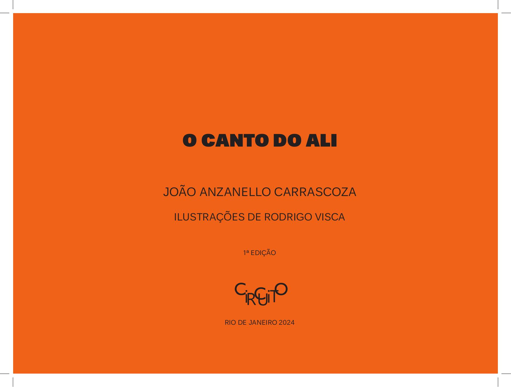

[Página 1]
O CANTO DO ALI
JOÃO ANZANELLO CARRASCOZA
ILUSTRAÇÕES DE RODRIGO VISCA
1ª EDIÇÃO

RIO DE JANEIRO 2024



---

[Página 2]
copyright Editora Circuito LTDA.

edição Renato Rezende
coedição Suzana Salama e Fábia Alvim
revisão Fábia Alvim
projeto gráfico Cynthia Cruttenden

Grafia atualizada segundo o Acordo Ortográfico da Língua
Portuguesa de 1990, em vigor no Brasil desde 2009.
Dados Internacionais de Catalogação na Publicação (CIP)
(Câmara Brasileira do Livro, SP, Brasil)
Anzanello Carrascoza, João

O canto do ali. João Anzanello Carrascoza; ilustração
Rodrigo Visca. 1. ed. São Paulo: Editora Circuito, 2024.

		
978-65-998890-0-4 (Livro do Estudante Impresso)
		
978-65-998890-2-8 (Livro do Estudante Digital)
		
978-65-998890-1-1 (Livro do Professor Digital)
		
1. Literatura infantojuvenil I. Guazzelli, Eloar. II. Título.
22-125280

Índices para catálogo sistemático:

1. Literatura infantil 028.5
2. Literatura infantojuvenil 028.5
Aline Graziele Benitez - Bibliotecária - CRB-1/3129
Direitos reservados em língua
portuguesa somente para o Brasil

Editora Circuito LTDA.
Rua Visconde de Inhaúma, 134, 1213
Rio de Janeiro, RJ, CEP 20091-901
+55 21 98124-8891, renato@editoracircuito.com.br

CDD-028.5



---

[Página 3]
O CANTO DO ALI



---

[Página 4]



---

[Página 5]
ONDE ESTÁ A ÁRVORE
QUE NÃO ESTÁ NEM AQUI,
NEM LÁ?



---

[Página 6]
ALI.



---

[Página 7]



---

[Página 8]



---

[Página 9]
E O PÁSSARO,
SE NÃO ESTÁ NA ÁRVORE,
NEM VOANDO, ONDE ESTÁ?



---

[Página 10]



---

[Página 11]
ALI.



---

[Página 12]



---

[Página 13]
ONDE FOI PARAR O AVIÃO
SE NÃO DECOLOU DE CÁ,
NEM ATERRISSOU ACOLÁ?



---

[Página 14]
ALI.



---

[Página 15]
SE O BRINQUEDO
NÃO ESTÁ PERTO,
NEM LONGE,
ONDE ELE ESTÁ?



---

[Página 16]
ALI.



---

[Página 17]


---

[Página 18]
E A BOLA,
A ROUPA,
O CHINELO?



---

[Página 19]
ALI, ALI, ALI.



---

[Página 20]
A TOALHA, CAÍDA,
NEM NO CHÃO, AQUI,
NEM NA PIA, LÁ,
É ALI QUE ELA ESTÁ.



---

[Página 21]


---

[Página 22]
AS CADEIRAS ESTÃO BEM ALI, AO REDOR DA MESA.
JÁ O FOGÃO ESTÁ AAAAIIIIIÍ, Ó!



---

[Página 23]


---

[Página 24]
E O QUE MAIS ESTÁ ALI?
A MÃE QUE,
PELO VÃO DA PORTA,
OBSERVA O MENINO
DORMIR.



---

[Página 25]
E ALI, EM CIMA DA MESINHA,
O ABAJUR LILÁS DA MENINA.



---

[Página 26]


---

[Página 27]
ALI, O PAI ACENANDO
AO ENTRAR NO ÔNIBUS, TCHAU,
ALI, O AVÔ E A VÓ NA TELA DO CELULAR
MANDAM BEIJOS – ATÉ JÁ.



---

[Página 28]
AQUI A JANELA.
ALI, A PAISAGEM.



---

[Página 29]


---

[Página 30]
AS BORBOLETAS BRINCAM COM AS FLORES,
LOGO ALI NO JARDIM.



---

[Página 31]
OLHE, ALI,
SOBRE O MURO,
UM GATO.

E O CACHORRO DO VIZINHO LATINDO, LATINDO, ALI.
O PÉ DE MANGA E A LARANJEIRA – ALI E ALI – NO FUNDO DO QUINTAL.



---

[Página 32]
LÁ ESTÁ O ARCO-ÍRIS:
E SE A GENTE DÁ UM PASSO,
ELE SE MOVE PARA ALI.
SE A GENTE DÁ OUTRO PASSO,
ELE SALTA DE NOVO PARA LÁ.



---

[Página 33]


---

[Página 34]
O ALI NÃO ANDA GRUDADO – AQUI – NA GENTE
NEM TEMOS DE CAMINHAR MUITO – ATÉ LÁ – PARA ALCANÇA-LO
O ALI NÃO VIVE DISTANTE,
NEM TÃO À MÃO.

O ALI ESTÁ BEM NO MEIO,
ENTRE O AQUI E O LÁ.
O ALI ESTÁ ALI.
COMO O SONHO.
NAQUELE CANTO.



---

[Página 35]
PARA CHEGAR A ELE,
TEMOS QUE SAIR DAQUI.

VAMOS?



---

[Página 36]
Esta obra foi composta em Unb Pro
e impressa em offset 90 g/m2
para a Editora Circuito LTDA



---

