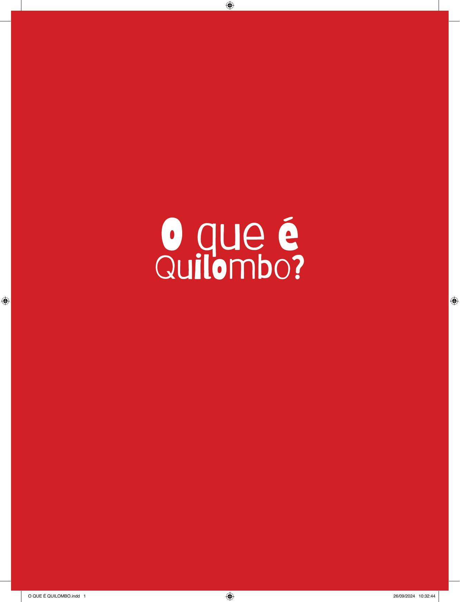

[Página 1]
O QUE É QUILOMBO.indd 1

26/09/2024 10:32:44



---

[Página 2]
Copyright do texto © 2024 Cássia dos Santos
Copyright das ilustrações © 2024 Aline Beatriz Alves

Todos os direitos reservados à Saíra Editorial.

O QUE É QUILOMBO.indd 2

26/09/2024 10:32:45



---

[Página 3]
NO BRASIL EXISTIU ESCRAVIDÃO.

O QUE É QUILOMBO.indd 3

26/09/2024 10:32:45



---

[Página 4]

O QUE É QUILOMBO?

O QUE É QUILOMBO.indd 4

26/09/2024 10:32:46



---

[Página 5]
ESCRAVIDÃO É QUANDO UMA PESSOA É OBRIGADA A
TRABALHAR PARA OUTRA SEM RECEBER NADA EM TROCA
E SEM PODER ESCAPAR. É MUITO TRISTE…
NO BRASIL, OS PRIMEIROS ESCRAVIZADOS FORAM
OS POVOS INDÍGENAS. QUE TAMBÉM SÃO CHAMADOS
DE POVOS ORIGINÁRIOS.
ORIGINÁRIOS

O QUE É QUILOMBO?

O QUE É QUILOMBO.indd 5

26/09/2024 10:32:47



---

[Página 6]
MAS LOGO OS PORTUGUESES COMEÇARAM
A TRAZER ESCRAVIZADOS DE VÁRIOS
LUGARES DA ÁFRICA
ÁFRICA.

O QUE É QUILOMBO.indd 6

26/09/2024 10:32:49



---

[Página 7]
MUITOS DESSES AFRICANOS MORRIAM
VINDO DA ÁFRICA PARA O BRASIL.
O QUE É QUILOMBO?

O QUE É QUILOMBO.indd 7

26/09/2024 10:32:49



---

[Página 8]

O QUE É QUILOMBO?

O QUE É QUILOMBO.indd 8

26/09/2024 10:32:52



---

[Página 9]
NA ESCRAVIDÃO, OS AFRICANOS SOFRIAM MUITO. FICAVAM
PRESOS EM SENZALAS E ERAM CASTIGADOS POR QUALQUER
MOTIVO. FOI UM TEMPO MUITO TRISTE DA NOSSA HISTÓRIA.

O QUE É QUILOMBO?

O QUE É QUILOMBO.indd 9

26/09/2024 10:32:53



---

[Página 10]
MAS OS ESCRAVIZADOS LUTAVAM POR SUA
LIBERDADE. FUGIAM E IAM SE REFUGIAR NOS
QUILOMBOS, COMUNIDADES QUE FICAVAM EM
QUILOMBOS
LUGARES ESCONDIDOS.

O QUE É QUILOMBO?

O QUE É QUILOMBO.indd 10

26/09/2024 10:32:55



---

[Página 11]
MUITOS INDÍGENAS AJUDAVAM OS NEGROS A SE
ESCONDER E VIVIAM COM ELES NOS QUILOMBOS.

O QUE É QUILOMBO?

O QUE É QUILOMBO.indd 11

26/09/2024 10:32:56



---

[Página 12]
QUILOMBO É UMA TERRA ONDE A CULTURA
DESSAS PESSOAS FOI PRESERVADA.

O QUE É QUILOMBO?

O QUE É QUILOMBO.indd 12

26/09/2024 10:32:58



---

[Página 13]
E ONDE PUDERAM RECUPERAR SUA
LIBERDADE E SEREM FELIZES.

O QUE É QUILOMBO?

O QUE É QUILOMBO.indd 13

26/09/2024 10:32:59



---

[Página 14]
MAS TAMBÉM É UMA TERRA DE
RESISTÊNCIA CONTRA QUALQUER
TIPO DE OPRESSÃO.

O QUE É QUILOMBO?

O QUE É QUILOMBO.indd 14

26/09/2024 10:33:00



---

[Página 15]
ALGUNS QUILOMBOS DESAPARECERAM, MAS
MUITOS RESISTEM/EXISTEM ATÉ HOJE,
MANTENDO SUAS TRADIÇÕES.

O QUE É QUILOMBO?

O QUE É QUILOMBO.indd 15

26/09/2024 10:33:01



---

[Página 16]
E NÃO FICAM SEMPRE LÁ LONGE,
HÁ VÁRIOS QUILOMBOS DENTRO
DAS CIDADES!

O QUE É QUILOMBO?

O QUE É QUILOMBO.indd 16

26/09/2024 10:33:03



---

[Página 17]
OS QUILOMBOS SÃO COMUNIDADES,
E QUEM MORA NELES É CHAMADO
DE QUILOMBOLA
QUILOMBOLA.

O QUE É QUILOMBO?

O QUE É QUILOMBO.indd 17

26/09/2024 10:33:04



---

[Página 18]

O QUE É QUILOMBO?

O QUE É QUILOMBO.indd 18

26/09/2024 10:33:06



---

[Página 19]
NO QUILOMBO, AS PESSOAS MAIS
VELHAS CONTAM HISTÓRIAS E ENSINAM
RITMOS E DANÇAS: CAPOEIRA E LUNDU,
MAZURCA E JONGO…
A GENTE APRENDE MUITA COISA
VIVENDO EM CULTURAS QUILOMBOLAS.

O QUE É QUILOMBO?

O QUE É QUILOMBO.indd 19

26/09/2024 10:33:07



---

[Página 20]
Ô GENTE, NASCI NA ANGOLA
ANGOLA QUE ME CRIOU,
EU SOU NETO DE
MOÇAMBIQUE, Ô GENTE...
EU SOU NEGRO SIM SINHÔ.

O QUE É QUILOMBO?

O QUE É QUILOMBO.indd 20

26/09/2024 10:33:09



---

[Página 21]
CADA QUILOMBO É UMA MISTURA
DE VÁRIAS CULTURAS AFRICANAS E
INDÍGENAS. E CULTURA É TUDO O
QUE NÓS SOMOS: CONHECIMENTOS,
HÁBITOS E CRENÇAS.

O QUE É QUILOMBO?

O QUE É QUILOMBO.indd 21

26/09/2024 10:33:10



---

[Página 22]
CHAMAMOS DE TRADIÇÃO A SOMA DE VÁRIOS
CONHECIMENTOS QUE PASSAMOS PARA AS
PRÓXIMAS GERAÇÕES.

O QUE É QUILOMBO?

O QUE É QUILOMBO.indd 22

26/09/2024 10:33:12



---

[Página 23]
COMO A RELIGIÃO E A COMIDA DE NOSSOS
AVÓS, UMA HISTÓRIA GUARDADA COM
CARINHO E O CHEIRO DE PÃO QUENTINHO.

O QUE É QUILOMBO?

O QUE É QUILOMBO.indd 23

26/09/2024 10:33:13



---

[Página 24]

O QUE É QUILOMBO?

O QUE É QUILOMBO.indd 24

26/09/2024 10:33:14



---

[Página 25]
FAMÍLIAS QUILOMBOLAS OCUPAM
TERRITÓRIOS BRASILEIROS HÁ SÉCULOS.

O QUE É QUILOMBO?

O QUE É QUILOMBO.indd 25

26/09/2024 10:33:15



---

[Página 26]
OS QUILOMBOLAS CULTIVAM E PRESERVAM
A NATUREZA
NATUREZA, CUIDANDO DELA.

O QUE É QUILOMBO?

O QUE É QUILOMBO.indd 26

26/09/2024 10:33:17



---

[Página 27]
O QUE É QUILOMBO?

O QUE É QUILOMBO.indd 27

26/09/2024 10:33:18



---

[Página 28]
CADA QUILOMBO É UM
PEDACINHO DE NOSSA HISTÓRIA,
CONHECIMENTOS QUE PRECISAMOS
APRENDER PARA PASSAR ADIANTE.

O QUE É QUILOMBO?

O QUE É QUILOMBO.indd 28

26/09/2024 10:33:20



---

[Página 29]
O QUE É QUILOMBO?

O QUE É QUILOMBO.indd 29

26/09/2024 10:33:21



---

[Página 30]
CÁSSIA DOS SANTOS É CIENTISTA NEGRA BRASILEIRA
E ESCREVE PARA TODOS OS PÚBLICOS. ELA INVESTIGA
UMA OBRA MUITO IMPORTANTE CHAMADA GRANDE
SERTÃO: VEREDAS, QUE TEM PALAVRAS CRIATIVAS
DEMAIS, UM UNIVERSO MUITO CURIOSO E CHEIO DE
MAGIA! É UMA OBRA ENORME, RICA EM AVENTURAS…
QUANDO ERA CRIANÇA SONHAVA EM SER GENTE
GRANDE, AGORA QUE É GENTE GRANDE SONHA EM
PODER COMPARTILHAR SUAS PESQUISAS COM O
MUNDO INTEIRINHO… OU APENAS UMA PARTE DELE.
ALÉM DE SER CIENTISTA, É MÃE DE UM GATO MUITO
FOFO E GRANDE, O FREDERICO.

O QUE É QUILOMBO?

O QUE É QUILOMBO.indd 30

26/09/2024 10:33:23



---

[Página 31]
ALINE BEATRIZ ALVES
DESDE PEQUENINA AMAVA PICOTAR PAPÉIS,
DESENHAR PINTAR, INVENTAR HISTÓRIAS E
CANTAR. CRESCI E ESCOLHI O DESENHO E A
PINTURA COMO COMPANHEIROS DE VIDA E OS
COMPARTILHO COM MEU FILHO ARTHUR, QUE AMA
DESENHAR E TOCAR GUITARRA. GOSTAMOS DE
JOGAR XADREZ, ASSISTIR FILMES, OUVIR MÚSICAS
E DIVIDIMOS NOSSA CASA COM A GATINHA
TANGERINA, QUE UM DIA APARECEU EM NOSSA
CASA E DESDE ENTÃO RESOLVEU NOS ADOTAR.

O QUE É QUILOMBO?

O QUE É QUILOMBO.indd 31

26/09/2024 10:33:25



---

[Página 32]

O QUE É QUILOMBO?

O QUE É QUILOMBO.indd 32

26/09/2024 10:33:25



---

