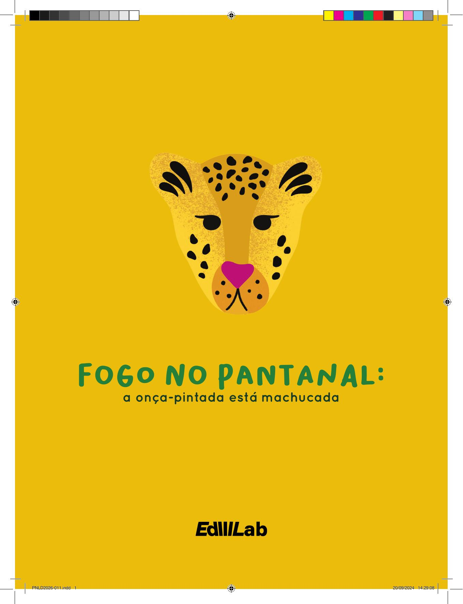

[Página 1]
FOGO NO PANTANAL:
a onça-pintada está machucada

Texto de
Luciana Leite
Ilustrações de
Cecília Saro

---

[Página 2]

---

[Página 3]
A TODOS OS
VOLUNTÁRIOS,
que, nos últimos anos,
têm se unido para
salvar o Pantanal.

---

[Página 4]
Moro no Pantanal,
Sou uma fêmea de onça-pintada,

---

[Página 5]

---

[Página 6]

---

[Página 7]
Sou um animal forte e valente,
Mas hoje estou machucada.

---

[Página 8]
Eu queimei minhas patinhas...
Estou me sentindo muito mal!

---

[Página 9]
Eu preciso de um veterinário
Para me levar ao hospital...

---

[Página 10]

---

[Página 11]
Me escondi em uma fazenda
E vou contar o que aconteceu.

---

[Página 12]
A minha história começa triste,
Mas você vai ver que, no fim,
O amor venceu.

---

[Página 13]

---

[Página 14]

---

[Página 15]
O Pantanal sempre foi muito bonito,
Com muitas plantas e animais.

---

[Página 16]
Todos preservavam a floresta,
e, juntos, vivíamos em paz.

---

[Página 17]

---

[Página 18]
Mas os anos foram se passando,
E a água desapareceu.

---

[Página 19]
Dizem que onde tiraram as árvores
O rio nunca mais correu.

---

[Página 20]
Sem os rios e sem a chuva,
A terra foi secando.

---

[Página 21]
O calor está muito forte...
Sinto que o clima está mudando...

---

[Página 22]

---

[Página 23]
E agora estamos com muito medo
Porque HÁ fogo por todo lado.

---

[Página 24]

---

[Página 25]
além de mim, eu fiquei sabendo
Que temos outros bichos machucados.

---

[Página 26]
As pessoas vão precisar ter mais cuidado:
Não podem colocar fogo na floresta.

---

[Página 27]

---

[Página 28]

---

[Página 29]
Ele se espalha rápido e destrói tudo!
Olhe o pouco que nos resta.

---

[Página 30]
Agora chegou o meu resgate.
Preciso me despedir.

---

[Página 31]
Mas vamos combinar que
nossa história Não termina por aqui!

---

[Página 32]
O mundo todo vai ter de se unir
Para proteger o Pantanal.

---

[Página 33]

---

[Página 34]

---

[Página 35]
Vamos juntar crianças e adultos
Nesta missão especial!

---

[Página 36]
Vamos replantar as matas
E trazer de volta os rios.

---

[Página 37]
Para os próximos anos,
Esse será o nosso desafio!

---

[Página 38]

---

[Página 39]
Vamos proteger a natureza
E salvar as onças-pintadas.

---

[Página 40]
Eu conto com você
Para proteger a bicharada!

---

[Página 41]

---

[Página 42]

---

[Página 43]
O que aconteceu com a amanaci?
Epílogo por Daniela Gianni
Coordenadora de Projetos e Atividades
Instituto de Preservação de Felídeos da Fauna Silvestre do Brasil.
A onça, de início batizada de Glória, por ter sido encontrada muito
machucada em uma fazenda cuja proprietária se chama Glória, mas, hoje,
mundialmente conhecida como Amanaci, Deusa das Chuvas em TupiGuarani, se recuperou de forma surpreendente. Após 78 dias de intensos
tratamentos, entre sedações e curativos, dia sim e dia não, Amanaci não teve
o final feliz que gostaríamos: livre novamente na mata. Mas, felizmente, ela
sobreviveu! Hoje Amanaci vive em um espaço construído especialmente
para ela no Instituto Nex, um Criadouro Científico Conservacionista que
há 21 anos luta contra a extinção da onça-pintada no Brasil.
Eu convivo com a Amanaci diariamente. Apesar das sequelas, posso
sentir a sua gratidão sempre que me sento ao seu lado. A sensação que
eu tenho é de que ela dá graças a Deus por estar viva e por estar ali,
em paz. Por mais que eu tente descrever, ninguém pode imaginar a dor
pela qual Amanaci passou. Até hoje, mesmo após a cicatrização total das
queimaduras, ela possui sensibilidade nas patinhas. Às vezes ela pisa e dá
uma tremidinha... As sequelas a fazem lembrar todos os dias do terror pelo
qual ela passou. Mesmo assim, o olhar de gratidão dela me impressiona.
Não é como as outras onças selvagens que, em decorrência da crueldade
humana, agora precisam viver sob os nossos cuidados, mas eu sinto que,
se pudessem, com certeza estariam livres. Amanaci parece ter perdido
a vontade de ser livre. Perdeu a coragem. Quando eu chego perto dela,
as orelhinhas vão para trás (de forma meiga) e ela deita de barriga para
cima, muitas vezes me mostrando as patinhas. Eu sempre me emociono.
Eu sei exatamente o que ela quer me mostrar: que a partir de agora, o Nex
é o seu lugar, longe de tudo o que possa machucá-la. Me sinto honrada
por fazer parte da história de uma onça guerreira, que nunca se entregou
e que confiou no nosso trabalho desde o primeiro dia. Mas, ao mesmo
tempo, me entristece saber que Amanaci é mais uma das inúmeras vítimas
dos seres humanos.
Se eu pudesse fazer um pedido aos céus, seria, com certeza, de poder
ver a Amanaci em liberdade outra vez, mas com a garantia de estar segura,
em um lugar onde os animais pudessem viver em paz e com o respeito
que merecem. Será que esse lugar existe?

---

[Página 44]
AUTORA
Luciana Leite é bióloga, feminista, ativista ambiental e uma
eterna sonhadora. Em 2020, foi voluntária no combate aos
incêndios florestais no Pantanal. Profundamente tocada
pela história da onça-pintada Amanaci e pela determinação
de dezenas de voluntários que conheceu na linha de
frente, Luciana decidiu eternizar a história dos incêndios
de 2020 neste livro infantil. A autora espera que o livro
inspire gerações futuras a amarem e cuidarem da nossa
biodiversidade. Luciana é autora também dos livros infantis
“Os sonhos de Ágatha”, sobre disparidade de gênero nas
ciências, e “O retorno da Arara-Azul-de-Lear”, sobre um
projeto de soltura da espécie no sertão baiano.

---

[Página 45]
ILUSTRADORA
Cecilia Saro é uma artista visual e feminista que tem como
maior fonte de inspiração do seu trabalho a natureza e o
feminino. Em 2020, participou de um movimento para
arrecadar dinheiro por meio de suas obras para a judar os
voluntários no combate aos incêndios florestais no Pantanal.
Aí começou uma parceria entre a ilustradora e a preservação
do bioma. Hoje, junto com a Chalana Esperança, ela ilustra
várias peças e livros sobre o Pantanal, torcendo para que
seu trabalho inspire gerações futuras a amarem e cuidarem
da nossa biodiversidade.

---

[Página 46]
conheça os bichos da nossa história!

Arara-azul
Anodorhynchus hyacinthinus

Capivara
Hydrochoerus hydrochaeris

Jacaré-do-pantanal
Caiman yacare

Anta
Tapirus terrestris

Cardeal-do-pantanal
Paroaria capitata

---

[Página 47]
Tuiuiú
Jabiru mycteria

Lobo-guará
Chrysocyon brachyurus

Onça-pintada
Panthera onca

---

[Página 48]
Esta obra foi composta em Bakso Sapi e Formular
e impressa em papel cuchê fosco 115 g/m²
para a EdLab Press.

---

