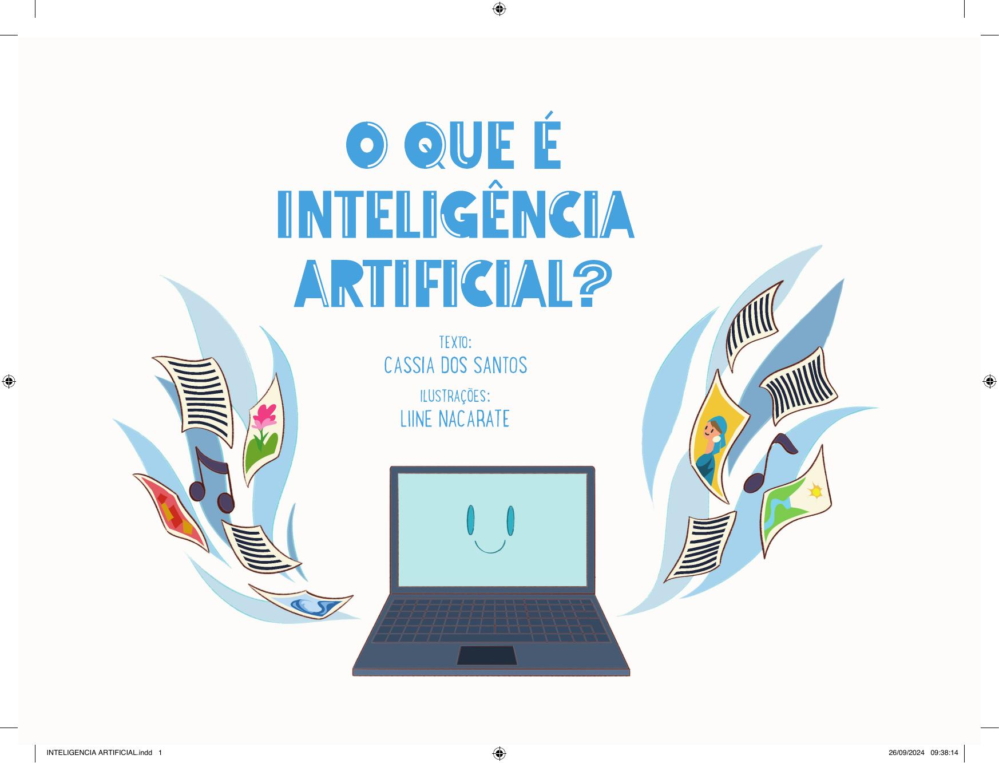

[Página 1]
INTELIGENCIA ARTIFICIAL.indd 1

26/09/2024 09:38:14



---

[Página 2]
Copyright do texto © 2024 Cássia dos Santos
Copyright das ilustrações © 2024 Liine Nacarate

Todos os direitos reservados à Saíra Editorial.

O QUE É INTELIGÊNCIA ARTIFICIAL?

INTELIGENCIA ARTIFICIAL.indd 2

26/09/2024 09:38:18



---

[Página 3]
VOCÊ JÁ OUVIU FALAR DE INTELIGÊNCIA
ARTIFICIAL? O QUE SERÁ ISSO? ALGUM
APARELHO QUE NOS DEIXA MAIS
INTELIGENTES?

A GENTE USA DINHEIRO PARA
TROCAR POR COISAS QUE A
GENTE QUER.
SE A GENTE TEM DINHEIRO,
PODE TROCAR POR COMIDA,
BRINQUEDOS, SERVIÇOS E
DIVERSÃO.
O QUE É INTELIGÊNCIA ARTIFICIAL?

INTELIGENCIA ARTIFICIAL.indd 3

26/09/2024 09:38:20



---

[Página 4]
NADA DISSO! INTELIGÊNCIA ARTIFICIAL
É UM PROGRAMA DE COMPUTADOR
QUE APRENDE COM O QUE
ENSINAMOS PARA ELE.

O QUE É INTELIGÊNCIA ARTIFICIAL?

INTELIGENCIA ARTIFICIAL.indd 4

26/09/2024 09:38:25



---

[Página 5]
PARA FACILITAR, A GENTE O CHAMA DE
IA, QUE SÃO AS PRIMEIRAS LETRAS DE
INTELIGÊNCIA E ARTIFICIAL.

O QUE É INTELIGÊNCIA ARTIFICIAL?

INTELIGENCIA ARTIFICIAL.indd 5

26/09/2024 09:38:26



---

[Página 6]
A IA NÃO “PENSA” DE VERDADE, MAS
FAZ AS COISAS TÃO RÁPIDO QUE É COMO
SE PENSASSE.

O QUE É INTELIGÊNCIA ARTIFICIAL?

INTELIGENCIA ARTIFICIAL.indd 6

26/09/2024 09:38:32



---

[Página 7]
O QUE É INTELIGÊNCIA ARTIFICIAL?

INTELIGENCIA ARTIFICIAL.indd 7

26/09/2024 09:38:33



---

[Página 8]

O QUE É INTELIGÊNCIA ARTIFICIAL?

INTELIGENCIA ARTIFICIAL.indd 8

26/09/2024 09:38:37



---

[Página 9]
COM ESSA RAPIDEZ TODA, A IA PODE
CONVERSAR COM VOCÊ COMO SE FOSSE
UMA PESSOA.
ELA RESPONDE A QUALQUER PERGUNTA QUE
VOCÊ FIZER E DÁ ATÉ OPINIÕES!

O QUE É INTELIGÊNCIA ARTIFICIAL?

INTELIGENCIA ARTIFICIAL.indd 9

26/09/2024 09:38:39



---

[Página 10]
EXISTEM MUITOS TIPOS DE IA, CADA UMA COM
SUAS HABILIDADES ESPECIAIS.
ALGUMAS CONTROLAM CARROS QUE ANDAM
SOZINHOS, SEM MOTORISTA!

O QUE É INTELIGÊNCIA ARTIFICIAL?

INTELIGENCIA ARTIFICIAL.indd 10

26/09/2024 09:38:49



---

[Página 11]
O QUE É INTELIGÊNCIA ARTIFICIAL?

INTELIGENCIA ARTIFICIAL.indd 11

26/09/2024 09:38:51



---

[Página 12]
OUTRAS AJUDAM TRADUZIR
O QUE A GENTE FALA, PARA
CONVERSAR COM PESSOAS
NO MUNDO TODO...

O QUE É INTELIGÊNCIA ARTIFICIAL?

INTELIGENCIA ARTIFICIAL.indd 12

26/09/2024 09:39:00



---

[Página 13]
O QUE É INTELIGÊNCIA ARTIFICIAL?

INTELIGENCIA ARTIFICIAL.indd 13

26/09/2024 09:39:02



---

[Página 14]
ELA AJUDA MÉDICOS A IDENTIFICAR DOENÇAS...

O QUE É INTELIGÊNCIA ARTIFICIAL?

INTELIGENCIA ARTIFICIAL.indd 14

26/09/2024 09:39:08



---

[Página 15]
...E PROFESSORES A DAR AULAS MELHORES.

O QUE É INTELIGÊNCIA ARTIFICIAL?

INTELIGENCIA ARTIFICIAL.indd 15

26/09/2024 09:39:10



---

[Página 16]

O QUE É INTELIGÊNCIA ARTIFICIAL?

INTELIGENCIA ARTIFICIAL.indd 16

26/09/2024 09:39:18



---

[Página 17]
COM A IA, PODEMOS FAZER COISAS INCRÍVEIS, COMO
EXPLORAR O ESPAÇO E IDENTIFICAR COMETAS E ASTEROIDES.

O QUE É INTELIGÊNCIA ARTIFICIAL?

INTELIGENCIA ARTIFICIAL.indd 17

26/09/2024 09:39:20



---

[Página 18]
ELA AJUDA A PREVER AS
MUDANÇAS NO CLIMA E
OS PROBLEMAS NO MEIO
AMBIENTE.

O QUE É INTELIGÊNCIA ARTIFICIAL?

INTELIGENCIA ARTIFICIAL.indd 18

26/09/2024 09:39:28



---

[Página 19]
O QUE É INTELIGÊNCIA ARTIFICIAL?

INTELIGENCIA ARTIFICIAL.indd 19

26/09/2024 09:39:30



---

[Página 20]

O QUE É INTELIGÊNCIA ARTIFICIAL?

INTELIGENCIA ARTIFICIAL.indd 20

26/09/2024 09:39:37



---

[Página 21]
ELA PODE ATÉ FAZER DESENHOS E PINTURAS,
MAS NÃO FICAM TÃO BONS COMO OS DE
ARTISTAS DE VERDADE. SÃO IMITAÇÕES DE
IMAGENS QUE JÁ EXISTEM.

O QUE É INTELIGÊNCIA ARTIFICIAL?

INTELIGENCIA ARTIFICIAL.indd 21

26/09/2024 09:39:39



---

[Página 22]
A IA TAMBÉM ESCREVE HISTÓRIAS E POEMAS IMITANDO O
ESTILO DE QUALQUER ESCRITOR.
MAS É COMO OS DESENHOS, NÃO FICAM ASSIM TÃO BONS...

O QUE É INTELIGÊNCIA ARTIFICIAL?

INTELIGENCIA ARTIFICIAL.indd 22

26/09/2024 09:39:45



---

[Página 23]
O QUE É INTELIGÊNCIA ARTIFICIAL?

INTELIGENCIA ARTIFICIAL.indd 23

26/09/2024 09:39:47



---

[Página 24]
A IA ESTÁ NO SEU DIA A DIA, MESMO
QUE VOCÊ NÃO PERCEBA.
NO CELULAR, NO COMPUTADOR, NA
TV E ATÉ NOS SEUS BRINQUEDOS, A IA
PODE ESTAR ESCONDIDA!

O QUE É INTELIGÊNCIA ARTIFICIAL?

INTELIGENCIA ARTIFICIAL.indd 24

26/09/2024 09:39:53



---

[Página 25]
O QUE É INTELIGÊNCIA ARTIFICIAL?

INTELIGENCIA ARTIFICIAL.indd 25

26/09/2024 09:39:55



---

[Página 26]

O QUE É INTELIGÊNCIA ARTIFICIAL?

INTELIGENCIA ARTIFICIAL.indd 26

26/09/2024 09:40:00



---

[Página 27]
MAS SERÁ QUE AS MÁQUINAS UM DIA
VÃO SUBSTITUIR OS HUMANOS?

O QUE É INTELIGÊNCIA ARTIFICIAL?

INTELIGENCIA ARTIFICIAL.indd 27

26/09/2024 09:40:02



---

[Página 28]
NÃO SE PREOCUPE, SÓ O CÉREBRO HUMANO
É CAPAZ DE SENTIR, AMAR E CRIAR.

O QUE É INTELIGÊNCIA ARTIFICIAL?

INTELIGENCIA ARTIFICIAL.indd 28

26/09/2024 09:40:10



---

[Página 29]
O QUE É INTELIGÊNCIA ARTIFICIAL?

INTELIGENCIA ARTIFICIAL.indd 29

26/09/2024 09:40:12



---

[Página 30]

O QUE É INTELIGÊNCIA ARTIFICIAL?

INTELIGENCIA ARTIFICIAL.indd 30

26/09/2024 09:40:22



---

[Página 31]
FOMOS NÓS QUE CRIAMOS A IA PARA ELA
NOS AJUDAR A SERMOS MAIS CRIATIVOS E A
CONSTRUIR UM MUNDO MELHOR!

O QUE É INTELIGÊNCIA ARTIFICIAL?

INTELIGENCIA ARTIFICIAL.indd 31

26/09/2024 09:40:24



---

[Página 32]
CÁSSIA DOS SANTOS É CIENTISTA NEGRA BRASILEIRA E ESCREVE PARA TODOS OS
PÚBLICOS. ELA INVESTIGA UMA OBRA MUITO IMPORTANTE CHAMADA GRANDE
SERTÃO: VEREDAS, QUE TEM PALAVRAS CRIATIVAS DEMAIS, UM UNIVERSO MUITO
CURIOSO E CHEIO DE MAGIA! É UMA OBRA ENORME, RICA EM AVENTURAS…
QUANDO ERA CRIANÇA SONHAVA EM SER GENTE GRANDE, AGORA QUE É GENTE
GRANDE SONHA EM PODER COMPARTILHAR SUAS PESQUISAS COM O MUNDO
INTEIRINHO… OU APENAS UMA PARTE DELE. ALÉM DE SER CIENTISTA, É MÃE DE UM
GATO MUITO FOFO E GRANDE, O FREDERICO.

LIINE NACARATE NASCEU EM 26 DE ABRIL DE 1998 EM RIO PRETO/MG. SEMPRE
AMOU DESENHAR E ENCONTROU NA ILUSTRAÇÃO UMA FORMA DE DAR VIDA A SUA
IMAGINAÇÃO. HOJE EM DIA BUSCA FAZER O MESMO PARA AS OUTRAS PESSOAS,
ILUSTRANDO AS HISTÓRIAS MÁGICAS DOS OUTROS.

O QUE É INTELIGÊNCIA ARTIFICIAL?

INTELIGENCIA ARTIFICIAL.indd 32

26/09/2024 09:40:27



---

