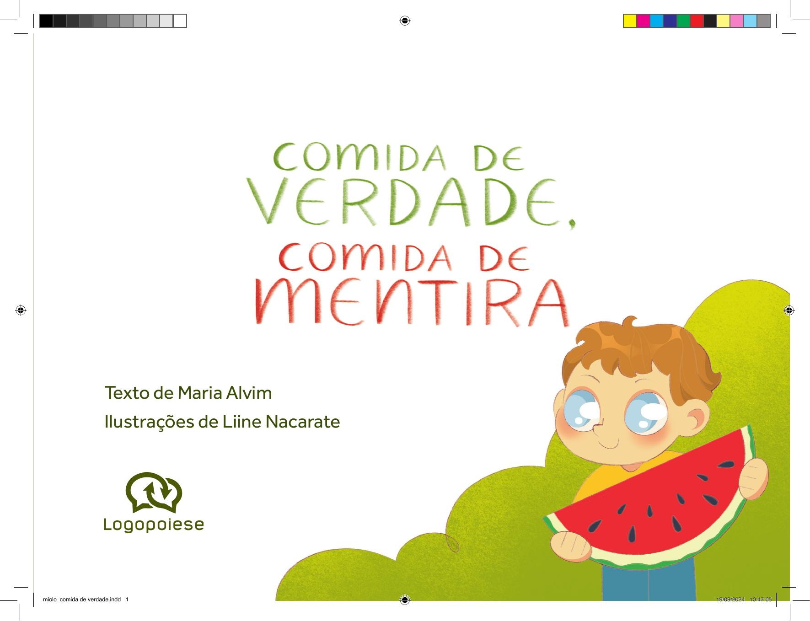

[Página 1]
Texto de Maria Alvim
Ilustrações de Liine Nacarate

miolo_comida de verdade.indd 1

19/09/2024 10:47:05



---

[Página 2]
Copyright do texto © 2024 Maria Alvim
Copyright das ilustrações © 2024 Liine Nacarate
Direção e curadoria
Gestão editorial
Diagramação
Revisão

Fábia Alvim
Felipe Augusto Neves Silva
Luisa Marcelino
Túlia Cibo

Dados Internacionais de Catalogação na Publicação (CIP) de acordo com ISBD
A475c Alvim, Maria
		
		
		

Comida de verdade, comida de mentira / Maria Alvim ; ilustrado
por Liine Nacarate. São Paulo : Saíra Editorial, 2024.
32 p. : il. ; 27,5cm x 20,5cm.

		
		

ISBN: 978-65-984208-0-2 (livro impresso da criança)
978-65-984208-1-9 (livro digital da criança)

		

1. Literatura infantil. I. Nacarate, Liine. II. Título.
CDD 028.5
CDU 82-93

2024-2311
Elaborado por Vagner Rodolfo da Silva - CRB-8/9410
Índice para catálogo sistemático:
1. Literatura infantil 028.5
2. Literatura infantil 82-93
Todos os direitos reservados à Logopoiese
www.logopoiese.com.br

Rua Doutor Samuel Porto, 411
Vila da Saúde – 04054-010 – São Paulo, SP

miolo_comida de verdade.indd 2

19/09/2024 10:47:06



---

[Página 3]
Comer bem é muito importante!

miolo_comida de verdade.indd 3

19/09/2024 10:47:07



---

[Página 4]
Quando comemos, ganhamos energia.
Quando brincamos, corremos ou fazemos
outras atividades, gastamos energia.
miolo_comida de verdade.indd 4

19/09/2024 10:47:09



---

[Página 5]
miolo_comida de verdade.indd 5

19/09/2024 10:47:11



---

[Página 6]
Mas o que importa não é só a quantidade de energia que
ganhamos ou gastamos. Também precisamos saber quais
são os melhores alimentos para a nossa saúde.

miolo_comida de verdade.indd 6

19/09/2024 10:47:13



---

[Página 7]
miolo_comida de verdade.indd 7

19/09/2024 10:47:15



---

[Página 8]
É importante saber que existem muitos
produtos por aí que imitam comida,
mas não são comida de verdade.

miolo_comida de verdade.indd 8

19/09/2024 10:47:16



---

[Página 9]
miolo_comida de verdade.indd 9

19/09/2024 10:47:18



---

[Página 10]
Os alimentos que vêm diretamente das plantas e
dos animais são os melhores. Eles são chamados de
alimentos in natura. É o caso das frutas, dos legumes,
do ovo e do leite.

miolo_comida de verdade.indd 10

19/09/2024 10:47:20



---

[Página 11]
miolo_comida de verdade.indd 11

19/09/2024 10:47:21



---

[Página 12]
Outros alimentos
são chamados
de ingredientes
culinários.

miolo_comida de verdade.indd 12

19/09/2024 10:47:23



---

[Página 13]
Eles devem ser
usados em pequenas
quantidades para
fazermos receitas
gostosas. Açúcar,
óleo e sal são alguns
exemplos.

miolo_comida de verdade.indd 13

19/09/2024 10:47:25



---

[Página 14]
Existem, ainda, os alimentos
processados, feitos para
durarem mais tempo.

miolo_comida de verdade.indd 14

19/09/2024 10:47:27



---

[Página 15]
São feitos de alimentos in natura
com sal e açúcar adicionados, por
exemplo. Pão da padaria, queijo e
geleia são alimentos processados.

miolo_comida de verdade.indd 15

19/09/2024 10:47:28



---

[Página 16]
E, por fim, existem os ultraprocessados. Seu nome é difícil,
e eles NÃO SÃO UMA BOA ESCOLHA na hora de comer.
miolo_comida de verdade.indd 16

19/09/2024 10:47:31



---

[Página 17]
Eles têm muitos INGREDIENTES ESQUISITOS e FAZEM MUITO MAL.
São ultraprocessados os biscoitos, o refrigerante, o presunto...
miolo_comida de verdade.indd 17

19/09/2024 10:47:32



---

[Página 18]
O milho que comemos cozido,
na espiga, é COMIDA DE VERDADE.

miolo_comida de verdade.indd 18

19/09/2024 10:47:35



---

[Página 19]
Mas o salgadinho de
milho, vendido no
pacotinho, é COMIDA
DE MENTIRA.

miolo_comida de verdade.indd 19

19/09/2024 10:47:37



---

[Página 20]
A banana é uma fruta deliciosa!
Comida de verdade!

miolo_comida de verdade.indd 20

19/09/2024 10:47:39



---

[Página 21]
Mas e a bala com
sabor de banana?

É comida de mentira!

miolo_comida de verdade.indd 21

19/09/2024 10:47:40



---

[Página 22]
O leite é comida de verdade.

miolo_comida de verdade.indd 22

19/09/2024 10:47:42



---

[Página 23]
Mas o leite com chocolate
que vem dentro da caixinha
é comida de mentira.

miolo_comida de verdade.indd 23

19/09/2024 10:47:44



---

[Página 24]
A comida de mentira está em muitos lugares.
É muito fácil encontrar esses alimentos.
miolo_comida de verdade.indd 24

19/09/2024 10:47:46



---

[Página 25]
Mas comer comida de verdade
sempre será MAIS SAUDÁVEL.

miolo_comida de verdade.indd 25

19/09/2024 10:47:48



---

[Página 26]
!
e
r
p
m
o
c
e
m

A propaganda pode ser
um perigo. Nela, a comida
de mentira muitas vezes
parece a melhor opção.

miolo_comida de verdade.indd 26

19/09/2024 10:47:50



---

[Página 27]
MAS NÃO É!

miolo_comida de verdade.indd 27

19/09/2024 10:47:52



---

[Página 28]
Aí vão algumas dicas importantes.
Coma sempre em boa companhia!

miolo_comida de verdade.indd 28

19/09/2024 10:47:55



---

[Página 29]
Coma sentado à mesa!
Coma sempre atento e tranquilo!

miolo_comida de verdade.indd 29

19/09/2024 10:47:57



---

[Página 30]
Sobre a autora

Maria Alvim é uma cientista que há alguns anos faz
pesquisas sobre o consumo de alimentos. Ela trabalha
na Universidade de São Paulo junto aos pesquisadores
que criaram o conceito de alimentos ultraprocessados e
descobriram que esses produtos fazem muito mal para
a saúde. Maria acredita, piamente, que todas as pessoas
devem ter acesso a comidas saudáveis e gostosas que
estejam de acordo com a cultura de cada um.

miolo_comida de verdade.indd 30

19/09/2024 10:47:58



---

[Página 31]
Sobre a ilustradora

Liine Nacarate nasceu em 26 de abril de 1998 na cidade
de Rio Preto, em Minas Gerais. Sempre amou desenhar
e encontrou na ilustração uma forma de dar vida a
sua imaginação. Em 2022, foi uma das vencedoras
do concurso de pratos do Spoleto com a ilustração
Koi. Encontrou nos livros infantis sua motivação para
continuar desenhando. Ela pode ser encontrada no
Instagram: @liinenacarate. Tem também uma página no
Behance: https://www.behance.net/liinenacarate.

miolo_comida de verdade.indd 31

19/09/2024 10:47:59



---

[Página 32]
Esta obra foi composta em Effra
e impressa sobre papel cuchê fosco 115 g/m²
para a Logopoiese em 2024.

miolo_comida de verdade.indd 32

19/09/2024 10:47:59



---

