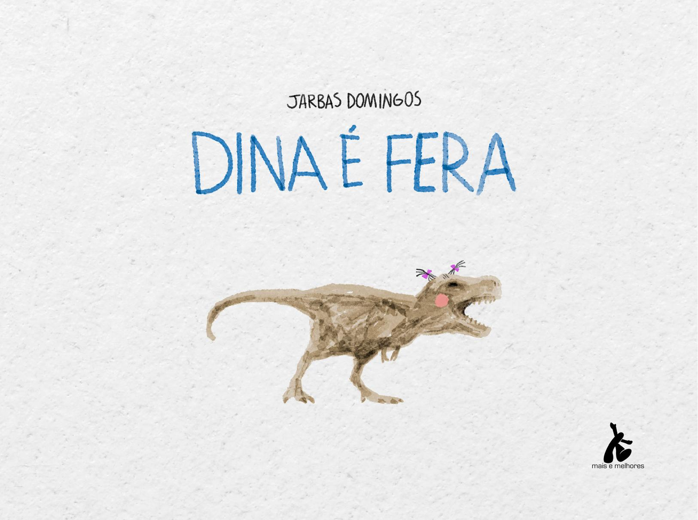

[Página 1]

---

[Página 2]

---

[Página 3]
DEDICO ESTE LIVRO A VOCÊ QUE TEM LIMITE.
QUE ÀS VEZES ATÉ DESISTE,
MAS QUERENDO SEGUIR EM FRENTE.
ESTE LIVRO É PARA VOCÊ,
QUE DOS OUTROS É DIFERENTE.
DEDICO A TODO O MUNDO,
POIS ASSIM É TODA GENTE.

---

[Página 4]
NO BAIRRO JURÁSSICO, NA ESCOLA DO LAGO,
TODO O MUNDO É FERA EM ALGO.

---

[Página 5]
A PEQUENA TIRANOSSAURO CHAMADA DINA
SE DESPEDE DOS PAIS LÁ NA ESQUINA.

---

[Página 6]
PASSOS LENTOS, “ACELERANDO ” O CORAÇÃO,
DINA CAMINHA EM DIREÇÃO AO PORTÃO.

---

[Página 7]
OLHA PARA A FRENTE E RESPIRA FUNDO.
NÃO QUER SER DIFERENTE DE TODO O MUNDO.

---

[Página 8]
NA ESCOLA, CAROLA É FERA EM JOGAR BOLA.
– TENTA, DINA! VAI VER TAMBÉM É SUA SINA.
DOU UM BICUDO E VOCÊ AGARRA COM TUDO.

---

[Página 9]

---

[Página 10]

---

[Página 11]

---

[Página 12]
NA NATAÇÃO, BRONTOSSAULO É CAMPEÃO.
– VEM, DINA! PULA NA PISCINA!
SEM ALVOROÇO. A ÁGUA BATE NO PESCOÇO

---

[Página 13]

---

[Página 14]

---

[Página 15]

---

[Página 16]
DINOEL É MUSICAL. MUITO FERA NO INSTRUMENTAL.
– OI, DINA! QUER TENTAR? MEU VIOLÃO EU POSSO EMPRESTAR.
SE EU POSSO, TU PODES. UMA MÃO NA CORDA, OUTRA NOS ACORDES.

---

[Página 17]

---

[Página 18]

---

[Página 19]

---

[Página 20]
JÁ TRICERATRIZ GOSTA DE AGITAR.
É FERA NA ARTE DE DANÇAR.

---

[Página 21]
– BORA, DINA! VAMOS ARREBENTAR. FAZ IGUAL, TENTA IMITAR!
DOU UM GIRO NO CHÃO E ME EQUILIBRO NUMA SÓ MÃO.

---

[Página 22]

---

[Página 23]

---

[Página 24]
JUSSAURA COM TODA A TERNURA, INCENTIVOU A PINTURA.
EXPLICOU, COM O PINCEL, CADA MOVIMENTO.
DINA, SORRINDO, FINGIU ENTENDIMENTO.

---

[Página 25]

---

[Página 26]

---

[Página 27]
O BRACINHO CURTO NÃO ALCANÇOU A TELA...
SUJOU SUA ROUPINHA DE AQUARELA...

---

[Página 28]
MAIS UM DIA FINDOU NA ESCOLA.
CAROLA GUARDOU A BOLA NA SACOLA.
BRONTOSSAULO, DE ROUPÃO, CORREU PARA A CONDUÇÃO.
DINOEL, COM O VIOLÃO, CANTAROLOU UMA CANÇÃO.

---

[Página 29]
TRICERATRIZ SAIU GIRANDO E PULANDO TODA FELIZ.
JUSSAURA, COM SUA TELA, SE DESPEDIU PELA JANELA.
DINA SEUS PAIS ESPERA, SEM SABER NO QUE É FERA...

---

[Página 30]
A TERRA GIROU PARA O OUTRO LADO
E MAIS UM DIA COMEÇA NA ESCOLA DO LAGO.
DINA CHEGA ACENANDO COM SEU DOCE TCHAU MIÚDO.
MAS A DIFERENÇA NAQUELE DIA ESTAVA EM TUDO.

---

[Página 31]
TODOS DIZEM “BOM DIA” – MAS COM PREOCUPAÇÃO.
NINGUÉM ABRIU A ESCOLA. ESTÁ FECHADO O PORTÃO.
CAIU NO BUEIRO A CHAVE, UMA PEQUENA BRECHA NO CHÃO.

---

[Página 32]
CAROLA USOU VARETA E COLA, MAS FRACASSOU.
BRONTOSSAULO, POR CAUSA DE UM CALO, SUA VEZ PASSOU.

---

[Página 33]
DINOEL USOU UM CANUDO DE PAPEL, QUE SE MOLHOU.
JUSSAURA, SEM UMA IDEIA CLARA, NÃO ARRISCOU.
TRICERATRIZ, SEMPRE MUITO FELIZ, NÃO SE IMPORTOU.

---

[Página 34]
FOI QUANDO DINA FALOU:
– POSSO TENTAR? MINHAS MÃOS PEQUENAS CONSEGUEM ENTRAR.
COM MUITA CONCENTRAÇÃO, DEITOU NO CHÃO...
RAPIDINHO LEVANTOU, COM A CHAVE NA MÃO.

---

[Página 35]
TODA CONQUISTA ALEGRIA GERA.
NUMA SÓ VOZ GRITAVAM:

DINA É FERA!

E FOI AÍ QUE ELA PERCEBEU ENTÃO
QUE NAQUELA ESCOLA NÃO ERA EXCEÇÃO!

---

[Página 36]
NO FUTEBOL, DINA APRENDEU A CABECEAR.

---

[Página 37]
BATENDO PERNINHAS, CONSEGUIU NADAR.

---

[Página 38]
MUITAS MÚSICAS APRENDEU A CANTAR.

---

[Página 39]
NUM TIPO DE DANÇA, APRENDEU A SAPATEAR.

---

[Página 40]
COM O PINCEL NA BOCA, SOUBE SUA ARTE EXPRESSAR.

---

[Página 41]
MAS FOI EM NÃO DESISTIR E SEMPRE TENTAR
QUE DINA SE TORNOU REALMENTE FERA!

---

[Página 42]
DINA APRENDEU QUE TODO O MUNDO TEM LIMITE.

---

[Página 43]
SE, DE UM JEITO NÃO DÁ, OUTRO JEITO EXISTE.

---

[Página 44]

---

[Página 45]

---

[Página 46]

Jarbas Domingos
www.jarbasdomingos.com

É PAI, CARTUNISTA, ILUSTRADOR, DESIGNER, AUTOR
DE HISTÓRIAS INFANTIS E QUADRINHOS.
TRABALHA COMO ARTISTA GRÁFICO DESDE 1998.
TRABALHOU NA IMPRENSA POR MAIS DE 20 ANOS.  
SEUS TRABALHOS FORAM PREMIADOS EM SALÕES
NACIONAIS E INTERNACIONAIS, COMO O WORLD
PRESS CARTOON, DE PORTUGAL.

---

[Página 47]

---

[Página 48]
ESTA OBRA FOI COMPOSTA EM CALIBRI
E IMPRESSA SOBRE PAPEL CUCHÊ FOSCO 115 G/M²
PARA A MAIS E MELHORES EM 2024.

---

