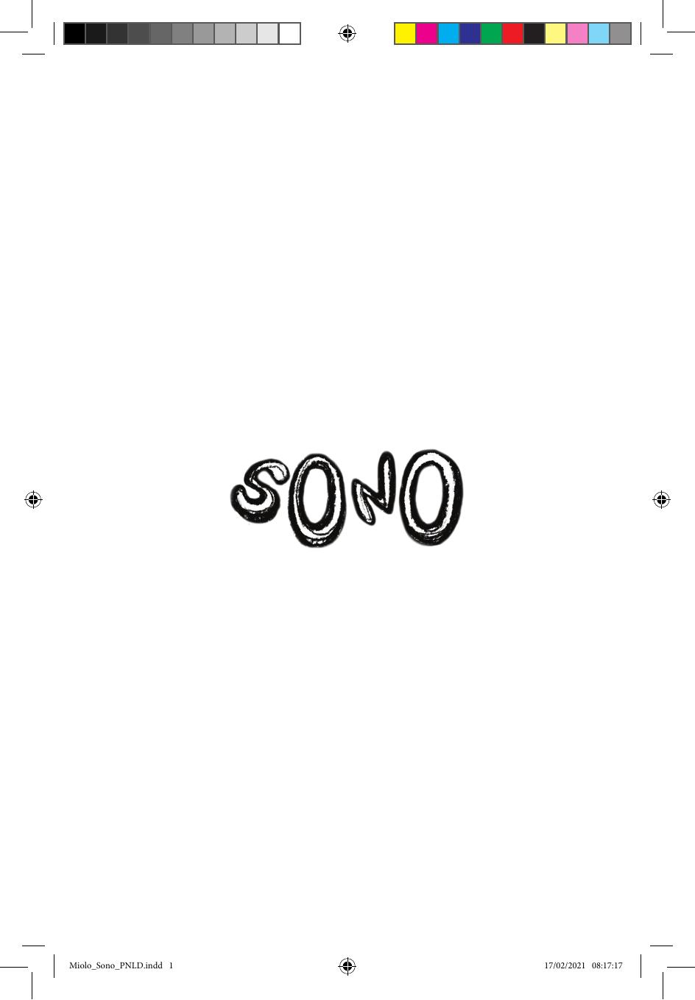

[Página 1]
Miolo_Sono_PNLD.indd 1

17/02/2021 08:17:17



---

[Página 2]
Miolo_Sono_PNLD.indd 2

17/02/2021 08:17:17



---

[Página 3]
Miolo_Sono_PNLD.indd 3

17/02/2021 08:17:18



---

[Página 4]
Copyright © 2021 Luciana Romão
2a edição
Gestão editorial
Gestão comercial
Gestão administrativa
Projeto gráfico e diagramação
Revisão

Fábia Alvim
Rochelle Mateika
Felipe Augusto Neves Silva
Matheus de Sá
Júlia M. Apolinari

Dados Internacionais de Catalogação na Publicação
(CIP) de acordo com ISBD
R761s

Romão, Luciana

Sono / Luciana Romão ; ilustrado por Luciana Romão.
- 2. ed. - São Paulo, SP : Saíra Editorial, 2021.
40 p. : il. ; 13,5cm x 20,5cm.
ISBN: 978-65-86236-13-2
1. Literatura infantil. I. Título.
CDD 028.5
CDU 82-93

2021-437

Elaborado por Odilio Hilario Moreira Junior - CRB-8/9949
Índice para catálogo sistemático:
1.
Literatura infantil 028.5
2. Literatura infantil 82-93

Todos os direitos reservados à
Saíra Editorial
Rua Doutor Samuel Porto, 396
04054-010 - Vila da Saúde, São Paulo, SP
Tel.: (11) 5594 0601/(11) 9 5967 2453
www.sairaeditorial.com.br
editorial@sairaeditorial.com.br

Miolo_Sono_PNLD.indd 4

17/02/2021 08:17:24



---

[Página 5]
PARA GUTO MOJICA E MAURÍCIO MICOSSI:
SEM A AJUDA DE VOCÊS, ESTE LIVRO AINDA
ESTARIA ESCONDIDO NA GAVETA.

Miolo_Sono_PNLD.indd 5

17/02/2021 08:17:29



---

[Página 6]
Miolo_Sono_PNLD.indd 6

17/02/2021 08:17:43



---

[Página 7]
Miolo_Sono_PNLD.indd 7

17/02/2021 08:17:56



---

[Página 8]
Miolo_Sono_PNLD.indd 8

17/02/2021 08:18:13



---

[Página 9]
Miolo_Sono_PNLD.indd 9

17/02/2021 08:18:25



---

[Página 10]
Miolo_Sono_PNLD.indd 10

17/02/2021 08:18:39



---

[Página 11]
Miolo_Sono_PNLD.indd 11

17/02/2021 08:18:50



---

[Página 12]
Miolo_Sono_PNLD.indd 12

17/02/2021 08:19:07



---

[Página 13]
Miolo_Sono_PNLD.indd 13

17/02/2021 08:19:19



---

[Página 14]
Miolo_Sono_PNLD.indd 14

17/02/2021 08:19:35



---

[Página 15]
Miolo_Sono_PNLD.indd 15

17/02/2021 08:19:53



---

[Página 16]
Miolo_Sono_PNLD.indd 16

17/02/2021 08:20:07



---

[Página 17]
Miolo_Sono_PNLD.indd 17

17/02/2021 08:20:21



---

[Página 18]
Miolo_Sono_PNLD.indd 18

17/02/2021 08:20:35



---

[Página 19]
Miolo_Sono_PNLD.indd 19

17/02/2021 08:20:47



---

[Página 20]
Miolo_Sono_PNLD.indd 20

17/02/2021 08:21:03



---

[Página 21]
Miolo_Sono_PNLD.indd 21

17/02/2021 08:21:19



---

[Página 22]
Miolo_Sono_PNLD.indd 22

17/02/2021 08:21:35



---

[Página 23]
Miolo_Sono_PNLD.indd 23

17/02/2021 08:21:49



---

[Página 24]
Miolo_Sono_PNLD.indd 24

17/02/2021 08:22:02



---

[Página 25]
Miolo_Sono_PNLD.indd 25

17/02/2021 08:22:17



---

[Página 26]
Miolo_Sono_PNLD.indd 26

17/02/2021 08:22:31



---

[Página 27]
Miolo_Sono_PNLD.indd 27

17/02/2021 08:22:42



---

[Página 28]
Miolo_Sono_PNLD.indd 28

17/02/2021 08:22:43



---

[Página 29]
Miolo_Sono_PNLD.indd 29

17/02/2021 08:22:43



---

[Página 30]
Miolo_Sono_PNLD.indd 30

17/02/2021 08:22:54



---

[Página 31]
Miolo_Sono_PNLD.indd 31

17/02/2021 08:23:06



---

[Página 32]
Miolo_Sono_PNLD.indd 32

17/02/2021 08:23:19



---

[Página 33]
Miolo_Sono_PNLD.indd 33

17/02/2021 08:23:32



---

[Página 34]
Miolo_Sono_PNLD.indd 34

17/02/2021 08:23:46



---

[Página 35]
Miolo_Sono_PNLD.indd 35

17/02/2021 08:23:59



---

[Página 36]
Miolo_Sono_PNLD.indd 36

17/02/2021 08:24:14



---

[Página 37]
Miolo_Sono_PNLD.indd 37

17/02/2021 08:24:28



---

[Página 38]
SOBRE A AUTORA
LUCIANA ROMÃO NASCEU E VIVEU BOA PARTE
DA VIDA EM SÃO PAULO. DESDE CRIANÇA,
GOSTA DE LER E DE RABISCAR SEUS CADERNOS,
O QUE A LEVOU A ESCOLHER A FACULDADE
DE ARQUITETURA E URBANISMO (FAU-USP)
PARA FORMAÇÃO PROFISSIONAL. TÍMIDA E
INTROSPECTIVA, GOSTA DE EXPRESSAR SEUS
SENTIMENTOS EM TEXTOS E ILUSTRAÇÕES.
INSEGURA E PERFECCIONISTA, SABE QUE
TEM UM LONGO CAMINHO DE ESTUDOS E
EXPERIMENTAÇÕES PELA FRENTE. TEIMOSA,
NÃO VAI ABRIR MÃO DO DIREITO À ARTE,
AO ERRO, ÀS REFORMULAÇÕES CONSTANTES,
AO PENSAMENTO LIVRE E ÀS IDEIAS MAIS
RADICAIS DE SOLIDARIEDADE EM SUA VIVÊNCIA
COTIDIANA NO MUNDO. ALÉM DE ILUSTRADORA,
ATUALMENTE TRABALHA COM EDUCAÇÃO NÃO
FORMAL EM ARTES E TECNOLOGIAS.

Miolo_Sono_PNLD.indd 38

17/02/2021 08:24:34



---

[Página 39]
Miolo_Sono_PNLD.indd 39

17/02/2021 08:24:41



---

[Página 40]
Letras manuscritas pela autora
Impressão em offset pela Grafnorte
Papel couché fosco 80 g/m2
Saíra Editorial
fevereiro de 2021

Miolo_Sono_PNLD.indd 40

17/02/2021 08:24:47



---

