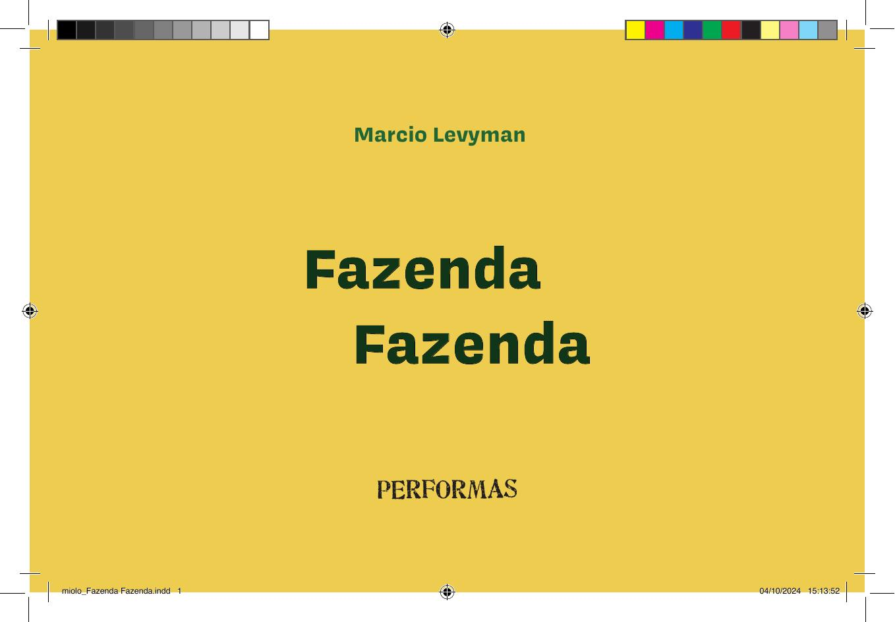

[Página 1]
Marcio Levyman

Fazenda
Fazenda

miolo_Fazenda Fazenda.indd 1

26/08/2024 10:28:54



---

[Página 2]
Copyright do texto e das ilustrações © 2022 Marcio Levyman
Direção e curadoria
Gestão editorial
Diagramação
Revisão

Todos os direitos reservados à Saíra Editorial
@sairaeditorial

Fábia Alvim
Felipe Augusto Neves Silva
Luisa Marcelino
Túlia Hortela

Dados Internacionais de Catalogação na Publicação (CIP)
de acordo com ISBD
L668f

/sairaeditorial

www.sairaeditorial.com.br
Rua Doutor Samuel Porto, 411
Vila da Saúde – 04054-010 – São Paulo, SP

Levyman, Marcio

Fazenda fazenda / Marcio Levyman ; ilustrado por Marcio
Levyman. - São Paulo, SP : Saíra Editorial, 2022.
24 p. : il. ; 20,5cm x 13,5cm.
ISBN: 978-65-86236-82-8
1. Literatura infantil. I. Título.

2022-3715

CDD 028.5
CDU 82-93

Elaborado por Vagner Rodolfo da Silva - CRB-8/9410
Índice para catálogo sistemático:
1. Literatura infantil 028.5
2. Literatura infantil 82-93

miolo_Fazenda Fazenda.indd 2-3

Para a inesquecível Fanny Abramovich, professora e parceira,
que leu, viu e insistiu para que essa Fazenda um dia virasse um livro.
Para a querida Cecilia Zioni, que ajudou a plantar
a primeira semente dessa Fazenda na Folhinha de S.Paulo.

26/08/2024 10:28:54



---

[Página 3]
Eram duas vezes
uma fazenda.

miolo_Fazenda Fazenda.indd 4-5

Fazenda onde tudo era duplo,
inclusive o nome.

26/08/2024 10:28:59



---

[Página 4]
Para se chegar até lá
era preciso andar duas vezes mais

porque a estrada de terra
dobrava em todas as curvas.

miolo_Fazenda Fazenda.indd 6-7

26/08/2024 10:29:02



---

[Página 5]
A casa tinha dois telhados,
duas entradas, duas saídas

miolo_Fazenda Fazenda.indd 9

e ainda por cima dois donos
que nela moravam duas vezes.

26/08/2024 10:29:04



---

[Página 6]
Na plantação nascia tudo em dobro. De cada semente, que era
dupla, nasciam sempre dois pés que cresciam duas vezes mais.

miolo_Fazenda Fazenda.indd 11

O espantalho espantava
duplamente.

26/08/2024 10:29:07



---

[Página 7]
Todas as árvores tinham dois troncos, duas copas
e faziam duas vezes mais sombra.

O rio eram dois.
Um que subia
e outro que descia.

miolo_Fazenda Fazenda.indd 13

26/08/2024 10:29:10



---

[Página 8]
As galinhas tinham dois bicos e quatro asas.
Botavam o dobro dos ovos,

de onde vinham sempre dois pintinhos.
Por sua vez, o galo acordava todo mundo duas vezes.

miolo_Fazenda Fazenda.indd 14-15

26/08/2024 10:29:13



---

[Página 9]
Nos porcos, com dois focinhos e dois rabos,
cada rabo era enrolado de um lado.

Tirar o leite da vaca era trabalho dobrado.
Cada litro, na verdade, eram dois.
miolo_Fazenda Fazenda.indd 17

26/08/2024 10:29:15



---

[Página 10]
Porque o sol era duplo, fazia duas vezes
mais calor durante o dia, que era duas
vezes mais longo.
E até as nuvens eram duplas. Quando chovia,
era chuva dobrada caindo duas vezes naquela
fazenda que era o dobro dela mesma.

miolo_Fazenda Fazenda.indd 19

26/08/2024 10:29:18



---

[Página 11]
Marcio Levyman nasceu em São Paulo. Tem formação em Arquitetura,
mas sempre atuou como artista gráfico e ilustrador. Participou de diversas
exposições individuais e coletivas. Transitou pela fotografia, pelo desenho
de humor, pela colagem e pela produção de materiais gráficos e objetos
inusitados. Utiliza técnicas como o desenho a nanquim, a colagem em papéis,
tecidos e texturas, os carimbos e as intervenções digitais. Colabora como
ilustrador em livros infantojuvenis, projetos didáticos, jornais e revistas.

miolo_Fazenda Fazenda.indd 21

26/08/2024 10:29:19



---

[Página 12]
O texto que compõe este livro foi publicado, originalmente, na Folha de
S.Paulo, na Folhinha, em novembro de 1984. Naquela época, Marcio Levyman
colaborava no jornal com cartuns e tiras para os pequenos leitores.

“Fui leitor da Folhinha quando criança e, muitos anos depois, este
foi o meu primeiro texto publicado. A ilustração que fiz para a
publicação tentava sintetizar tudo em uma só imagem.”
Marcio Levyman.

miolo_Fazenda Fazenda.indd 22-23

26/08/2024 10:29:19



---

[Página 13]
Esta obra foi composta em Presley Slab e Covik Sans
e impressa em offset sobre papel couché fosco 150 g/m²
para a Saíra Editorial em 2022

miolo_Fazenda Fazenda.indd 24

26/08/2024 10:29:19



---

