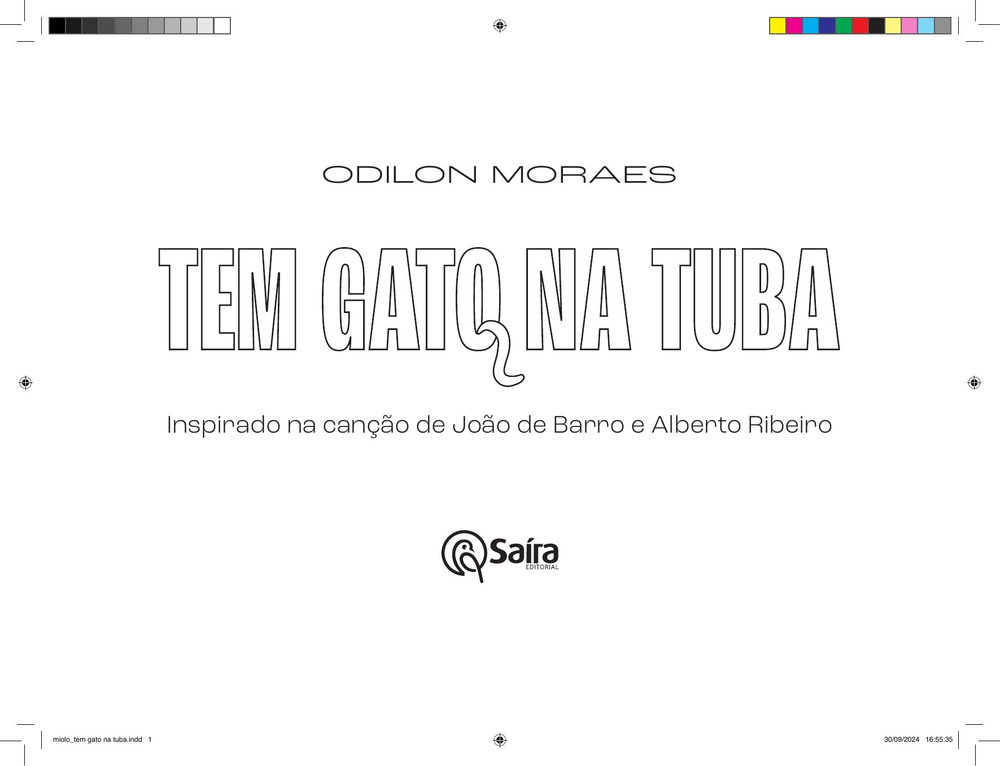

[Página 1]
TEM GATO NA TUBA

De ODILON MORAES
Inspirado na canção de João de Barro e Alberto Ribeiro

---

[Página 2]

---

[Página 3]
Para minha mãe e meu pai, que me cantaram
e encantaram com Braguinha.

---

[Página 4]

---

[Página 5]
Todo domingo…

---

[Página 6]
havia banda

---

[Página 7]

---

[Página 8]
no coreto do jardim.

---

[Página 9]

---

[Página 10]

---

[Página 11]
E já de longe

---

[Página 12]
a gente ouvia

---

[Página 13]

---

[Página 14]

---

[Página 15]
a tuba do Serafim.

---

[Página 16]
Porém um dia

---

[Página 17]

---

[Página 18]
entrou um gato

---

[Página 19]

---

[Página 20]
na tuba do Serafim.

---

[Página 21]

---

[Página 22]
E o resultado

---

[Página 23]

---

[Página 24]
dessa melódia

---

[Página 25]

---

[Página 26]

---

[Página 27]
foi que a tuba tocou assim:

---

[Página 28]
PUM

---

[Página 29]

PUM PUM

---

[Página 30]

---

[Página 31]

MIAUUU!!!

---

[Página 32]

PUM PU RU

---

[Página 33]

RUM PUM PUM!

---

[Página 34]

---

[Página 35]

MIAUUU!!!

---

[Página 36]

PUM

---

[Página 37]

PUM PUM

---

[Página 38]

---

[Página 39]

MIAUUU!!!

---

[Página 40]

PUM PU RU

---

[Página 41]

RUM PUM PUM!!

---

[Página 42]

---

[Página 43]

---

[Página 44]

---

[Página 45]
Miau…

---

[Página 46]
Quem foram João de Barro e Alberto Ribeiro?
Carlos Alberto Braga, conhecido também
como Braguinha ou João de Barro, nasceu
no Rio de Janeiro em 1907 e viveu até 2006.
Ainda em sua mocidade, quando estudava no Colégio Batista no Rio de Janeiro,
conheceu o violonista Henrique Brito, que
lhe despertou o interesse pela música. Motivado, ele organizou, em 1928, um grupo musical inicialmente chamado “Flor do tempo”,
que depois foi rebatizado como “Bando dos
tangarás”. Nele, teve entre seus companheiros Noel Rosa e Henrique Foréis Domingues
(mais conhecido como Almirante).
Depois de uma breve carreira como
cantor, Braguinha decidiu se dedicar à
composição e criou clássicos da música
feita no Brasil. Uma de suas mais famosas
composições foi “Carinhoso”, letra que foi
complementada por uma melodia composta por Pixinguinha. Estabeleceu ali uma parceria com um dos mais importantes músicos brasileiros.
As parcerias, aliás, ficaram famosas
dentro da história da música. Trata-se de
uma prática em que duas ou mais pessoas
criam músicas juntas. O mais comum é

que alguém faça a letra da música e outra
pessoa faça a melodia, mas isso não é uma
regra. Existem diversos tipos de parceria,
que variam também quanto ao número de
participantes.
Braguinha teve alguns parceiros, como
Antônio Almeida e Alcir Pires Vermelho,
mas seu companheiro musical mais constante foi Alberto Ribeiro, que viveu entre
1902 e 1971. Juntos, os dois criaram os sucessos “Fon-fon”, “Chiquita Bacana”, “Copacabana”, “Fim de semana em Paquetá”, além
da divertida “Tem gato na tuba”. Também
fizeram juntos muitas marchinhas juninas
e de carnaval que até hoje são cantadas e
relembradas nas festas pelo país.
Braguinha e Alberto Ribeiro tiveram,
além das parcerias, outra característica
comum: ambos realizaram em suas vidas
várias atividades. Braguinha trabalhou inventando argumentos, produzindo e compondo para muitos filmes, como “Alô, alô
Brasil”, “Banana da terra” e “Laranja da China”. Foi também diretor artístico da gravadora Columbia e um dos responsáveis pela
criação dos famosos “disquinhos coloridos”,

em que suas adaptações e criações de
histórias infantis fizeram enorme sucesso,
atingindo a marca de mais de cinco milhões
de cópias vendidas em 1976.
Alberto foi compositor, mas também
poeta, cantor e, durante dez anos, diretor
da União Brasileira de Compositores. Além
disso, como médico homeopata, foi reconhecido por exercer a profissão de maneira generosa e abnegada.
A consagração carnavalesca de Braguinha aconteceu em 1984, no ano da inauguração do sambódromo do Rio de Janeiro. A
escola de samba carioca “Estação primeira
de Mangueira” apresentou o samba-enredo
“Yes, nós temos Braguinha”, prestando reverência ao grande carnavalesco João de
Barro e indiretamente ao seu mais constante parceiro, Alberto Ribeiro.
Antes disso, no Maracanã, Braguinha e
Alberto receberam uma de suas maiores
aclamações, quando, espontaneamente,
milhares de pessoas cantaram a composição da dupla “Touradas em Madri” após a
vitória do time brasileiro sobre a esquadra
espanhola na Copa do Mundo de 1950.

---

[Página 47]
Quem é Odilon Moraes?
Odilon Moraes nasceu em São Paulo no ano de 1966 e logo foi com
a família para o interior do estado, onde passou sua infância e sua
adolescência. Retornou à capital para estudar e formou-se arquiteto na Universidade de São Paulo, mas, ainda no meio do curso,
já havia escolhido construir livros ao invés de casas.
Tornou- se ilustrador e posteriormente começou também a
escrever e ilustrar algumas de suas obras. Recebeu quatro prêmios Jabuti (em 1994, 2009, 2016 e 2017) por suas ilustrações e,
como autor de textos e imagens, recebeu por três vezes o prêmio “Melhor livro do ano para crianças”, em 2003, 2005 e 2018,
dado pela FNLIJ.
Dizendo ter se apaixonado por livros ilustrados, passou a escrever e dar aulas sobre a história e a poética desses objetos.
Odilon costuma comparar as sequências de imagens de um livro
ilustrado à melodia de uma canção, sendo as duas responsáveis
por trazer para a palavra não só uma ambientação, mas principalmente um ritmo.

Tem gato na tuba
Todo domingo havia banda
no coreto do jardim
e já de longe a gente ouvia
a tuba do Serafim…
Porém um dia entrou um gato
na tuba do Serafim…
E o resultado dessa melódia
foi que a tuba tocou assim:
pum… pum… pum… (miau)
pum pu ru rum pum pum (miau)
pum… pum… pum… (miau)
pum pu ru rum pum pum
João de Barro & Alberto Ribeiro

---

[Página 48]
Esta obra foi composta em Roc Grotesk
e impressa sobre papel cuchê fosco 115 g/m2
para a Saíra Editorial em 2024.

---

