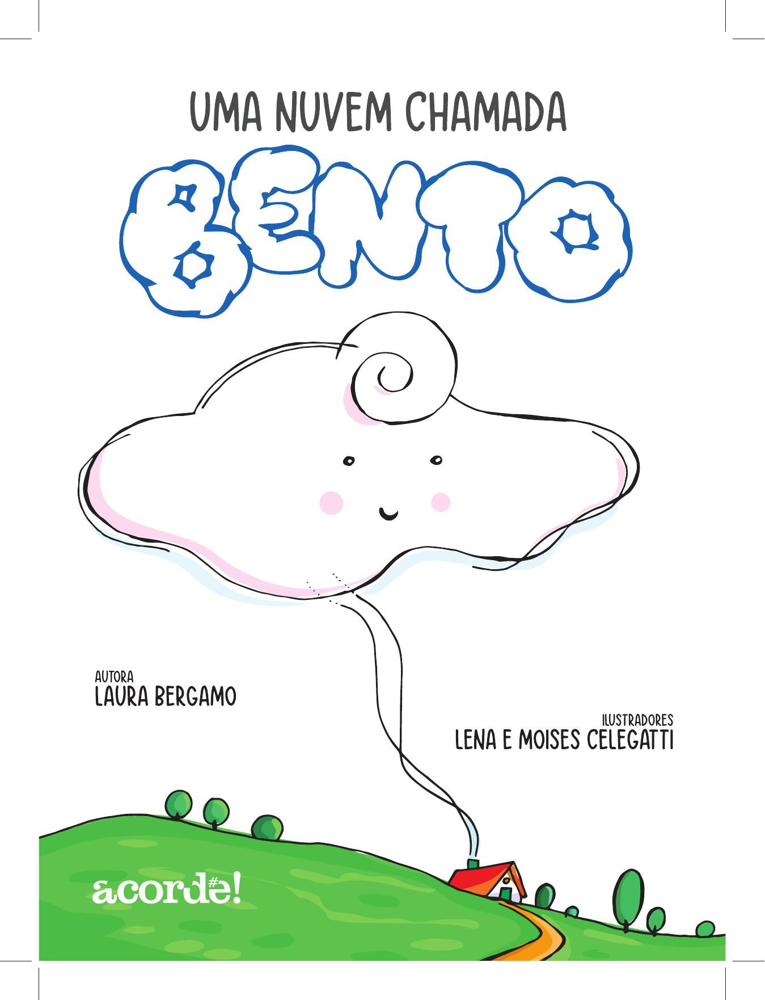

[Página 1]

---

[Página 2]

---

[Página 3]
ESTA É A HISTÓRIA DE ALGUÉM MUITO ESPECIAL. PARA SER MAIS ESPECÍFICA, DE UMA NUVEM. O BENTO.

ESTE É O BENTO. ELE VIVE NO CÉU COM AS ESTRELAS, OS COMETAS, OS PLANETAS E O SOL.
E, É CLARO, COM SUA FAMÍLIA.

---

[Página 4]
CADA FAMÍLIA É DE UM JEITO.
A DO BENTO TEM MÃE, PAI, AVÓS, TIOS, PRIMOS E CINCO IRMÃOS: MIGUEL, CLARA, JOANA, ANTÔNIO E BRUNO.

BENTO É O CAÇULA.
POR AINDA SER PEQUENO, TEM UM SEGREDO QUE ELE AINDA NÃO DESCOBRIU...

---

[Página 5]
...QUE ELE É A NUVEM DE ALGUÉM!
VOCÊ SABIA QUE PARA CADA PESSOA EXISTEM
UMA NUVEM E UMA ESTRELA?
BENTO É A NUVEM DO PEDRO.

AH, ENTENDI! VOCÊS ESTÃO QUERENDO
SABER QUEM É O PEDRO, NÉ?

PEDRO
ELE AMA A MACARRONADA DO VOVÔ.

---

[Página 6]
SABE O QUE ELE TAMBÉM AMA?
DEITAR NA GRAMA E FICAR OLHANDO AS NUVENS BRANCAS
E GORDINHAS PASSEANDO PELO CÉU AZUL.

---

[Página 7]
UM DIA, COMEÇOU A CAIR O MAIOR TORÓ. A MÃE DO PEDRO PEDIU PRA ELE
ENTRAR EM CASA. E LÁ FOI ELE, CARREGANDO OS PREGADORES
COLORIDOS ENQUANTO ELA RECOLHIA A ROUPA.

---

[Página 8]
LÁ DE CIMA, BENTO OBSERVAVA TUDO, CHORANDO.
SUA MÃE PERGUNTOU:
- POR QUE VOCÊ ESTÁ CHORANDO, FILHO?

---

[Página 9]
BENTO, TRISTONHO, RESPONDEU:
- EU QUERIA SER UM MENINO, MAMÃE. CORRER,
BRINCAR E FICAR DEITADO NO VERDE.

A MÃE PERGUNTOU:
-SABE POR QUE ELE FICA DEITADO NO VERDE, FILHO?

---

[Página 10]
A MÃE EXPLICOU QUE O MENINO DEITAVA NO VERDE PARA ADMIRAR BENTO,
PORQUE BENTO ERA A NUVEM DELE.
EXPLICOU O SEGREDO: CADA NUVEM TEM UMA CRIANÇA.
QUANDO VOCÊ CHORA, O CÉU ESCURECE E CHOVE.
E MUITOS MENINOS PRECISAM ENTRAR EM CASA.

---

[Página 11]
- QUANDO VOCÊ SORRI, O CÉU ESTÁ AZUL E ELE PODE ADMIRAR VOCÊ.
BENTO FICOU FELIZ. MESMO DE LONGE, ALGUÉM GOSTAVA TANTO DELE!

---

[Página 12]
ENTÃO BENTO FICOU BRINCANDO DE CRIAR FORMAS PARA
PEDRO ADMIRAR: LEÕES, PUDINS, ASTRONAUTAS
E ATÉ DINOSSAUROS.

---

[Página 13]
BENTO SE SENTIA ESPECIAL, COMO
TODOS SÃO ESPECIAIS E TÊM UM LUGAR
DETERMINADO NO UNIVERSO.

---

[Página 14]
DAQUELE DIA EM DIANTE, BENTO NÃO CHORAVA POR ESTAR TRISTE,
PORQUE ELE TINHA APRENDIDO COMO ERA UMA PEÇA IMPORTANTE
PARA UM QUEBRA-CABEÇA GIGANTE CHAMADO MUNDO...

---

[Página 15]
BENTO SÓ CHOVIA QUANDO A NATUREZA PEDIA. E ATÉ FAZIA ARCO-ÍRIS COM O SOL.

SÓ PARA VER PEDRO SORRIR.

---

[Página 16]
Desde 1979 unidos na arte e no amor. Um casal que ilustra
com o coração. Seus trabalhos, tanto em livros quanto com
alunos, são de pura alegria. Primeiro foram seus filhos que
conheceram o mundo da arte. Agora, já são seus dois netos
que fazem arte com eles. Para Lena e Moises, cada dia é uma
oportunidade de deixar o mundo mais bonito e colorido. Você
pode conhecer mais sobre eles no Instagram
@lenamoisescelegatti.

é jornalista e paulistana. a inspiração dos livros infantis
sempre fez parte de sua vida, seja ouvindo histórias quando
criança, ou contando histórias para crianças em um hospital
de são paulo. “uma nuvem chamada bento” foi uma história
que chegou durante um sonho e agora é realidade.

---

