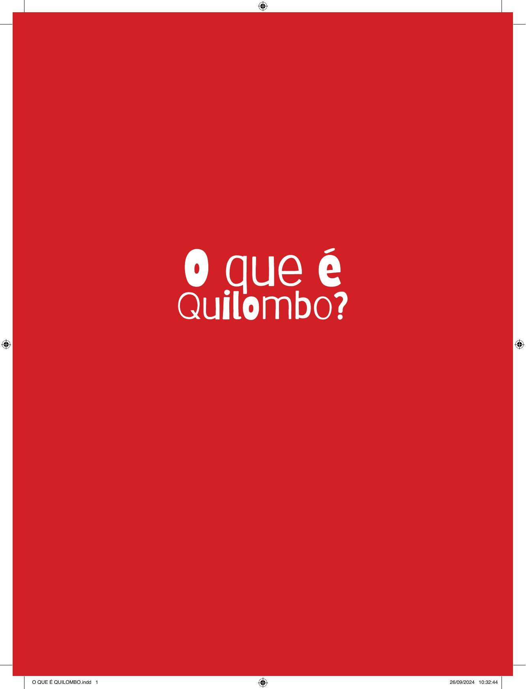

[Página 1]
O que é quilombo?

De Cássia dos Santos 

Ilustrações de Aline Beatriz Alves

---

[Página 2]

---

[Página 3]
NO BRASIL EXISTIU ESCRAVIDÃO.

---

[Página 4]

---

[Página 5]
ESCRAVIDÃO É QUANDO UMA PESSOA É OBRIGADA A
TRABALHAR PARA OUTRA SEM RECEBER NADA EM TROCA
E SEM PODER ESCAPAR. É MUITO TRISTE…
NO BRASIL, OS PRIMEIROS ESCRAVIZADOS FORAM
OS POVOS INDÍGENAS. QUE TAMBÉM SÃO CHAMADOS
DE POVOS ORIGINÁRIOS.
ORIGINÁRIOS

---

[Página 6]
MAS LOGO OS PORTUGUESES COMEÇARAM
A TRAZER ESCRAVIZADOS DE VÁRIOS
LUGARES DA ÁFRICA
ÁFRICA.

---

[Página 7]
MUITOS DESSES AFRICANOS MORRIAM

---

[Página 8]

---

[Página 9]
NA ESCRAVIDÃO, OS AFRICANOS SOFRIAM MUITO. FICAVAM
PRESOS EM SENZALAS E ERAM CASTIGADOS POR QUALQUER
MOTIVO. FOI UM TEMPO MUITO TRISTE DA NOSSA HISTÓRIA.

---

[Página 10]
MAS OS ESCRAVIZADOS LUTAVAM POR SUA
LIBERDADE. FUGIAM E IAM SE REFUGIAR NOS
QUILOMBOS, COMUNIDADES QUE FICAVAM EM
QUILOMBOS
LUGARES ESCONDIDOS.

---

[Página 11]
MUITOS INDÍGENAS AJUDAVAM OS NEGROS A SE
ESCONDER E VIVIAM COM ELES NOS QUILOMBOS.

---

[Página 12]
QUILOMBO É UMA TERRA ONDE A CULTURA
DESSAS PESSOAS FOI PRESERVADA.

---

[Página 13]
E ONDE PUDERAM RECUPERAR SUA
LIBERDADE E SEREM FELIZES.

---

[Página 14]
MAS TAMBÉM É UMA TERRA DE
RESISTÊNCIA CONTRA QUALQUER
TIPO DE OPRESSÃO.

---

[Página 15]
ALGUNS QUILOMBOS DESAPARECERAM, MAS
MUITOS RESISTEM/EXISTEM ATÉ HOJE,
MANTENDO SUAS TRADIÇÕES.

---

[Página 16]
E NÃO FICAM SEMPRE LÁ LONGE,
HÁ VÁRIOS QUILOMBOS DENTRO
DAS CIDADES!

---

[Página 17]
OS QUILOMBOS SÃO COMUNIDADES,
E QUEM MORA NELES É CHAMADO
DE QUILOMBOLA
QUILOMBOLA.

---

[Página 18]

---

[Página 19]

NO QUILOMBO, AS PESSOAS MAIS
VELHAS CONTAM HISTÓRIAS E ENSINAM
RITMOS E DANÇAS: CAPOEIRA E LUNDU,
MAZURCA E JONGO…
A GENTE APRENDE MUITA COISA
VIVENDO EM CULTURAS QUILOMBOLAS.

---

[Página 20]

Ô GENTE, NASCI NA ANGOLA
ANGOLA QUE ME CRIOU,
EU SOU NETO DE
MOÇAMBIQUE, Ô GENTE...
EU SOU NEGRO SIM SINHÔ.

---

[Página 21]

CADA QUILOMBO É UMA MISTURA
DE VÁRIAS CULTURAS AFRICANAS E
INDÍGENAS. E CULTURA É TUDO O
QUE NÓS SOMOS: CONHECIMENTOS,
HÁBITOS E CRENÇAS.

---

[Página 22]

CHAMAMOS DE TRADIÇÃO A SOMA DE VÁRIOS
CONHECIMENTOS QUE PASSAMOS PARA AS
PRÓXIMAS GERAÇÕES.

---

[Página 23]

COMO A RELIGIÃO E A COMIDA DE NOSSOS
AVÓS, UMA HISTÓRIA GUARDADA COM
CARINHO E O CHEIRO DE PÃO QUENTINHO.

---

[Página 24]

---

[Página 25]

FAMÍLIAS QUILOMBOLAS OCUPAM
TERRITÓRIOS BRASILEIROS HÁ SÉCULOS.

---

[Página 26]

OS QUILOMBOLAS CULTIVAM E PRESERVAM
A NATUREZA
NATUREZA, CUIDANDO DELA.

---

---

[Página 28]

CADA QUILOMBO É UM
PEDACINHO DE NOSSA HISTÓRIA,
CONHECIMENTOS QUE PRECISAMOS
APRENDER PARA PASSAR ADIANTE.

---

---

[Página 30]

CÁSSIA DOS SANTOS É CIENTISTA NEGRA BRASILEIRA
E ESCREVE PARA TODOS OS PÚBLICOS. ELA INVESTIGA
UMA OBRA MUITO IMPORTANTE CHAMADA GRANDE
SERTÃO: VEREDAS, QUE TEM PALAVRAS CRIATIVAS
DEMAIS, UM UNIVERSO MUITO CURIOSO E CHEIO DE
MAGIA! É UMA OBRA ENORME, RICA EM AVENTURAS…
QUANDO ERA CRIANÇA SONHAVA EM SER GENTE
GRANDE, AGORA QUE É GENTE GRANDE SONHA EM
PODER COMPARTILHAR SUAS PESQUISAS COM O
MUNDO INTEIRINHO… OU APENAS UMA PARTE DELE.
ALÉM DE SER CIENTISTA, É MÃE DE UM GATO MUITO
FOFO E GRANDE, O FREDERICO.

---

[Página 31]

ALINE BEATRIZ ALVES
DESDE PEQUENINA AMAVA PICOTAR PAPÉIS,
DESENHAR PINTAR, INVENTAR HISTÓRIAS E
CANTAR. CRESCI E ESCOLHI O DESENHO E A
PINTURA COMO COMPANHEIROS DE VIDA E OS
COMPARTILHO COM MEU FILHO ARTHUR, QUE AMA
DESENHAR E TOCAR GUITARRA. GOSTAMOS DE
JOGAR XADREZ, ASSISTIR FILMES, OUVIR MÚSICAS
E DIVIDIMOS NOSSA CASA COM A GATINHA
TANGERINA, QUE UM DIA APARECEU EM NOSSA
CASA E DESDE ENTÃO RESOLVEU NOS ADOTAR.

---

[Página 32]

---

