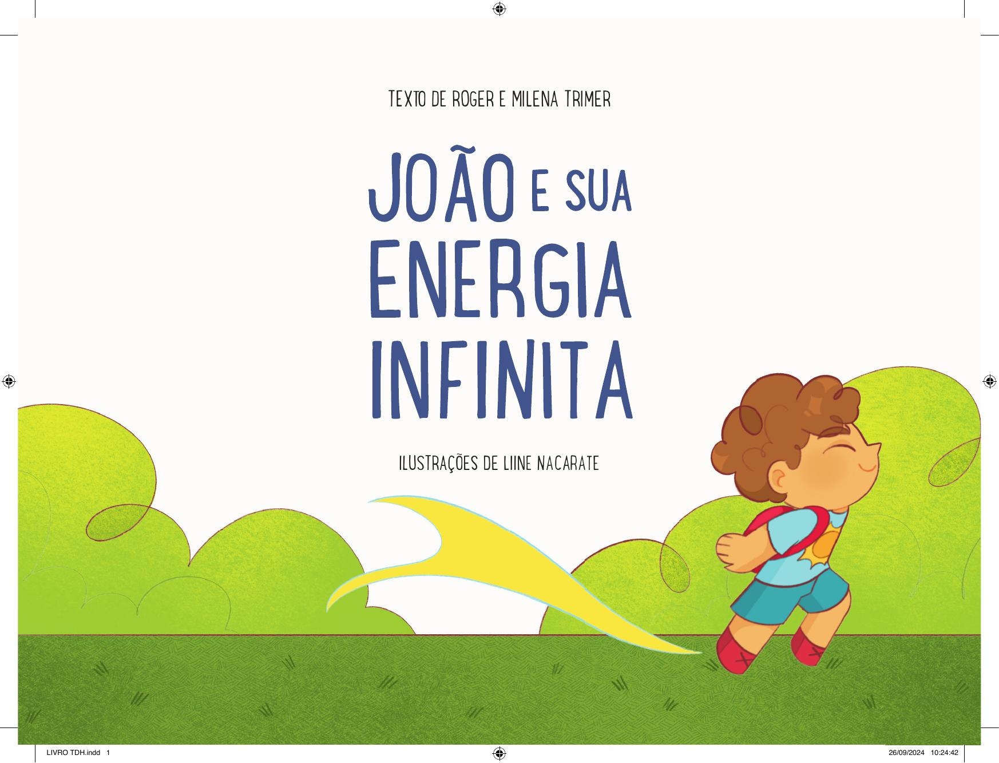

[Página 1]

JOÃO E SUA ENERGIA INFINITA

DE ROGER E MILENA TRIMER
ILUSTRAÇÕES DE LIINE NACARATE

---

[Página 2]

---

[Página 3]

VOCÊ SABIA QUE EXISTEM PESSOAS
QUE PENSAM DIFERENTE DAS OUTRAS?
SÃO AS PESSOAS QUE TÊM TDAH.

---

[Página 4]

ESTE É O JOÃO. OS PAIS DELE O
CHAMAM DE JOÃO FURACÃO,
POIS POR ONDE ELE PASSA TUDO
VIRA UMA BAGUNÇA!

---

[Página 5]

---

[Página 6]

---

[Página 7]

JOÃO É MUITO ALEGRE E CHEIO DE ENERGIA.
VIVE TROPEÇANDO NAS COISAS, MAS NEM LIGA!
ADORA BRINCAR, CORRER E PULAR. TEM TANTOS
PENSAMENTOS E IDEIAS QUE DIZ QUE SUA CABEÇA
É UM PARQUE DE DIVERSÕES!

---

[Página 8]

COM ESSA ENERGIA TODA,
JOÃO NÃO PRESTA ATENÇÃO NAS AULAS
E NÃO TERMINA SUAS TAREFAS.

---

[Página 9]

---

[Página 10]

ELE É UM MENINO LEGAL E GOSTA
DA PROFESSORA, MAS NÃO
CONSEGUE FICAR PARADO...

---

[Página 11]

---

[Página 12]

JOÃO NASCEU COM TDAH, O QUE
QUER DIZER QUE ELE FUNCIONA
DE MANEIRA DIFERENTE. NEM
MELHOR, NEM PIOR:
SÓ DIFERENTE!

---

[Página 13]

---

[Página 14]

MAS ENTÃO COMO VAI SER?
ELE NÃO VAI CONSEGUIR APRENDER?
NÃO VAI CRESCER E TER UMA PROFISSÃO,
COMO PROFESSOR, MÉDICO OU BOMBEIRO?

---

[Página 15]

---

[Página 16]

---

[Página 17]

IMAGINA, É CLARO QUE VAI! OS PAIS DO JOÃO
PEDIRAM AJUDA A MÉDICOS E PSICÓLOGOS PARA
APRENDER COMO AJUDÁ-LO.

---

[Página 18]

FOI ENTÃO QUE JOÃO COMEÇOU A
FAZER TERAPIA, QUE É COMO IR AO
MÉDICO, SÓ QUE MAIS LEGAL.

---

[Página 19]

---

[Página 20]

---

[Página 21]

COM A TERAPIA, JOÃO PASSOU A SE LEMBRAR
MAIS DAS COISAS, TROPEÇAR MENOS E TER
MAIS FOCO NA ESCOLA. NAS PAUSAS,
VIVA O EXCESSO DE ENERGIA!

---

[Página 22]

NA ESCOLA, A PROFESSORA DO
JOÃO DECIDIU CRIAR ATIVIDADES
DIFERENTES PARA O JOÃO USAR
SUA ENERGIA. E SABE O QUE
ACONTECEU?
OS AMIGOS BRIGAM PARA TER O
JOÃO NO GRUPO, POIS ELE É O
MAIS ANIMADO!

---

[Página 23]

---

[Página 24]

AGORA, A PROFESSORA FAZ PEQUENAS PAUSAS, PARA O
JOÃO LEVANTAR, PULAR E GASTAR UM POUCO DE ENERGIA.
DEPOIS DAS PAUSAS, O JOÃO VOLTA TODO CALMO
E CONCENTRADO.

---

[Página 25]

---

[Página 26]

OS PAIS DO JOÃO VIRAM QUE O TDAH
NÃO ERA UM PROBLEMÃO.
QUANDO A PROFESSORA MUDOU UMAS
COISAS, JOÃO CONSEGUIU APRENDER
MUITO E AINDA SE DIVERTIR.

---

[Página 27]

---

[Página 28]

CRIANÇAS COM TDAH CONSEGUEM
APRENDER E TÊM SENTIMENTOS.
ELAS SÓ PRECISAM DE APOIO E RESPEITO
PARA ALCANÇAR SEU POTENCIAL.

---

[Página 29]

---

[Página 30]

MILENA TRIMER
EDUCADORA DE CARTEIRINHA E ETERNA FÃ DAS DIFERENÇAS. ACHO QUE CADA
ALUNO TEM SEU SUPERPODER, E MEU TRABALHO É AJUDAR A DESCOBRIR! MORO
COM MINHA FILHA, UMA TERAPEUTA DE QUATRO PATAS CHAMADA BÁRBARA (UM
SRD CHEIO DE ATITUDE) E A VERDADEIRA DONA DA CASA: BATUTA, MEU
PORQUINHO-DA-ÍNDIA. ENTRE ENSINAR E APRENDER, ME PERGUNTO SE NÃO DEVERIA
SER HEROÍNA DE QUADRINHOS!

ROGER TRIMER
SEMPRE GOSTEI MUITO DE LER LIVROS E QUADRINHOS E SEMPRE QUIS TRABALHAR
COM LIVROS. VIREI EDITOR, QUE É A PESSOA QUE PEGA O TEXTO DO AUTOR E
TRANSFORMA EM UM LIVRO DE VERDADE. DEPOIS DE FAZER TANTOS LIVROS,
ACABEI TENDO A IDEIA DE SER EU MESMO AUTOR, E GOSTEI MUITO. MORO COM
MINHA FILHA, UM BULDOGUE E QUATRO TARTARUGAS.

---

[Página 31]

LIINE NACARATE
LIINE NACARATE NASCEU EM 26 DE ABRIL DE 1998 EM RIO PRETO/MG.
SEMPRE AMOU DESENHAR E ENCONTROU NA ILUSTRAÇÃO UMA FORMA DE
DAR VIDA A SUA IMAGINAÇÃO. HOJE EM DIA BUSCA FAZER O MESMO PARA
AS OUTRAS PESSOAS, ILUSTRANDO AS HISTÓRIAS MÁGICAS DOS OUTROS.

---

[Página 32]

---

