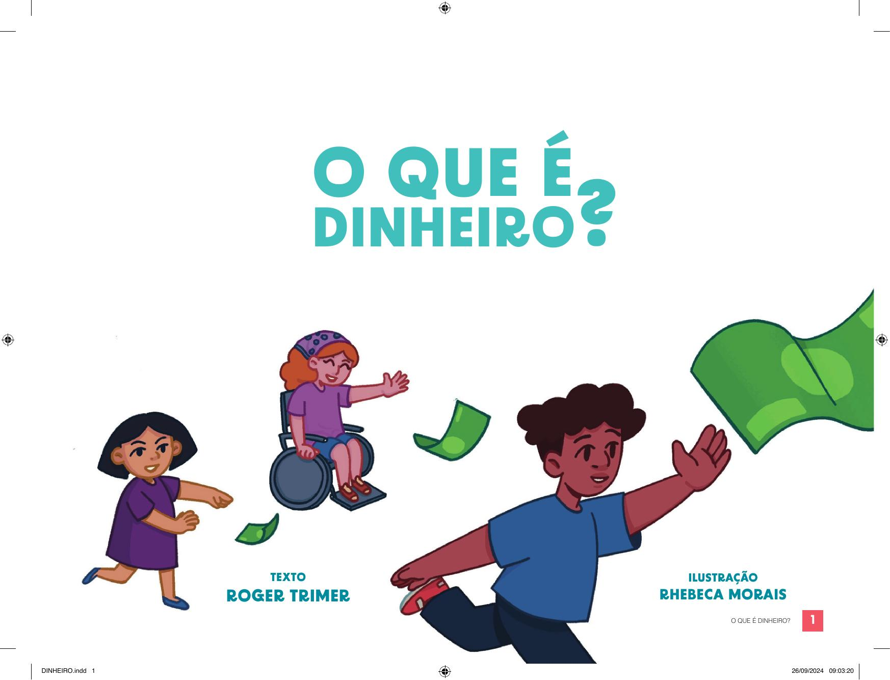

[Página 1]

O QUE É
DINHEIRO?

De
ROGER TRIMER

Com ILUSTRAÇÕEs de 

RHEBECA MORAIS

---

[Página 2]

---

[Página 3]

A GENTE USA DINHEIRO PARA
TROCAR POR COISAS QUE A
GENTE QUER.
SE A GENTE TEM DINHEIRO,
PODE TROCAR POR COMIDA,
BRINQUEDOS, SERVIÇOS E
DIVERSÃO.

---

[Página 4]

---

[Página 5]

GENTE GRANDE TROCA SEU TRABALHO POR
DINHEIRO E DEPOIS TROCA O DINHEIRO
PELO TRABALHO DOS OUTROS OU POR
PRODUTOS QUE OS OUTROS TÊM.

---

[Página 6]

---

[Página 7]

HÁ VÁRIAS FORMAS DE DINHEIRO: DE METAL, DE PAPEL E
ATÉ DIGITAL. MAS NEM SEMPRE FOI ASSIM. ANTES DE O
DINHEIRO EXISTIR, AS PESSOAS TROCAVAM UM PRODUTO
ESCAMBO.
PELO OUTRO – ERA O ESCAMBO

---
[Página 8]

NEM SEMPRE A TROCA ERA JUSTA...
ERA DIFÍCIL TROCAR FEIJÃO POR UM PEIXE!

---

[Página 9]

CADA PEIXE VALE UM SACO DE FEIJÃO, MAS ÀS
VEZES QUEM TEM FEIJÃO PARA TROCAR NEM GOSTA
DE PEIXE! E AGORA?

---

[Página 10]

E TINHA OUTRO PROBLEMA. SE TEM POUCO PEIXE
E MUITO FEIJÃO, O PESCADOR VAI QUERER MAIS
FEIJÃO POR CADA PEIXE; MAS SE A PESCA FOI BOA E
A COLHEITA FOI FRACA, O FAZENDEIRO VAI QUERER
MAIS PEIXE PELO SEU FEIJÃO.

---

[Página 11]

---

[Página 12]

---

[Página 13]

ISSO SE CHAMA PREÇO, E O PREÇO VARIA. UM DIA UM SACO DE FEIJÃO
VALE DOIS PEIXES, ÀS VEZES UM PEIXE VALE DOIS SACOS DE FEIJÃO.
ASSIM, QUANDO TODO O MUNDO QUER UM PRODUTO, O PREÇO SOBE;
SE NINGUÉM QUER, O PREÇO CAI.

---

[Página 14]

FOI PARA AJUDAR NESSAS TROCAS, QUE SE CHAMAM COMÉRCIO
COMÉRCIO, QUE CRIAMOS
MOEDAS. ATÉ HOJE, CHAMAMOS O DINHEIRO DE
O DINHEIRO, NA FORMA DE MOEDAS
CADA PAÍS DE MOEDA, MESMO QUE ELE SEJA EM PAPEL.

---

[Página 15]

---

[Página 16]

---

[Página 17]

MAS MOEDAS PESAM NO BOLSO E
OCUPAM MUITO ESPAÇO. POR ISSO,
LOGO SURGIU O DINHEIRO DE PAPEL.

---

[Página 18]

---

[Página 19]

E HOJE O DINHEIRO TAMBÉM É VIRTUAL,
PODEMOS PAGAR AS COISAS COM CARTÃO DE
CRÉDITO E ATÉ COM O CELULAR!
COM QUALQUER TIPO DE DINHEIRO, A TROCA
FICA MAIS FÁCIL E JUSTA.

---

[Página 20]

SE UMA PESSOA COMPRA UM
LANCHE QUE CUSTA R$5,00 E
DÁ UMA NOTA DE R$10,00, O
VENDEDOR LHE DEVOLVE R$5,00.
ESSE É O TROCO!

---

[Página 21]

MAS O QUE FAZEMOS COM O
TROCO? É MELHOR GASTAR OU
GUARDAR?
PODEMOS COMPRAR ALGUMAS
BALAS... OU JUNTAR COM O TROCO
DE OUTROS DIAS PARA COMPRAR
ALGO MAIS LEGAL!

---

[Página 22]

ISSO SE CHAMA POUPAR
POUPAR.
GUARDAMOS HOJE PARA
GARANTIR O FUTURO.

---

[Página 23]

MAS ONDE É SEGURO
GUARDAR DINHEIRO? EM CASA,
DEBAIXO DO COLCHÃO?
---

[Página 24]

---

[Página 25]

NÃO, DINHEIRO FICA NO BANCO. NÃO O DE JARDIM, MAS UM
PRÉDIO GRANDE ONDE TODO MUNDO GUARDA SEU DINHEIRO.
ALI, ELE VAI SE ACUMULANDO, CRESCENDO, ATÉ A GENTE PODER
COMPRAR ALGO MAIS IMPORTANTE!

---

[Página 26]

ALGUMAS PESSOAS TÊM MUITO
DINHEIRO, MAS OUTRAS TÊM
POUCO, PRINCIPALMENTE AS QUE
NÃO TIVERAM OPORTUNIDADE
DE ESTUDAR.

---

[Página 27]

---

[Página 28]

QUANDO UMA PESSOA TEM DINHEIRO,
É POSSÍVEL INVESTIR
INVESTIR. ABRIR UMA
LOJINHA, UM RESTAURANTE, PARA
PODER GANHAR UM POUCO MAIS.

---

[Página 29]

E O INVESTIMENTO MAIS SEGURO
É EM EDUCAÇÃO
EDUCAÇÃO. QUANDO SE
ESTUDA BASTANTE, É POSSÍVEL
GANHAR MAIS DINHEIRO E TER
UMA VIDA MELHOR!

---

[Página 30]

---

[Página 31]

AGORA QUE APRENDEU O QUE É DINHEIRO,
APRENDA A USÁ-LO COM SABEDORIA, NUNCA
GASTE MAIS DO QUE PODE!

---

[Página 32]

Sobre ROGER TRIMER:

SEMPRE GOSTEI MUITO DE LER
LIVROS E QUADRINHOS E SEMPRE
QUIS TRABALHAR COM LIVROS.
VIREI EDITOR, QUE É A PESSOA
QUE PEGA O TEXTO DO AUTOR
E TRANSFORMA EM UM LIVRO
DE VERDADE. DEPOIS DE FAZER
TANTOS LIVROS, ACABEI TENDO A
IDEIA DE SER EU MESMO AUTOR,
E GOSTEI MUITO. MORO COM
MINHA FILHA, UM BULDOGUE E
QUATRO TARTARUGAS.

Sobre RHEBECA MORAIS:

EU AMAVA RABISCAR E PINTAR
QUANDO CRIANÇA MAS PAREI
QUANDO FUI CRESCENDO POR
PENSAR QUE NÃO DAVA PRA
VIVER DE DESENHAR. QUANDO
VIREI ADULTA DESCOBRI QUE EU
PODERIA TRABALHAR COM ARTE,
CONTANDO HISTORIAS E CRIANDO
QUADRINHOS! ENTÃO RESOLVI
TENTAR. HOJE EU TAMBÉM
TRABALHO COM VIDEOGAMES, E
AMO O QUE FAÇO.

---

