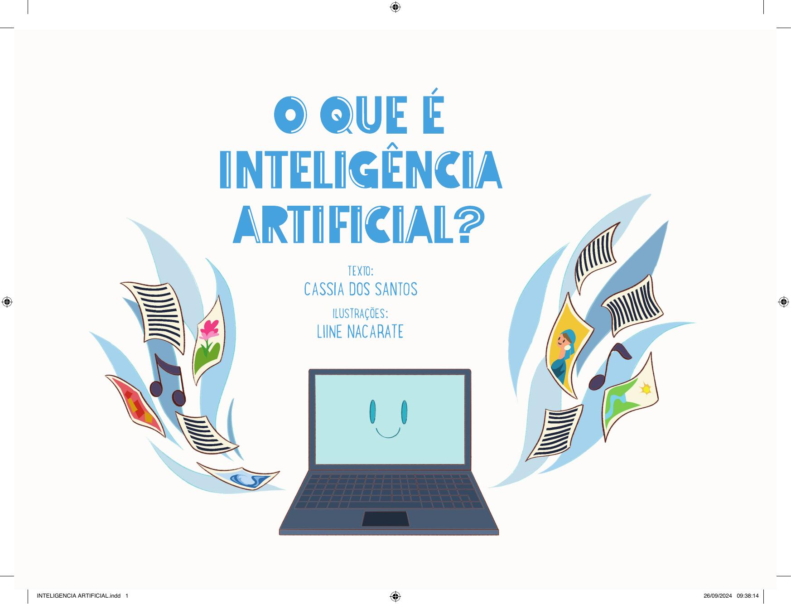

[Página 1]

De Cássia dos Santos
Com Ilustrações de Liine Nacarate

---
[Página 2]

---

[Página 3]

VOCÊ JÁ OUVIU FALAR DE INTELIGÊNCIA
ARTIFICIAL? O QUE SERÁ ISSO? ALGUM
APARELHO QUE NOS DEIXA MAIS
INTELIGENTES?

---

[Página 4]

NADA DISSO! INTELIGÊNCIA ARTIFICIAL
É UM PROGRAMA DE COMPUTADOR
QUE APRENDE COM O QUE
ENSINAMOS PARA ELE.

---

[Página 5]

PARA FACILITAR, A GENTE O CHAMA DE
IA, QUE SÃO AS PRIMEIRAS LETRAS DE
INTELIGÊNCIA E ARTIFICIAL.

---

[Página 6]

A IA NÃO “PENSA” DE VERDADE, MAS
FAZ AS COISAS TÃO RÁPIDO QUE É COMO
SE PENSASSE.

---

[Página 7]

---

[Página 8]

---

[Página 9]

COM ESSA RAPIDEZ TODA, A IA PODE
CONVERSAR COM VOCÊ COMO SE FOSSE
UMA PESSOA.
ELA RESPONDE A QUALQUER PERGUNTA QUE
VOCÊ FIZER E DÁ ATÉ OPINIÕES!

---

[Página 10]

EXISTEM MUITOS TIPOS DE IA, CADA UMA COM
SUAS HABILIDADES ESPECIAIS.
ALGUMAS CONTROLAM CARROS QUE ANDAM
SOZINHOS, SEM MOTORISTA!

---

[Página 11]

---

[Página 12]

OUTRAS AJUDAM TRADUZIR
O QUE A GENTE FALA, PARA
CONVERSAR COM PESSOAS
NO MUNDO TODO...

---

[Página 13]

---

[Página 14]

ELA AJUDA MÉDICOS A IDENTIFICAR DOENÇAS...

---

[Página 15]

...E PROFESSORES A DAR AULAS MELHORES.

---

[Página 16]

---

[Página 17]

COM A IA, PODEMOS FAZER COISAS INCRÍVEIS, COMO
EXPLORAR O ESPAÇO E IDENTIFICAR COMETAS E ASTEROIDES.

---

[Página 18]

ELA AJUDA A PREVER AS
MUDANÇAS NO CLIMA E
OS PROBLEMAS NO MEIO
AMBIENTE.

---

[Página 19]

---

[Página 20]

---

[Página 21]

ELA PODE ATÉ FAZER DESENHOS E PINTURAS,
MAS NÃO FICAM TÃO BONS COMO OS DE
ARTISTAS DE VERDADE. SÃO IMITAÇÕES DE
IMAGENS QUE JÁ EXISTEM.

---

[Página 22]

A IA TAMBÉM ESCREVE HISTÓRIAS E POEMAS IMITANDO O
ESTILO DE QUALQUER ESCRITOR.
MAS É COMO OS DESENHOS, NÃO FICAM ASSIM TÃO BONS...

---

[Página 23]

---

[Página 24]

A IA ESTÁ NO SEU DIA A DIA, MESMO
QUE VOCÊ NÃO PERCEBA.
NO CELULAR, NO COMPUTADOR, NA
TV E ATÉ NOS SEUS BRINQUEDOS, A IA
PODE ESTAR ESCONDIDA!

---

[Página 25]

---

[Página 26]

---

[Página 27]

MAS SERÁ QUE AS MÁQUINAS UM DIA
VÃO SUBSTITUIR OS HUMANOS?

---

[Página 28]

NÃO SE PREOCUPE, SÓ O CÉREBRO HUMANO
É CAPAZ DE SENTIR, AMAR E CRIAR.

---

[Página 29]

---

[Página 30]

---

[Página 31]

FOMOS NÓS QUE CRIAMOS A IA PARA ELA
NOS AJUDAR A SERMOS MAIS CRIATIVOS E A
CONSTRUIR UM MUNDO MELHOR!

---

[Página 32]

CÁSSIA DOS SANTOS É CIENTISTA NEGRA BRASILEIRA E ESCREVE PARA TODOS OS
PÚBLICOS. ELA INVESTIGA UMA OBRA MUITO IMPORTANTE CHAMADA GRANDE
SERTÃO: VEREDAS, QUE TEM PALAVRAS CRIATIVAS DEMAIS, UM UNIVERSO MUITO
CURIOSO E CHEIO DE MAGIA! É UMA OBRA ENORME, RICA EM AVENTURAS…
QUANDO ERA CRIANÇA SONHAVA EM SER GENTE GRANDE, AGORA QUE É GENTE
GRANDE SONHA EM PODER COMPARTILHAR SUAS PESQUISAS COM O MUNDO
INTEIRINHO… OU APENAS UMA PARTE DELE. ALÉM DE SER CIENTISTA, É MÃE DE UM
GATO MUITO FOFO E GRANDE, O FREDERICO.

LIINE NACARATE NASCEU EM 26 DE ABRIL DE 1998 EM RIO PRETO/MG. SEMPRE
AMOU DESENHAR E ENCONTROU NA ILUSTRAÇÃO UMA FORMA DE DAR VIDA A SUA
IMAGINAÇÃO. HOJE EM DIA BUSCA FAZER O MESMO PARA AS OUTRAS PESSOAS,
ILUSTRANDO AS HISTÓRIAS MÁGICAS DOS OUTROS.

---

