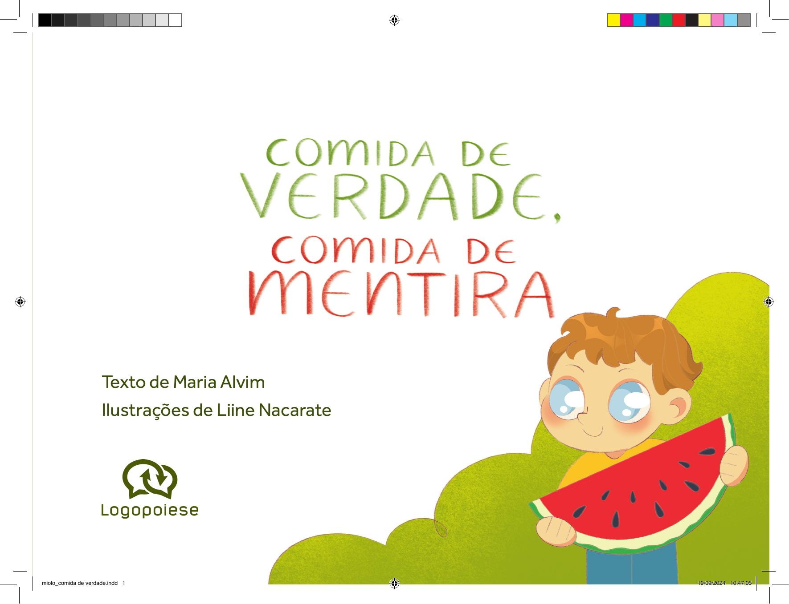

[Página 1]

Comida de verdade, comida de mentira

Texto de Maria Alvim
Ilustrações de Liine Nacarate

---

[Página 2]

---

[Página 3]

Comer bem é muito importante!

---

[Página 4]

Quando comemos, ganhamos energia.
Quando brincamos, corremos ou fazemos
outras atividades, gastamos energia.

---

[Página 5]

---

[Página 6]

Mas o que importa não é só a quantidade de energia que
ganhamos ou gastamos. Também precisamos saber quais
são os melhores alimentos para a nossa saúde.

---

[Página 7]

---

[Página 8]

É importante saber que existem muitos
produtos por aí que imitam comida,
mas não são comida de verdade.

---

[Página 9]

---

[Página 10]

Os alimentos que vêm diretamente das plantas e
dos animais são os melhores. Eles são chamados de
alimentos in natura. É o caso das frutas, dos legumes,
do ovo e do leite.

---

[Página 11]

---

[Página 12]

Outros alimentos
são chamados
de ingredientes
culinários.

---

[Página 13]

Eles devem ser
usados em pequenas
quantidades para
fazermos receitas
gostosas. Açúcar,
óleo e sal são alguns
exemplos.

---

[Página 14]

Existem, ainda, os alimentos
processados, feitos para
durarem mais tempo.

---

[Página 15]

São feitos de alimentos in natura
com sal e açúcar adicionados, por
exemplo. Pão da padaria, queijo e
geleia são alimentos processados.

---

[Página 16]

E, por fim, existem os ultraprocessados. Seu nome é difícil,
e eles NÃO SÃO UMA BOA ESCOLHA na hora de comer.

---

[Página 17]

Eles têm muitos INGREDIENTES ESQUISITOS e FAZEM MUITO MAL.
São ultraprocessados os biscoitos, o refrigerante, o presunto...

---

[Página 18]

O milho que comemos cozido,
na espiga, é COMIDA DE VERDADE.

---

[Página 19]

Mas o salgadinho de
milho, vendido no
pacotinho, é COMIDA
DE MENTIRA.

---

[Página 20]

A banana é uma fruta deliciosa!
Comida de verdade!

---

[Página 21]

Mas e a bala com
sabor de banana?

É comida de mentira!

---

[Página 22]

O leite é comida de verdade.

---

[Página 23]

Mas o leite com chocolate
que vem dentro da caixinha
é comida de mentira.

---

[Página 24]

A comida de mentira está em muitos lugares.
É muito fácil encontrar esses alimentos.

---

[Página 25]

Mas comer comida de verdade
sempre será MAIS SAUDÁVEL.

---

[Página 26]

A propaganda pode ser
um perigo. Nela, a comida
de mentira muitas vezes
parece a melhor opção.

ME COMPRE!

---

[Página 27]

MAS NÃO É!

---

[Página 28]

Aí vão algumas dicas importantes.
Coma sempre em boa companhia!

---

[Página 29]

Coma sentado à mesa!
Coma sempre atento e tranquilo!

---

[Página 30]

Sobre a autora

Maria Alvim é uma cientista que há alguns anos faz
pesquisas sobre o consumo de alimentos. Ela trabalha
na Universidade de São Paulo junto aos pesquisadores
que criaram o conceito de alimentos ultraprocessados e
descobriram que esses produtos fazem muito mal para
a saúde. Maria acredita, piamente, que todas as pessoas
devem ter acesso a comidas saudáveis e gostosas que
estejam de acordo com a cultura de cada um.

---

[Página 31]

Sobre a ilustradora

Liine Nacarate nasceu em 26 de abril de 1998 na cidade
de Rio Preto, em Minas Gerais. Sempre amou desenhar
e encontrou na ilustração uma forma de dar vida a
sua imaginação. Em 2022, foi uma das vencedoras
do concurso de pratos do Spoleto com a ilustração
Koi. Encontrou nos livros infantis sua motivação para
continuar desenhando. Ela pode ser encontrada no
Instagram: @liinenacarate. Tem também uma página no
Behance: https://www.behance.net/liinenacarate.

---

[Página 32]

Esta obra foi composta em Effra
e impressa sobre papel cuchê fosco 115 g/m²
para a Logopoiese em 2024.

---

