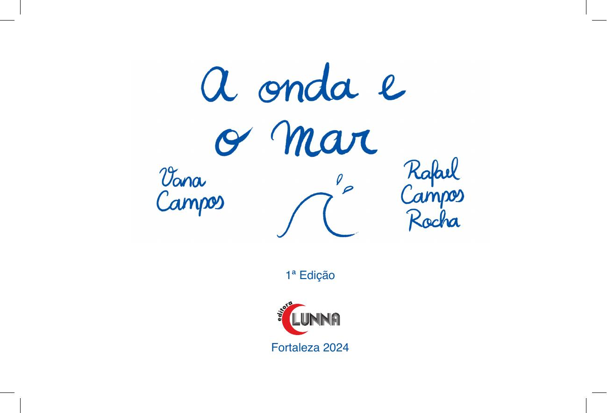

[Página 1]

A onda e o mar

De Vana Campos

Com ilustração de
Rafael Campos Rocha

1ª Edição
Fortaleza 2024

Editora Lunna

---

[Página 2]

---

[Página 3]

A ONDA E O MAR

---

[Página 4]

---

[Página 5]

---

[Página 6]

ONDULADA ONDA

---

[Página 7]

ANDA BRANDA

---

[Página 8]

ESPUMA BRANCA

---

[Página 9]

ONDE ANDARÁ?

---

[Página 10]

A ONDA REDONDA

---

[Página 11]

SALTA ALTO

---

[Página 12]

O SOL ALCANÇA

---

[Página 13]

O MAR BALANÇA

---

[Página 14]

ONDA, ALEGRIA DO MAR

---

[Página 15]

VEM ME ABRAÇAR.

---

[Página 16]

ONDA, ALEGRIA DO MAR

---

[Página 17]

VEM ME ABRAÇAR

---

[Página 18]

VOLTA CORRENDO

---

[Página 19]

SUGA O VENTO

---

[Página 20]

PARECE QUE ENCOLHE

---

[Página 21]

ENGOLE O MAR

---

[Página 22]

ONDA, ALEGRIA DO MAR

---

[Página 23]

VEM ME VISITAR

---

[Página 24]

ONDA, ALEGRIA DO MAR

---

[Página 25]

VEM ME VISITAR

---

[Página 26]

A LUA VAI MUDAR

---

[Página 27]

A ONDA VAI VIRAR

---

[Página 28]

A ONDA E O MAR

---

[Página 29]

A ONDA E O MAR

---

[Página 30]

---

[Página 31]

---

[Página 32]

Esta obra foi composta em Helvética
e impressa em offset 90 g/m2
para a Editora Lunna LTDA.

---

