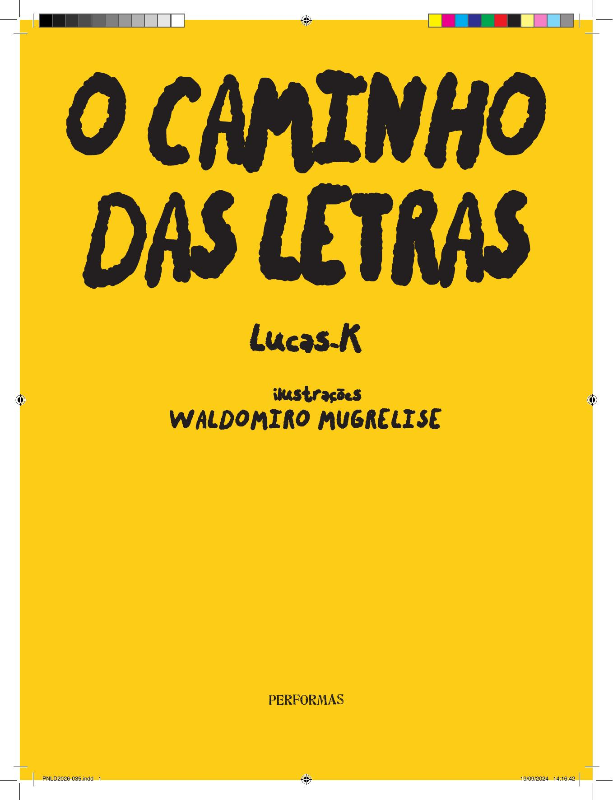

[Página 1]

O CAMINHO DAS LETRAS

DE LUCAS-K

COM ILUSTRAÇÕES DE 
WALDOMIRO MUGRELISE

---

[Página 2]

---

[Página 3]

---

[Página 4]

---

[Página 5]

AS LETRAS SAÍRAM PARA PASSEAR. ONDE AS LETAS FORAM?

---

[Página 6]

---

[Página 7]

A (a)
B (bê)
C (cê)
D (dê)
E (ê)
F (efe)
G (gê)
H (agá)
I (i)
J (jóta)
K (cá)
L (ele)
M (eme)
N (ene)
O (ó)
P (pê)
Q (quê)
R (erre)
S (esse)
T (tê)
U (u)
V (vê)
W (dáblio)
X (xis)
Y (ípsilon)
Z (zê)

---

[Página 8]

"A" FOI ANDAR NA CIDADE, VAMOS ENCONTRÁ-LO?

---

[Página 9]

---

[Página 10]

A CIDADE ESTAVA MUITO BARULHENTA, ENTÃO "B" FOI PASSEAR NA FLORESTA.

---

[Página 11]

---

[Página 12]

"C" GOSTA DE CAMINHAR NAS MONTANHAS. QUAL O CAMINHO?

---

[Página 13]

---

[Página 14]

"D" GOSTA DE VER OS BARQUINHOS, ONDE ELE FOI?

---

[Página 15]

---

[Página 16]

"E" GOSTA DE FICAR NO MEIO DAS ÁRVORES. VOCÊ CONSEGUE VER ONDE ELE ESTÁ?

---

[Página 17]

---

[Página 18]

"F" ESTÁ PERTO DOS TRIÂNGULOS. VAMOS ATÉ LÁ!

---

[Página 19]

---

[Página 20]

"G" DESCEU A MONTANHA ANDANDO. ONDE ELE ESTÁ DESCANSANDO?

---

[Página 21]

---

[Página 22]

"H" ATRAVESSOU A PONTE DOS BARQUINHOS. VAMOS ATRÁS DELA.

---

[Página 23]

---

[Página 24]

VAMOS PASSEAR COM A LETRA "I" PELAS MONTANHAS?

---

[Página 25]

---

[Página 26]

"J" ESTÁ PERTO DA CASA. ONDE ELA ESTÁ?

---

[Página 27]

---

[Página 28]

"K" MORA NO MEIO DA CIDADE. MUITA GENTE MORA LÁ. VAMOS LÁ
BRINCAR COM ELA. 

---

[Página 29]

---

[Página 30]

"L" MORA NA FLORESTA DAS BOLAS. VAMOS LÁ BRINCAR COM ELA?

---

[Página 31]

---

[Página 32]

"M" ESTÁ ESCONDIDA NO LABIRINTO DAS ESCADAS. VAMOS ENCONTRÁ-LA?

---

[Página 33]

---
[Página 34]

"N" QUERIA MUITO BRINCAR NA FLORESTA. VAMOS AJUDAR ELA A NOS ENCONTRAR!

---
[Página 35]

---
[Página 36]

QUE DELÍCIA O SOL DO DIA. VAMOS PASSEAR COM O "O"?

---
[Página 37]

---
[Página 38]

"P" GOSTA DE IR PARA A PRAIA! VAMOS LÁ BRINCAR NO MAR?

---
[Página 39]

---
[Página 40]

"Q" QUER BRINCAR COM O VENTO. VAMOS LÁ BRINCAR TAMBÉM!

---
[Página 41]

---
[Página 42]

NA CIDADE DE "R" TODOS GOSTAM DE DANÇAR. VAMOS LÁ?

---
[Página 43]

---
[Página 44]

"S" GOSTA DE VER ESTRELAS DE NOITE NA FLORESTA. VAMOS LÁ VER TAMBÉM?

---
[Página 45]

---
[Página 46]

"T" MUDOU DE CASA E AGORA VIVE NAS MONTANHAS. ONDE ELA ESTÁ?

---
[Página 47]

---
[Página 48]

"U" GOSTA DE BRINCAR COM PEDRINHAS DA FLORESTA. VAMOS TENTAR TAMBÉM?

---
[Página 49]

---
[Página 50]

O "V" ESTÁ NO MEIO DO CAMINHO. VAMOS NOS ENCONTRAR COM ELE?

---
[Página 51]

---
[Página 52]

"W" ESTÁ MORANDO UM POUCO LONTE. ONDE É SUA CASA?

---
[Página 53]

---
[Página 54]

"Y" MORA EM UMA CIDADE COM PRÉDIOS ENORMES. VAMOS LÁ VISITAR ELA?

---
[Página 55]

---
[Página 56]

VAMOS ACHAR "X" NO MEIO DAS PESSOAS. QUE CAMINHO FAZEMOS?

---
[Página 57]

---
[Página 58]

ESTÁ FICANDO DE NOITE E "Z" QUER IR PARA CASA. VAMOS DORMIR TAMBÉM?

---
[Página 59]

---
[Página 60]

**Lucas-K, nome artístico de Lucas de Mesquita Kröeff, é um artista visual brasileiro. É bacharel em Design pela Universidade Federal de Minas Gerais (UFMG) e em Artes Visuais pela Cambridge School of Arts (Ruskin School), na Inglaterra. Desenvolve trabalhos em uma interface livre entre iniciativas independentes, instituições de arte e editoras. Produz instalações, livros, vídeos e experiências coletivas.**

---
[Página 61]

---
[Página 62]

---
[Página 63]

Página de créditos

---
[Página 64]

---

