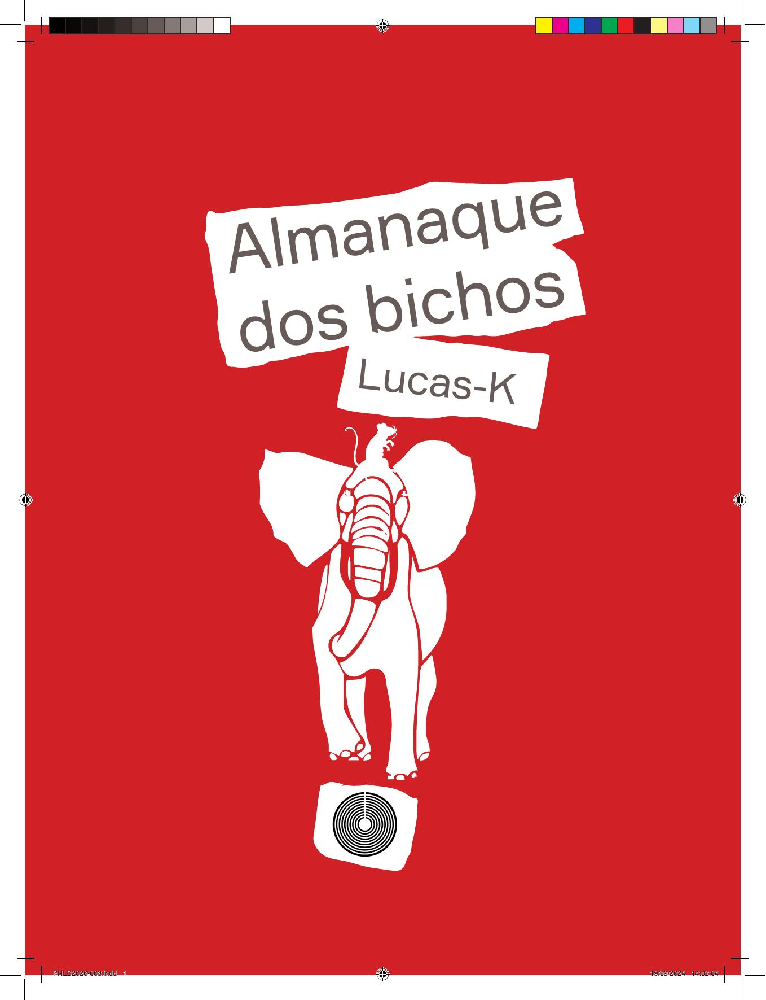

[Página 1]
ALMANAQUE DOS BICHOS

de Lucas-K

---

[Página 2]

---

[Página 3]

---

[Página 4]

A

---

[Página 5]
Aranha

---

[Página 6]

A

---

[Página 7]

---

[Página 8]

B

---

[Página 9]
Borboleta

---

[Página 10]

B

---

[Página 11]

---

[Página 12]

B

---

[Página 13]

---

[Página 14]

B

---

[Página 15]

---

[Página 16]

B

---

[Página 17]

---

[Página 18]
C

---

[Página 19]
Cachorro

---

[Página 20]

C

---

[Página 21]

---

[Página 22]

C

---

[Página 23]

---

[Página 24]
D

---

[Página 25]
Dromedário

---

[Página 26]

D

---

[Página 27]

---

[Página 28]
E

---

[Página 29]
Elefante

---

[Página 30]

E

---

[Página 31]

---

[Página 32]

F

---

[Página 33]
Foca

---

[Página 34]

F

---

[Página 35]

---

[Página 36]
G

---

[Página 37]
Gato

---

[Página 38]

G

---

[Página 39]

---

[Página 40]

G

---

[Página 41]

---

[Página 42]

G

---

[Página 43]

---

[Página 44]
H

---

[Página 45]
Hipopótamo

---

[Página 46]

H

---

[Página 47]

---

[Página 48]

I

---

[Página 49]
Iguana

---

[Página 50]

I

---

[Página 51]

---

[Página 52]

J

---

[Página 53]
Jacaré

---

[Página 54]

J

---

[Página 55]

---

[Página 56]
K

---

[Página 57]
Kiwi

---

[Página 58]

K

---

[Página 59]

---

[Página 60]
L

---

[Página 61]
Leão

---

[Página 62]

L

---

[Página 63]

---

[Página 64]

L

---

[Página 65]

---

[Página 66]
M

---

[Página 67]
Mosquito

---

[Página 68]

M

---

[Página 69]

---

[Página 70]
N

---

[Página 71]
Narval

---

[Página 72]

N

---

[Página 73]

---

[Página 74]
O

---

[Página 75]
Ovelha

---

[Página 76]

O

---

[Página 77]

---

[Página 78]
P

---

[Página 79]
Pavão

---

[Página 80]

P

---

[Página 81]

---

[Página 82]
Q

---

[Página 83]
Quati

---

[Página 84]

Q

---

[Página 85]

---

[Página 86]
R

---

[Página 87]
Rato

---

[Página 88]

R

---

[Página 89]

---

[Página 90]
S

---

[Página 91]
Sardinha

---

[Página 92]

S

---

[Página 93]

---

[Página 94]

S

---

[Página 95]

---

[Página 96]

T

---

[Página 97]
Tartaruga

---

[Página 98]

T

---

[Página 99]

---

[Página 100]
U

---

[Página 101]
Urso

---

[Página 102]

U

---

[Página 103]

---

[Página 104]

U

---

[Página 105]

---

[Página 106]
V

---

[Página 107]
Vaca

---

[Página 108]

V

---

[Página 109]

---

[Página 110]
W

---

[Página 111]
Wallaby

---

[Página 112]

W

---

[Página 113]

---

[Página 114]
X

---

[Página 115]
Xexéu

---

[Página 116]

X

---

[Página 117]

---

[Página 118]
Y

---

[Página 119]
Yak

---

[Página 120]

Y

---

[Página 121]

---

[Página 122]
Z

---

[Página 123]
Zebra

---

[Página 124]

Z

---

[Página 125]

---

[Página 126]

Z

---

[Página 127]

---

[Página 128]
Esta obra foi composta em Formular e Helvetica
e impressa em papel cuchê fosco 115 g/m2
para a editora Allyon.

---

