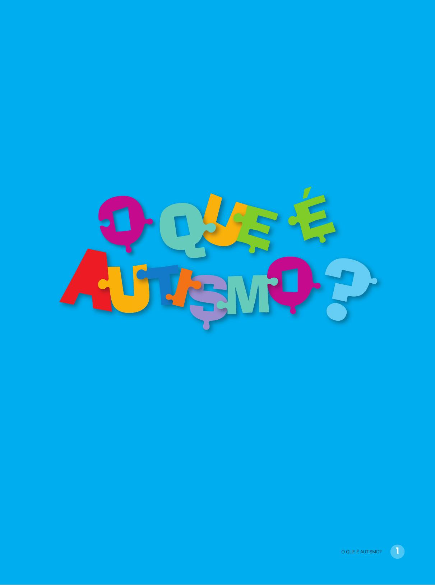

[Página 1]

O QUE É AUTISMO?

De Roger e Milena Trimer
Com ilustrações de Mariline Nacarate Alves

---

[Página 2]

---

[Página 3]
DENTRO DA NOSSA CABEÇA, TEMOS
UM COMPUTADOR MUITO PODEROSO:
NOSSO CÉREBRO.

---

[Página 4]
ALGUNS DESSES COMPUTADORES TÊM UMA
PROGRAMAÇÃO DIFERENTE. SÃO OS QUE ESTÃO
NAS CABEÇAS DAS PESSOAS CHAMADAS
“AUTISTAS”.
AUTISTAS VIVEM, SENTEM E RESPONDEM AO
MUNDO DE UMA FORMA DIFERENTE.

---

[Página 5]

---

[Página 6]
UMA CRIANÇA AUTISTA PODE ACHAR DIFÍCIL FALAR
COM OUTRAS PESSOAS OU BRINCAR COM AMIGOS.
MAS ELES SÃO MUITO SENSÍVEIS.
MUITOS AUTISTAS NÃO SUPORTAM SONS ALTOS,
CHEIROS DIFERENTES, GOSTOS ESTRANHOS,
CORES BRILHANTES. ESSAS COISAS FAZEM OS
AUTISTAS SOFREREM

---

[Página 7]

---

[Página 8]

---

[Página 9]
CRIANÇAS COM AUTISMO PODEM TER DIFICULDADE
EM LIDAR COM AS EMOÇÕES, POIS AINDA ESTÃO
APRENDENDO SOBRE ELAS.
E ELAS SOFREM MUITO SE ALGUMA COISA ACONTECE
DE UM JEITO DIFERENTE DO QUE ESPERAVAM.

---

[Página 10]
POR TUDO ISSO, A CRIANÇA AUTISTA FICA
MUITO SOZINHA, PORQUE NÃO SABE BEM
O QUE FAZER QUANDO ESTÁ COM OUTRAS
CRIANÇAS.
SE VOCÊ CONTAR UMA PIADA PARA UM
AUTISTA, ELE NÃO VAI RIR. NÃO É FALTA
DE EDUCAÇÃO, É SÓ QUE ELE ENTENDE AS
COISAS DE MANEIRA LITERAL.

---

[Página 11]

---

[Página 12]
AS PESSOAS AUTISTAS NASCEM
ASSIM. DESDE BEBÊS ELES SÃO
DIFERENTES, NÃO SE COMUNICAM,
FICAM LÁ NO SEU MUNDINHO.

---

[Página 13]
COM O TEMPO, ELES ATÉ VÃO PARA A ESCOLA E FAZEM
AMIGOS, MAS ISSO OS DEIXA CANSADOS E LOGO BUSCAM
A SEGURANÇA DE SEU MUNDO PARTICULAR.

---

[Página 14]
MUITOS AUTISTAS TÊM DIFICULDADE PARA FALAR
COM AS PESSOAS.

ELES PODEM TER AFLIÇÃO SE ALGUÉM TOCA NELES
E SE INCOMODAM COM BARULHOS ALTOS, LUZES
BRILHANTES E CHEIROS FORTES.

---

[Página 15]

---

[Página 16]
PARA SE ACALMAR, AS CRIANÇAS AUTISTAS FAZEM
MOVIMENTOS REPETITIVOS. BALANÇAM AS MÃOS E O CORPO
PARA A FRENTE E PARA TRÁS.
ESSES MOVIMENTOS FAZEM COM QUE SE SINTAM MELHOR
QUANDO ESTÃO NERVOSOS, MAS TAMBÉM FAZEM ISSO
QUANDO ESTÃO FELIZES.

---

[Página 17]

---

[Página 18]
OUTROS MOVIMENTOS REPETITIVOS DOS AUTISTAS SÃO BATER
PALMAS, ESFREGAR AS MÃOS, PULAR COMO UM CANGURU,
GIRAR COMO UM PIÃO...

---

[Página 19]
QUANDO NÃO PODEM
FAZER ESSES
MOVIMENTOS, FICAM
“DESREGULADOS” E
PODEM TER UMA CRISE
MUITO FORTE.

---

[Página 20]
EM UMA CRISE, UMA CRIANÇA AUTISTA PODE
GRITAR, CHUTAR, MORDER E ATÉ BATER EM SI
MESMA. MAS NÃO É POR MALDADE, ELES NÃO
SABEM O QUE ESTÃO FAZENDO!

---

[Página 21]

---

[Página 22]
MAS SABIA QUE OS AUTISTAS TÊM UM
“SUPERPODER”? ELE SE CHAMA “HIPERFOCO”. POR
CAUSA DO HIPERFOCO, ELAS TÊM UMA COISA DE
QUE GOSTAM MUITO E SÓ PENSAM NELA.

---

[Página 23]
COM ISSO, OS AUTISTAS FICAM MUITO BONS
NESSAS COISAS. ELES PODEM SER MUITO BONS EM
APRENDER INGLÊS, EM CONHECER AS ESTRELAS,
EM MONTAR O CUBO MÁGICO!

---

[Página 24]

---

[Página 25]
SE UMA CRIANÇA AUTISTA TEM HIPERFOCO EM
CAVALOS, ELA QUER SABER TUDO DE CAVALOS:
RAÇAS, TIPOS, A MANEIRA COMO CADA UM
ANDA, QUANTO CORREM, TUDO MESMO!

SE PRECISAR SABER DE ALGUMA COISA QUE
É HIPERFOCO DE UM COLEGA AUTISTA, PODE
PERGUNTAR QUE ELE VAI EXPLICAR TUDINHO!

---

[Página 26]
O ENGRAÇADO É QUE OS AUTISTAS PODEM TER ALGUMAS
COISAS PARECIDAS, MAS TODOS SÃO DIFERENTES.

---

[Página 27]
POR EXEMPLO, ALGUMAS CRIANÇAS AUTISTAS NÃO FALAM,
OUTRAS SÓ COMEM COMIDAS AMARELAS, OUTRAS SE
INCOMODAM ATÉ COM AS ROUPAS QUE VESTEM.

---

[Página 28]
AS CRIANÇAS AUTISTAS PODEM FAZER
TERAPIA PARA LIDAR MELHOR COM SUAS
DIFICULDADES, MAS NÃO HÁ NADA DE
ERRADO COM ELAS.

---

[Página 29]
MESMO GOSTANDO DE ESTAR
EM SEU MUNDINHO, ELES SÃO
CARINHOSOS E PRECISAM SER
RESPEITADOS E AMADOS.

---

[Página 30]

ROGER TRIMER

MILENA TRIMER

SEMPRE GOSTEI MUITO DE LER
LIVROS E QUADRINHOS E SEMPRE
QUIS TRABALHAR COM LIVROS.
VIREI EDITOR, QUE É A PESSOA
QUE PEGA O TEXTO DO AUTOR
E TRANSFORMA EM UM LIVRO
DE VERDADE. DEPOIS DE FAZER
TANTOS LIVROS, ACABEI TENDO A
IDEIA DE SER EU MESMO AUTOR,
E GOSTEI MUITO. MORO COM
MINHA FILHA, UM BULDOGUE E
QUATRO TARTARUGAS.

EDUCADORA DE CARTEIRINHA E
ETERNA FÃ DAS DIFERENÇAS.
ACHO QUE CADA ALUNO TEM SEU
SUPERPODER, E MEU TRABALHO É
AJUDAR A DESCOBRIR! MORO COM
MINHA FILHA, UMA TERAPEUTA DE
QUATRO PATAS CHAMADA BÁRBARA
(UM SRD CHEIO DE ATITUDE) E
A VERDADEIRA DONA DA CASA:
BATUTA, MEU PORQUINHO-DA-ÍNDIA.
ENTRE ENSINAR E APRENDER, ME
PERGUNTO SE NÃO DEVERIA SER
HEROÍNA DE QUADRINHOS!

---

[Página 31]
PEDRO JUNIOR É UM ILUSTRADOR
NEGRO QUE ILUSTRA DIVERSOS
SEGMENTOS HÁ MAIS DE DEZ ANOS.
QUANDO CRIANÇA, SEMPRE
DESENHOU E SE DIVERTIU CRIANDO
PERSONAGENS , PINTANDO E USANDO
SUA CRIATIVIDADE PARA ISSO.
ELE NÃO SONHAVA QUE UM DIA
PODERIA TORNAR ESSA DIVERSÃO EM
PROFISSÃO.
HOJE SONHA QUE SUAS ILUSTRAÇÕES
CHEGUEM PARA MUITAS CRIANÇAS
E QUE ELAS INSPIREM E FAÇAM
IMAGINAR UM MUNDO MÁGICO CHEIO
DE AVENTURAS.

---

[Página 32]

---

