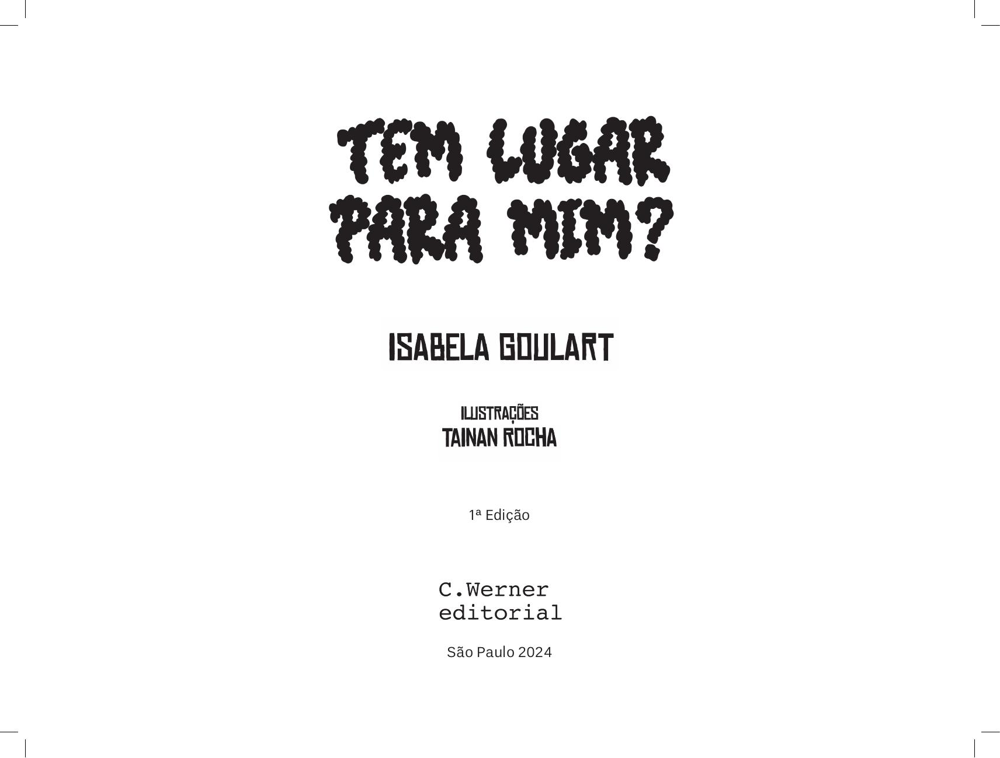

[Página 1]

TEM LUGAR PRA MIM?

DE ISABELA GOULART

COM ILUSTRAÇÕES DE TAINAN ROCHA

---

[Página 2]

---

[Página 3]

TEM LUGAR PRA MIM?

---

[Página 4]

---

[Página 5]

PIPOQUINHA ERA UMA FORMA DIFERENTE DE TODAS AS OUTRAS...

---

[Página 6]

ELA NÃO ERA REDONDINHA COMO OS CÍRCULOS

---

[Página 7]

TAMBÉM NÃO TINHA OS LADOS IGUAIS COMO OS QUADRADOS

---

[Página 8]

PIPOQUINHA ERA UMA FORMA QUE NÃO TINHA TRÊS PONTAS COMO OS TRIÂNGULOS

---

[Página 9]

CHAMAVAM ELA DE PIPOQUINHA 
PORQUE ELA TINHA FORMA DE PIPOCA

---

[Página 10]

PIPOQUINHA SE SENTIA MUITO SOZINHA
PORQUE NINGUÉM QUERIA BRINCAR COM ELA

---

[Página 11]

QUANDO PIPOQUINHA VIA OS CÍRCULOS RODOPIANDO, 
PERGUNTAVA: "TEM LUGAR PRA MIM?"

OS CÍRCULOS RESPONDIAM QUE NÃO PORQUE
ELA NÃO ERA REDONDINHA COMO ELES

---

[Página 12]

QUANDO PIPOQUINHA VIA OS QUADRADOS SE EMPILHANDO, 
PERGUNTAVA: "TEM LUGAR PRA MIM?"

---

[Página 13]

OS QUADRADOS RESPONDIAM QUE NÃO PORQUE 
ELA NÃO TINHA OS LADOS IGUAIS COMO ELES

---

[Página 14]

QUANDO PIPOQUINHA VIA OS TRIÂNGULOS BRINCANDO
DE SE EQUILIBRAR, PERGUNTAVA: "TEM LUGAR PRA MIM?"

---

[Página 15]

OS TRIÂNGULOS RESPONDIAM QUE NÃO PORQUE
ELA NÃO TINHA TRÊS PONTAS COMO ELES

PIPOQUINHA ACHA QUE NÃO TINHA
LUGAR NENHUM PARA ELA

---

[Página 16]

---

[Página 17]

UM BELO DIA, A CIDADE DAS FORMAS DECIDIU ORGANIZAR UMA GRANDE FESTA

TODAS AS FORMAS ESTARIAM LÁ PARA MONTAR 
UM GRANDE QUEBRA-CABEÇA

---

[Página 18]

PIPOQUINHA PREFERIU NÃO IR PORQUE ACHAVA
QUE NÃO TERIA LUGAR PARA ELA NO QUEBRA-CABEÇA

---

[Página 19]

TOC-TOC

DE REPENTE, PIPOQUINHA OUVIU 
VÁRIAS BATIDAS NA PORTA DE SUA CASA

---

[Página 20]

"PIPOQUINHA! PRECISAMOS DE VOCÊ! ABRA A PORTA!"

---

[Página 21]

PIPOQUINHA FOI CORRENDO ABRIR A PORTA E TOMOU UM SUSTO QUANDO
VIU UM CÍRCULO, UM QUADRADO E UM TRIÂNGULO

---

[Página 22]

"PIPOQUINHA, PRECISAMOS DE VOCÊ PARA COMPLETAR O QUEBRA-CABEÇA DA CIDADE! VAMOS!"

---

[Página 23]

PIPOQUINHA SAIU CORRENDO COM AS OUTRAS FORMAS PARA 
O LUGAR ONDE O QUEBRA-CABEÇA ESTAVA SENDO MONTADO

---

[Página 24]

CHEGANDO LÁ, VIU UM ENORME QUEBRA-CABEÇA
FEITO COM TODAS AS FORMAS DA CIDADE

---

[Página 25]

BEM AO CENTRO HAVIA UM ESPAÇO VAZIO, 
UM ESPAÇO QUE TINHA EXATAMENTE A SUA FORMA!

---

[Página 26]

PIPOQUINHA FOI SALTITANDO PARA OCUPAR O SEU LUGAR
E TODAS AS FORMAS GRITARAM DE FELICIDADE
VENDO O QUEBRA-CABEÇA COMPLETO

---

[Página 27]

DEPOIS DESSE DIA, AS FORMAS ENTENDERAM QUE POR MAIS DIFERENTES QUE ELAS
SEJAM, SEMPRE VAI TER UM LUGAR PARA TODO MUNDO.

---

[Página 28]
Esta obra foi composta em Helvética
e impressa em offset 90 g/m2 para
a Acorde Produções Musicais LTDA.

---

