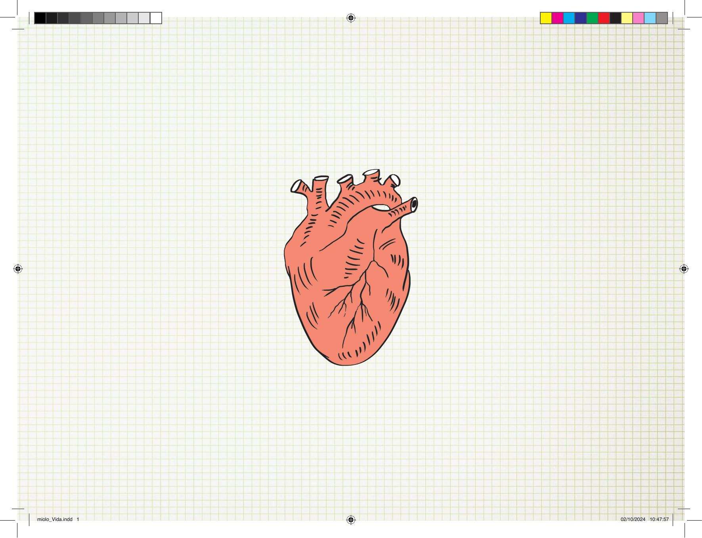

[Página 1]
miolo_Vida.indd 1

02/10/2024 10:47:57



---

[Página 2]
Copyright do texto e das ilustrações © 2024 Newton Cesar
Direção e curadoria
Gestão editorial
Diagramação
Revisão

Fábia Alvim
Felipe Augusto Neves Silva
Luisa Marcelino
Samuel Silva

Catalogação na publicação
Elaborada por Bibliotecária Janaina Ramos – CRB-8/9166

N561v
Newton Cesar
Vida / Newton Cesar. – São Paulo: C. Werner, 2024.
64 p., il.; 27,5 x 20,5 cm
ISBN: 978-659-9864-05-6 (livro impresso da criança)
978-659-9864-06-3 (livro digital da criança)
1. Literatura infantil. I. Newton Cesar. II. Título.
CDD 028.5

Índice para catálogo sistemático:
1. Literatura infantil 028.5
Todos os direitos reservados à C. Werner Editorial
www.hedra.com.br
Rua Fradique Coutinho, 465, Apto 118
05416-010 – São Paulo, SP

miolo_Vida.indd 2

02/10/2024 10:47:57



---

[Página 3]
VIDA
TEXTO E ILUSTRAÇÕES

NEWTON CESAR

miolo_Vida.indd 3

02/10/2024 10:47:58



---

[Página 4]

miolo_Vida.indd 4

02/10/2024 10:47:59



---

[Página 5]

miolo_Vida.indd 5

VI
02/10/2024 10:47:59



---

[Página 6]
IDA

miolo_Vida.indd 6

02/10/2024 10:47:59



---

[Página 7]
QUAL É O

miolo_Vida.indd 7

02/10/2024 10:47:59



---

[Página 8]
O

miolo_Vida.indd 8

02/10/2024 10:48:01



---

[Página 9]
SENT

ID

?

miolo_Vida.indd 9

02/10/2024 10:48:03



---

[Página 10]
A VIDA PODE SER

miolo_Vida.indd 10

02/10/2024 10:48:03



---

[Página 11]
UMA

miolo_Vida.indd 11

02/10/2024 10:48:04



---

[Página 12]
SEMENTE

miolo_Vida.indd 12

02/10/2024 10:48:04



---

[Página 13]

miolo_Vida.indd 13

02/10/2024 10:48:04



---

[Página 14]

miolo_Vida.indd 14

02/10/2024 10:48:04



---

[Página 15]

miolo_Vida.indd 15

02/10/2024 10:48:05



---

[Página 16]
A VIDA

PODE SER

miolo_Vida.indd 16

02/10/2024 10:48:05



---

[Página 17]
O
P

O?
R

S
M
U

miolo_Vida.indd 17

02/10/2024 10:48:06



---

[Página 18]

miolo_Vida.indd 18

02/10/2024 10:48:07



---

[Página 19]
SER RÁPIDA!

miolo_Vida.indd 19

02/10/2024 10:48:07



---

[Página 20]
OU

miolo_Vida.indd 20

02/10/2024 10:48:07



---

[Página 21]
TAMBÉM

miolo_Vida.indd 21

02/10/2024 10:48:07



---

[Página 22]
DE

miolo_Vida.indd 22

02/10/2024 10:48:08



---

[Página 23]
V

miolo_Vida.indd 23

02/10/2024 10:48:09



---

[Página 24]
A

miolo_Vida.indd 24

02/10/2024 10:48:09



---

[Página 25]
G

miolo_Vida.indd 25

02/10/2024 10:48:09



---

[Página 26]
A

miolo_Vida.indd 26

02/10/2024 10:48:09



---

[Página 27]
R

miolo_Vida.indd 27

02/10/2024 10:48:10



---

[Página 28]
A VIDA

miolo_Vida.indd 28

02/10/2024 10:48:10



---

[Página 29]
PODE SER

miolo_Vida.indd 29

02/10/2024 10:48:10



---

[Página 30]
CLARA

miolo_Vida.indd 30

02/10/2024 10:48:10



---

[Página 31]
OU ESCURA...

miolo_Vida.indd 31

02/10/2024 10:48:11



---

[Página 32]
AMARELA

miolo_Vida.indd 32

02/10/2024 10:48:11



---

[Página 33]
OU VERMELHA...

miolo_Vida.indd 33

02/10/2024 10:48:12



---

[Página 34]
P

OD

E

miolo_Vida.indd 34

02/10/2024 10:48:12



---

[Página 35]
SER

miolo_Vida.indd 35

02/10/2024 10:48:12



---

[Página 36]
ILU

miolo_Vida.indd 36

02/10/2024 10:48:12



---

[Página 37]
MI

miolo_Vida.indd 37

02/10/2024 10:48:12



---

[Página 38]
NA

miolo_Vida.indd 38

02/10/2024 10:48:13



---

[Página 39]
DA

miolo_Vida.indd 39

02/10/2024 10:48:13



---

[Página 40]
TER

OBS

TÁCULOS?

ALGUNS

PODE

miolo_Vida.indd 40

02/10/2024 10:48:13



---

[Página 41]
DE UNS

PODEMOS DESVIAR!

miolo_Vida.indd 41

02/10/2024 10:48:14



---

[Página 42]
ÀS VEZES
TEMOS DE

CONTINUAR

SUBINDO

miolo_Vida.indd 42

02/10/2024 10:48:15



---

[Página 43]
EM CERTOS
MOMENTOS,
A VIDA PODE SER
UM POUCO

miolo_Vida.indd 43

02/10/2024 10:48:16



---

[Página 44]

miolo_Vida.indd 44

02/10/2024 10:48:17



---

[Página 45]
!

RE
EG

AL

R

P
S
MA

E
D
O

SE

miolo_Vida.indd 45

02/10/2024 10:48:18



---

[Página 46]

miolo_Vida.indd 46

02/10/2024 10:48:19



---

[Página 47]
PODE SER COM DUAS MÃES

miolo_Vida.indd 47

02/10/2024 10:48:19



---

[Página 48]

miolo_Vida.indd 48

02/10/2024 10:48:19



---

[Página 49]
PODE SER COM DOIS PAIS

miolo_Vida.indd 49

02/10/2024 10:48:20



---

[Página 50]
A

JUNTE A

A VIDA PODE TER

miolo_Vida.indd 50

02/10/2024 10:48:20



---

[Página 51]
B

COM B

miolo_Vida.indd 51

02/10/2024 10:48:21



---

[Página 52]
AMOR

miolo_Vida.indd 52

02/10/2024 10:48:21



---

[Página 53]

miolo_Vida.indd 53

02/10/2024 10:48:22



---

[Página 54]

miolo_Vida.indd 54

02/10/2024 10:48:22



---

[Página 55]
N
O
C

I
U
Q

A
T
S

miolo_Vida.indd 55

02/10/2024 10:48:23



---

[Página 56]
DESCOBERTA

miolo_Vida.indd 56

02/10/2024 10:48:23



---

[Página 57]
era uma vez uma

criança que

entrou em um

livro e descobriu

vidas incríveis!

miolo_Vida.indd 57

02/10/2024 10:48:23



---

[Página 58]
PORÉM!

miolo_Vida.indd 58

02/10/2024 10:48:23



---

[Página 59]
O MAIS LEGAL É QUE A

miolo_Vida.indd 59

02/10/2024 10:48:23



---

[Página 60]
V

miolo_Vida.indd 60

02/10/2024 10:48:23



---

[Página 61]
VIDA SERÁ SEMPRE

miolo_Vida.indd 61

02/10/2024 10:48:24



---

[Página 62]
TRANSFORMAÇÃO

miolo_Vida.indd 62

02/10/2024 10:48:24



---

[Página 63]

miolo_Vida.indd 63

02/10/2024 10:48:25



---

[Página 64]
NEWTON CESAR
Autor e ilustrador
Formado em Marketing e pós-graduado em Marketing Digital,
Newton Cesar é escritor, publicitário, designer e ilustrador.
Atuou em agências de propaganda, exercendo as funções de
direção de arte e criação. Também se especializou em design
editorial desenvolvendo projetos gráficos e capas de livros para
editoras. Como escritor, publicou livros de ficção e de negócios.
Entre eles:
• É assim que eu sou!
• Tratamento especial
• Um minuto
• Bendito maldito
• Eu, Beatriz e Ângela
• O mar e a escuridão
• A morte é de matar
• Direção de arte em propaganda
• Making of
• Vitamina fotográfica
• Os primeiros segredos da direção de arte
• Do livro ao livro: a arte de escrever e publicar ficção.

Esta obra foi composta em Freeroad
e impressa sobre papel cuchê fosco 115 g/m2
para a C. Werner em 2024.

miolo_Vida.indd 64

02/10/2024 10:48:25



---

