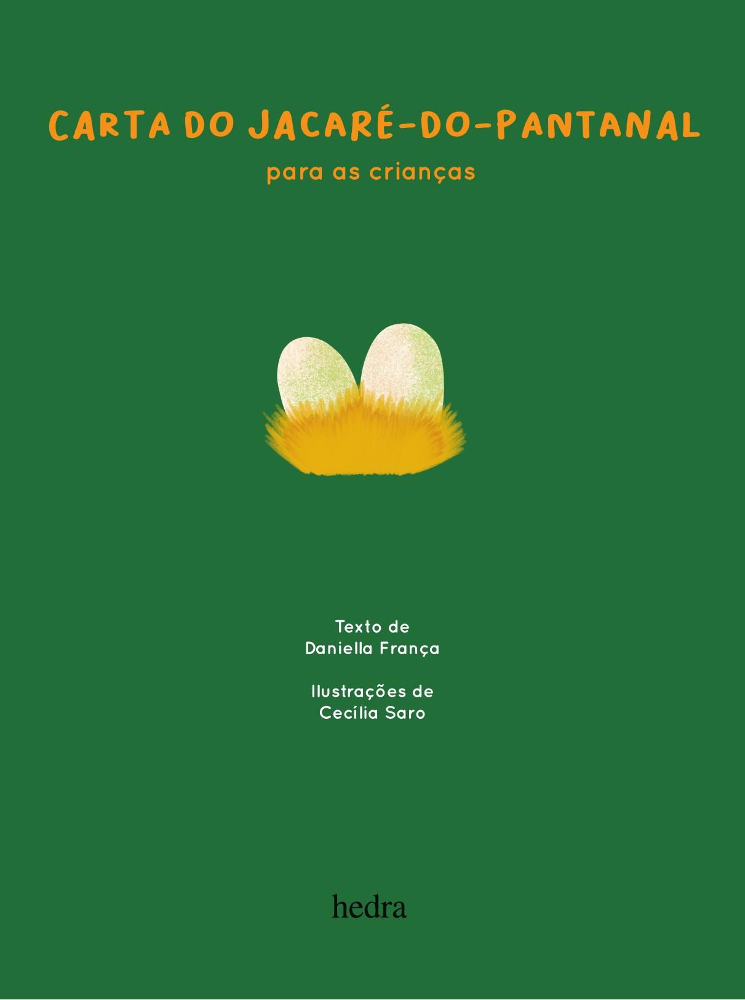

[Página 1]
Carta do Jacaré-do-pantanal
para as crianças

Texto de
Daniella França
Ilustrações de
Cecília Saro



---

[Página 2]
copyright da edição © Editora Hedra LTDA
edição Fábia Alvim
coedição Suzana Salama
revisão Paulo Henrique Pompermaier
Esta obra é uma adaptação de um dos títulos da coleção ‘Vozes do
Pantanal’ produzida pelo projeto socioambiental Chalana Esperança,
com o apoio da Acaia Pantanal e da Documenta Pantanal.
Grafia atualizada segundo o Acordo Ortográfico da Língua
Portuguesa de 1990, em vigor no Brasil desde 2009.
DADOS INTERNACIONAIS DE CATALOGAÇÃO
NA PUBLICAÇÃO (CIP)
CÂMARA BRASILEIRA DO LIVRO, SP, BRASIL

França, Daniella Pereira Fagundes de
Carta do Jacaré-do-Pantanal para as crianças /
Daniella Pereira Fagundes ; ilustrado por Cecilia
Saro. - São Paulo : Hedra, 2024.
ISBN: 978-85-7715-989-5 (Livro impresso)
ISBN: 978-85-7715-991-8 (Livro digital)
1. Literatura infantil I. Saro, Cecilia II. Título.

CDD 028.5
2024-3370
CDU 82-93
ÍNDICES PARA CATÁLOGO SISTEMÁTICO
1.

Literatura infantil 028.5

2.

Literatura infantil 82-93

Elaborado por Vagner Rodolfo da Silva - CRB-8/9410

Direitos reservados em língua
portuguesa somente para o Brasil.
Editora Hedra LTDS

Avenida São Luís, 187, Piso 3, Loja 8
São Paulo-SP CEP 01046-001
editora@hedra.com.br



---

[Página 3]
Aos meus filhos,
Ernesto e Paula, que
me inspiram a falar a
linguagem dos bichos e
das crianças, que é como
se fosse a mesma.



---

[Página 4]



---

[Página 5]
Eu tenho patas bem pequenas
E os dentes afiados



---

[Página 6]
Minha cauda é comprida
Meu focinho é esticado



---

[Página 7]



---

[Página 8]
Posso parecer malvado
Mas malvado eu não sou



---

[Página 9]
Sou apenas assustado
Não me toque, por favor!



---

[Página 10]
Eu sou apenas um animal
E não quero te fazer mal



---

[Página 11]
Sabe qual é o meu nome?
É jacaré-do-Pantanal



---

[Página 12]
Gosto muito de nadar
Vivo nas lagoas e NOS rios



---

[Página 13]
Mas de uns tempos para cá
Tenho enfrentado uns desafios



---

[Página 14]
Os nossos rios estão secando
E, além disso, ainda tem mais!



---

[Página 15]
Tem gente que vem para cá
Para caçar os animais.



---

[Página 16]
Este problema assim tão sério
Tem nos deixado com muito medo



---

[Página 17]
Quando aparece o bicho-homem,
Fugimos igual a um torpedo!



---

[Página 18]
As pessoas têm nos caçado
E eu não sei bem o porquê



---

[Página 19]
Afinal, no supermercado,
Podem achar o que comer!



---

[Página 20]
A perdiz que antes cantava
Agora só sabe chorar



---

[Página 21]
O caititu que livre andava
Não quer sair para passear



---

[Página 22]
Os meus primos jacarés
Não querem ir PARA O rio nadar



---

[Página 23]
Por medo do caçador
Que pode os ameaçar



---

[Página 24]



---

[Página 25]
A anta, a onça, o veado
E todos os animais



---

[Página 26]
Precisam da sua ajuda
Pois querem viver em paz



---

[Página 27]
Somos todos seres vivos
Filhos da Mãe-Natureza



---

[Página 28]



---

[Página 29]
Queremos viver na nossa casa
Sem medo e sem tristeza



---

[Página 30]
Sei que sou só um jacaré
Não sei ler nem escrever



---

[Página 31]
Mas eu tenho muita fé
No que vocês podem fazer!



---

[Página 32]
As crianças podem ser
A voz contra a caça ilegal



---

[Página 33]
Podem dar um grande basta

e salvar o pantanal!



---

[Página 34]
Conheça os bichos da nossa história!
Perdiz
Rhynchotus rufescens
Jacaré-do-pantanal
Caiman yacare

Cervo-do-pantanal
Blastocerus dichotomus
Caititu
Pecari tajacu

Sururucu-do-pantanal
Hydrodynastes gigas



---

[Página 35]
Onça-pintada
Panthera onca

Jaó
Crypturellus undulatus

Canarinho-da-terra
Sicalis flaveola

Anta
Tapirus terrestris

Porco-do-mato
Tayassu pecari



---

[Página 36]



---

[Página 37]
AUTORA
Daniella França é bióloga e doutora em Zoologia.
Atua como educadora, divulgadora científica e pesquisadora
nas áreas de Educação para Conservação, Zoologia e sobre
as questões de gênero na ciência. Poeta da conservação,
acredita que seu amor pela natureza pode ser compartilhado
por meio de suas rimas e imagens dos animais que fotografa.
É uma das fundadoras da iniciativa Chalana Esperança,
que atua em ações de educação para conservação no
Pantanal, atuando como coordenadora de Educação para
Conservação. Sua missão na vida é usar tudo o que aprende
para a judar na conservação da nossa biodiversidade e lutar
para que as diversas minorias possam ocupar lugares de
destaque na sociedade.



---

[Página 38]



---

[Página 39]
ILUSTRADORA
Cecilia Saro é uma artista visual feminista que tem como
maior fonte de inspiração do seu trabalho a natureza e o
feminino. Em 2020, participou de um movimento para
arrecadar dinheiro por meio de suas obras para a judar os
voluntários no combate aos incêndios florestais no Pantanal.
Desde então, começou uma parceria entre a ilustradora e a
preservação do bioma. Hoje, junto com a Chalana Esperança,
ela ilustra várias peças e livros sobre o Pantanal, torcendo
para que seu trabalho inspire gerações futuras a amarem e
cuidarem da nossa biodiversidade.



---

[Página 40]
Esta obra foi composta em Bakso Sapi e Formular
e impressa em papel cuchê fosco 115 g/m²
para a Editora Hedra.



---

