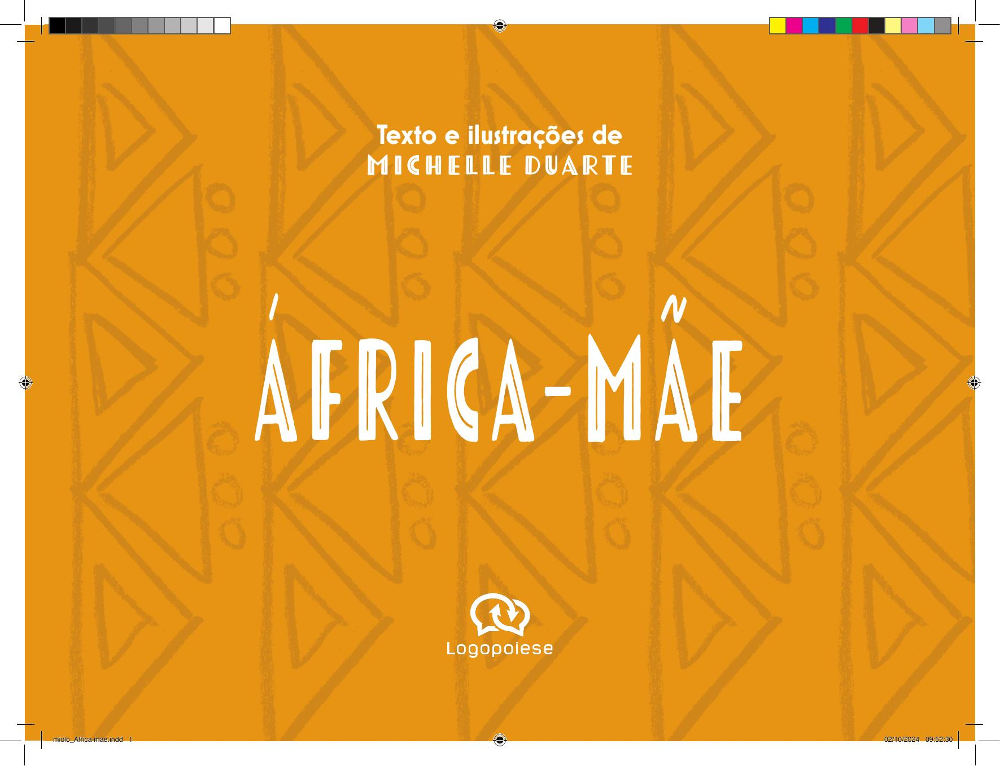

[Página 1]
Texto e ilustrações de
Michelle Duarte

ÁFRICA-MÃE
miolo_Africa mae.indd 1

02/10/2024 09:52:30



---

[Página 2]
Copyright do texto e das ilustrações © 2024 Michelle Duarte
Direção e curadoria
Gestão editorial
Diagramação
Revisão

Fábia Alvim
Felipe Augusto Neves Silva
Luisa Marcelino
Públio Terêncio Afro

Dados Internacionais de Catalogação na Publicação (CIP) de acordo com ISBD

D812a

Duarte, Michelle

		
		
		

África-mãe / Michelle Duarte ; ilustrado por Michelle Duarte
São Paulo : Logopoiese, 2024.
64 p. : il. ; 27,5cm x 20,5cm.

		
		

ISBN: 978-65-984208-4-0 (livro impresso da criança)
978-65-984208-2-6 (livro digital da criança)

		

1. Literatura infantil. I. Nacarate, Liine. II. Título.
CDD 028.5
CDU 82-93

2024-3114

Elaborado por Vagner Rodolfo da Silva - CRB-8/9410
Índice para catálogo sistemático:
1. Literatura infantil 028.5
2. Literatura infantil 82-93

Todos os direitos reservados à Logopoiese
www.logopoiese.com.br
Rua Doutor Samuel Porto, 411
Vila da Saúde – 04054-010 – São Paulo, SP

miolo_Africa mae.indd 2

02/10/2024 09:52:31



---

[Página 3]
A África é um continente
grande e cheio de países!

miolo_Africa mae.indd 3

02/10/2024 09:52:34



---

[Página 4]
Cada país africano é cheio de
histórias para nos contar.

miolo_Africa mae.indd 4

02/10/2024 09:52:38



---

[Página 5]
África do Sul

Na África do Sul, é muito comum as crianças se
divertirem brincando de mamba. Um jogador faz
o papel de cobra (mamba) e tenta capturar os
demais em um espaço delimitado. Os capturados
vão se juntando ao corpo da cobra.

miolo_Africa mae.indd 5

02/10/2024 09:52:42



---

[Página 6]
la

o
Ang

Em Luanda, capital de Angola,
existe um monumento em
homenagem a um angolano
importante chamado
António Agostinho Neto.

miolo_Africa mae.indd 6

02/10/2024 09:52:46



---

[Página 7]
Argélia
Na Argélia, há uma cidade
chamada Argel, que tem muitos
prédios brancos bonitos. Por isso,
a cidade é conhecida como
"Argel, a branca"!

miolo_Africa mae.indd 7

02/10/2024 09:52:50



---

[Página 8]
No Benim, existe um local chamado Ganvié, que
fica em cima da água! As pessoas usam barcos
para comprar e vender coisas, como se fosse
uma cidade flutuante.

Benim

miolo_Africa mae.indd 8

02/10/2024 09:52:54



---

[Página 9]
Em Botsuana, as pessoas falam muitas línguas
diferentes, como o setswana e o inglês!
Isso ajuda todos a se entenderem
e serem amigos!

B
o
t
s
u
a
n
a
miolo_Africa mae.indd 9

02/10/2024 09:52:57



---

[Página 10]
Burquina
Fasso

Em Burquina Fasso, há uma grande festa chamada Festival
Panafricano de Cinema e Televisão (FESPACO).
Pessoas de vários países vão para assistir a filmes e
celebrar o cinema africano!

miolo_Africa mae.indd 10

02/10/2024 09:53:02



---

[Página 11]
Burundi
s
essoa
p
s
a
rundi, r ao som
u
B
o
N
ança
d
m
a
res!
o
ador
b
m
dos ta

Eles fazem
apresenta
ções incrí
veis
com roup
as colorid
as e
tocam ta
mbores g
randes
e barulhe
ntos.

miolo_Africa mae.indd 11

02/10/2024 09:53:05



---

[Página 12]
e
d

V

C ab o

er

Em Cabo Verde, há muitas ilhas bonitas
cercadas pelo oceano. As pessoas
adoram cantar e dançar músicas
alegres chamadas mornas e coladeiras.

miolo_Africa mae.indd 12

02/10/2024 09:53:10



---

[Página 13]
Em Camarões, há uma montanha
chamada Monte Camarões,
que é um vulcão.
Muitas pessoas adoram
escalá-la até o topo
para ver a vista incrível.

Mas, às vezes, ele solta
fumaça e lava.

Camarões
miolo_Africa mae.indd 13

02/10/2024 09:53:13



---

[Página 14]
Grande parte do Chade é coberta pelo
Deserto do Saara, o terceiro maior do planeta,
mas esse também é o maior deserto quente do
mundo. O Chade também não tem acesso ao
mar, exatamente como o estado brasileiro
do Tocantins, por exemplo.

e
d

a
h

C

miolo_Africa mae.indd 14

02/10/2024 09:53:17



---

[Página 15]
Comores
Nas Comores, há uma flor chamada
ylang-ylang, que tem um cheiro
delicioso. Ela é usada para fazer
perfumes famosos no mundo todo!

miolo_Africa mae.indd 15

02/10/2024 09:53:21



---

[Página 16]
Costa do

Marfim

Na Costa do Marfim, existe
uma dança chamada zaouli.
Os dançarinos usam máscaras
coloridas e se movem muito
rápido, criando um show
fascinante!

miolo_Africa mae.indd 16

02/10/2024 09:53:25



---

[Página 17]
u
o

b
i
j

D

i
t

O Djibouti tem um lago
chamado Lago Assal, um dos lugares
mais salgados do mundo. A água é tão
salgada que se pode flutuar facilmente nela!

miolo_Africa mae.indd 17

02/10/2024 09:53:29



---

[Página 18]
Egito
As crianças do Egito gostam de brincar de “pegue o bastão”.
Cada jogador segura uma vara tocando o chão e se coloca junto
aos outros em um círculo. Todos deixam sua vara equilibrada e
correm para a próxima à direita para pegá-la. Quem não pegar
sai do jogo. Vence o último que ficar.
miolo_Africa mae.indd 18

02/10/2024 09:53:33



---

[Página 19]
Na Eritreia, há uma cidade
chamada Asmara, famosa
por seus prédios antigos
e bonitos. Muitas pessoas
dizem que parece um
museu a céu aberto!

Eritreia
miolo_Africa mae.indd 19

02/10/2024 09:53:36



---

[Página 20]
Os suazis, como são chamados os habitantes de Essuatíni,
participam de um evento chamado Incwala. É uma
celebração importante em que todos cantam, dançam e
comemoram juntos!

Ess
i
uatín
miolo_Africa mae.indd 20

02/10/2024 09:53:41



---

[Página 21]
a

pi

ió
Et

Acredita-se que o café foi
descoberto na Etiópia. Dizem
que um pastor encontrou a
planta e notou que suas cabras
ficavam mais animadas depois
de comer os grãos!

miolo_Africa mae.indd 21

02/10/2024 09:53:44



---

[Página 22]
No Gabão, existe um dos
poucos lugares do mundo onde
se podem ver hipopótamos
nadando no oceano!

Gabão

miolo_Africa mae.indd 22

02/10/2024 09:53:48



---

[Página 23]
a
i
b
m
Gâ
A Gâmbia é um país
pequeno, mas tem um rio muito
grande chamado Rio Gâmbia. Muitas
pessoas gostam de passear
de barco nesse rio e ver os
animais que vivem
em suas margens.

miolo_Africa mae.indd 23

02/10/2024 09:53:52



---

[Página 24]
na
Ga
Em Gana, existe uma brincadeira chamada ampe.
Um líder fica de frente para outros jogadores em um
semicírculo e vai até o primeiro de uma extremidade.
Ambos batem palmas, pulam, saltam e colocam um pé à
frente. Se colocarem o mesmo, o jogador toma o lugar do líder.
Senão o líder ganha um ponto e vai para o próximo jogador.
miolo_Africa mae.indd 24

02/10/2024 09:53:56



---

[Página 25]
Na Guiné, há montanhas chamadas
Fouta Djallon, que são muito bonitas
e têm muitas cachoeiras.

G
u
i
n
é
miolo_Africa mae.indd 25

02/10/2024 09:53:59



---

[Página 26]
Guiné-Bissau

Em Guiné-Bissau, muitas ilhas
formam um lugar chamado
Arquipélago dos Bijagós, onde
vivem tartarugas-marinhas e
hipopótamos.

miolo_Africa mae.indd 26

02/10/2024 09:54:04



---

[Página 27]
Guiné
Equatorial
A Guiné Equatorial tem uma
ilha chamada Bioko, onde
se podem ver macacos raros
e muitas aves coloridas.

miolo_Africa mae.indd 27

02/10/2024 09:54:07



---

[Página 28]
Le

so

to

Dizem que, em Lesoto, viveu um pequeno
dinossauro herbívoro e bípede que
chamaram de Lesothosaurus.

miolo_Africa mae.indd 28

02/10/2024 09:54:11



---

[Página 29]
Libéria
A Libéria foi o primeiro país
da África a ter uma mulher
como presidente. Ela se
chama Ellen Johnson Sirleaf
e foi eleita em 2005.

miolo_Africa mae.indd 29

02/10/2024 09:54:21



---

[Página 30]
A Líbia tem, na cidade de Homs, as ruínas
de uma cidade antiga chamada Léptis Magna,
provavelmente fundada por fenícios.
É cheia de muitas
memórias impressionantes.

Líbia

miolo_Africa mae.indd 30

02/10/2024 09:54:31



---

[Página 31]
Em Madagascar, e só lá,
vive um animal chamado
lêmure. Os lêmures têm
olhos grandes e gostam de
pular de árvore em árvore!

M

a
g
s
a
ca r
d
a

miolo_Africa mae.indd 31

02/10/2024 09:54:35



---

[Página 32]
Maláui

O Maláui tem uma dança
tradicional chamada
gule wamkulu.
As pessoas se vestem
com máscaras e fazem
movimentos divertidos,
em uma festa cheia
de música e alegria!

miolo_Africa mae.indd 32

02/10/2024 09:54:39



---

[Página 33]
No Máli, há uma antiga
cidade chamada Timbuktu,
famosa por suas bibliotecas
e mesquitas de barro. Muitas
pessoas viajavam de longe
para estudar lá!

i
l
á
M
miolo_Africa mae.indd 33

02/10/2024 09:54:43



---

[Página 34]
Marrocos

No Marrocos, as pessoas adoram ir aos mercados
coloridos chamados souks para comprar frutas,
doces e brinquedos divertidos!
miolo_Africa mae.indd 34

02/10/2024 09:54:47



---

[Página 35]
Nas Ilhas Maurício, existia uma ave chamada dodô,
que não voava e parecia um grande pombo. O dodô
entrou em extinção em 1681, depois que a região
começou a ser colonizada por europeus, mas ele
ainda é lembrado como um símbolo especial do país.

Ilhas
Maurício

miolo_Africa mae.indd 35

02/10/2024 09:54:50



---

[Página 36]
A Mauritânia tem um lugar chamado Estrutura
de Richat, que parece um grande olho visto do
espaço. É um mistério natural que deixa
as pessoas fascinadas!

â
n
t
i
i
a
r
u
a
M

miolo_Africa mae.indd 36

02/10/2024 09:54:55



---

[Página 37]
Moçambique

Em Moçambique, as
pessoas adoram dançar
ao som da marrabenta,
um estilo de música
alegre e animado.
Quando a música toca,
todos se juntam para
dançar e se divertir!

miolo_Africa mae.indd 37

02/10/2024 09:54:58



---

[Página 38]
Na Namíbia, existe um
lugar chamado Deserto do
Namibe, onde as dunas de
areia podem mudar de cor!

miolo_Africa mae.indd 38

Namíbia
02/10/2024 09:55:02



---

[Página 39]
O Níger tem um rio
importante chamado Rio
Níger, onde muitas pessoas
pescam e navegam em
barcos. Ele é como uma
estrada de água que
atravessa o país!

Níger

miolo_Africa mae.indd 39

02/10/2024 09:55:06



---

[Página 40]
Nigéria

Na Nigéria, existe um
lugar lindo, considerado
sagrado, que é o Bosque
de Oxum-Oxobô, às
margens do Rio Oxum.

miolo_Africa mae.indd 40

02/10/2024 09:55:10



---

[Página 41]
Quênia
Existe, no Quênia, uma língua chamada
suaíli. Nela, para se dizer “oi”, as pessoas
usam a palavra hujambo.

miolo_Africa mae.indd 41

02/10/2024 09:55:14



---

[Página 42]
a
n
a
c
i
r
Rep
f
A
ública CentroNa República Centro-Africana, o céu
noturno é bastante escuro. Isso faz que
esse seja um dos melhores lugares no
mundo para observar as estrelas.
miolo_Africa mae.indd 42

02/10/2024 09:55:18



---

[Página 43]
Na República Democrática do
Congo, existe uma montanha
chamada Nyiragongo, que tem
um dos maiores lagos de lava do
mundo. À noite, o brilho da lava
parece um show de luzes!

República
Democrática
do Congo
miolo_Africa mae.indd 43

02/10/2024 09:55:21



---

[Página 44]
República
do Congo

A República do Congo tem uma floresta tropical
chamada Floresta do Mayombe, que é cheia de árvores
altas e plantas incríveis. É como um grande jardim verde!

miolo_Africa mae.indd 44

02/10/2024 09:55:26



---

[Página 45]
a
d
n
a
u

R

Ruanda tem um lago lindo chamado Lago Kivu,
onde as pessoas gostam de nadar e passear de
barco. É um lugar tranquilo e muito bonito!

miolo_Africa mae.indd 45

02/10/2024 09:55:29



---

[Página 46]
Em São Tomé e Príncipe, há
um vulcão chamado Pico Cão
Grande, que parece uma torre
gigante subindo para o céu –
uma vista incrível e única!

São Tomé e Príncipe
miolo_Africa mae.indd 46

02/10/2024 09:55:34



---

[Página 47]
e
l
h
e
c
s
i
e
S

Seicheles tem uma tartaruga
gigante chamada aldabra,
que pode viver por mais de
100 anos. Elas são muito
grandes e impressionantes!

miolo_Africa mae.indd 47

02/10/2024 09:55:44



---

[Página 48]
No Senegal, há um lago
chamado Lago Retba, que
é rosa! A água tem uma cor
diferente por causa de um tipo
especial de alga que vive lá.

Senegal

miolo_Africa mae.indd 48

02/10/2024 09:55:48



---

[Página 49]
Serra

Leoa

Na Serra Leoa, o arroz é
um dos principais alimentos
consumidos. Ele é preparado
de diversas maneiras e com
molhos variados.

miolo_Africa mae.indd 49

02/10/2024 09:55:51



---

[Página 50]
A Somália é famosa por seu incenso, feito de uma
resina perfumada chamada olíbano. As pessoas usam o
incenso para tornar suas casas cheirosas e acolhedoras.

Somália
miolo_Africa mae.indd 50

02/10/2024 09:55:55



---

[Página 51]
o
ã
S ud

No Sudão, existe uma deliciosa
receita chamada moukhbaza, que
é uma mistura do doce da banana
com o picante da pimenta.

miolo_Africa mae.indd 51

02/10/2024 09:55:59



---

[Página 52]
No Sudão do Sul, há um grande
pântano chamado Sudd, que é um
dos maiores do mundo.
Muitas aves e animais vivem
lá, e é um lugar muito
importante para a natureza.

Sudão do Sul
miolo_Africa mae.indd 52

02/10/2024 09:56:03



---

[Página 53]
Tanzânia

A Tanzânia tem o monte mais alto da África, chamado Kilimanjaro. Ele é tão alto
que seu topo está sempre coberto de neve, mesmo ficando em um lugar quente!

miolo_Africa mae.indd 53

02/10/2024 09:56:07



---

[Página 54]
As pessoas no Togo adoram um prato
chamado fufu, feito com mandioca
ou inhame. Eles amassam até virar
uma massa macia e comem com
molhos saborosos!

Togo
miolo_Africa mae.indd 54

02/10/2024 09:56:11



---

[Página 55]
Tunísia
Na Tunísia, fica
Cartago, que era uma
cidade antiga muito
importante, onde
até hoje se podem
ver ruínas e aprender
sobre a história dos
fenícios, que viveram
lá há muito tempo.

miolo_Africa mae.indd 55

02/10/2024 09:56:14



---

[Página 56]
Uganda é o lar dos gorilas-das-montanhas, que vivem nas
florestas. As pessoas viajam de
longe para ver esses animais
incríveis em seu hábitat natural.

Uganda

miolo_Africa mae.indd 56

02/10/2024 09:56:19



---

[Página 57]
Na Zâmbia, as pessoas adoram comer um prato chamado
nshima, feito de milho. Elas comem nshima com vegetais, carne
ou peixe, e é uma comida muito importante para elas.

Zâmbia

miolo_Africa mae.indd 57

02/10/2024 09:56:23



---

[Página 58]
Existe, no Zimbábue, uma montanha muito alta,
chamada Monte Nyangani. Lá em cima, as
nuvens ficam pertinho e o nascer do sol é lindo!

Zimbábue
miolo_Africa mae.indd 58

02/10/2024 09:56:27



---

[Página 59]
A palavra

continente
indica algo
que sabe conter.

Como a África contém

seus países
todos...

miolo_Africa mae.indd 59

02/10/2024 09:56:31



---

[Página 60]
... com tantas paisagens...

miolo_Africa mae.indd 60

02/10/2024 09:56:35



---

[Página 61]
... com tantas línguas...

miolo_Africa mae.indd 61

02/10/2024 09:56:39



---

[Página 62]
... com tantas
descobertas!

miolo_Africa mae.indd 62

02/10/2024 09:56:43



---

[Página 63]
MICHELLE DUARTE
Michelle Duarte nasceu e mora em São Bernardo do
Campo, no estado de São Paulo. Desde criança, ama
desenhar e pintar. Em 2019, ilustrou pela primeira vez um
livro infantil, intitulado “O elefante e o urubu”, do autor
Mauro Pereira Alvim, publicado no ano seguinte pela
Saíra Editorial, uma editora da capital de São Paulo.
Desde então, segue com outros projetos de ilustração
para o público infantil. Também professora, inspira-se nos
desenhos das crianças para compor suas ilustrações.

miolo_Africa mae.indd 63

02/10/2024 09:56:46



---

[Página 64]
Esta obra foi composta em Tomarik e Mostra Nuova
e impressa sobre papel cuchê fosco 115 g/m²
para a Logopoiese em 2024.

miolo_Africa mae.indd 64

02/10/2024 09:56:46



---

