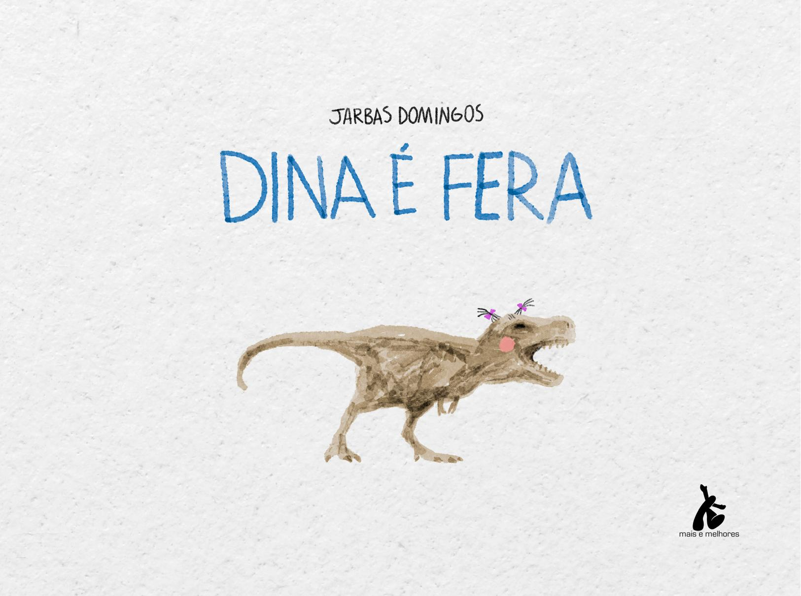

[Página 1]
miolo_Dina e fera.indd 1

01/10/2024 10:59:43



---

[Página 2]
Copyright do texto e das ilustrações © 2024 Jarbas Domingos
Direção e curadoria
Gestão editorial
Diagramação
Revisão

Fábia Alvim
Felipe Augusto Neves Silva
Luisa Marcelino
Dênis Lacerta

Dados Internacionais de Catalogação na Publicação (CIP) de acordo com ISBD
K19c

Kasburg, Denise

		
		
		

Crescer / Denise Kasburg ; ilustrado por Liine Nacarate. São Paulo : Saíra Editorial, 2024.
32 p. : il. ; 24cm x 24cm.

		ISBN: 978-65-81295-80-6
1. Literatura infantil. I. Nacarate, Liine. II. Título.
CDD 028.5
CDU 82-93

2024-2939
Elaborado por Vagner Rodolfo da Silva - CRB-8/9410
Índice para catálogo sistemático:
1. Literatura infantil 028.5
2. Literatura infantil 82-93

DEDICO ESTE LIVRO A VOCÊ QUE TEM LIMITE.
QUE ÀS VEZES ATÉ DESISTE,
MAS QUERENDO SEGUIR EM FRENTE.
ESTE LIVRO É PARA VOCÊ,
QUE DOS OUTROS É DIFERENTE.
DEDICO A TODO O MUNDO,
POIS ASSIM É TODA GENTE.

Todos os direitos reservados à Mais e Melhores
instagram.com/acorde_editorial
Rua Sá Viana, 136, 30
20540-260 – Rio de Janeiro, RJ

miolo_Dina e fera.indd 2-3

01/10/2024 10:59:46



---

[Página 3]
A PEQUENA TIRANOSSAURO CHAMADA DINA
NO BAIRRO JURÁSSICO, NA ESCOLA DO LAGO,

SE DESPEDE DOS PAIS LÁ NA ESQUINA.

TODO O MUNDO É FERA EM ALGO.

miolo_Dina e fera.indd 4-5

01/10/2024 10:59:48



---

[Página 4]
OLHA PARA A FRENTE E RESPIRA FUNDO.
NÃO QUER SER DIFERENTE DE TODO O MUNDO.
PASSOS LENTOS, “ACELERANDO ” O CORAÇÃO,
DINA CAMINHA EM DIREÇÃO AO PORTÃO.

miolo_Dina e fera.indd 7

01/10/2024 10:59:49



---

[Página 5]
NA ESCOLA, CAROLA É FERA EM JOGAR BOLA.
– TENTA, DINA! VAI VER TAMBÉM É SUA SINA.
DOU UM BICUDO E VOCÊ AGARRA COM TUDO.

miolo_Dina e fera.indd 8-9

01/10/2024 10:59:51



---

[Página 6]
miolo_Dina e fera.indd 10-11

01/10/2024 10:59:53



---

[Página 7]
NA NATAÇÃO, BRONTOSSAULO É CAMPEÃO.
– VEM, DINA! PULA NA PISCINA!
SEM ALVOROÇO. A ÁGUA BATE NO PESCOÇO

miolo_Dina e fera.indd 12-13

01/10/2024 10:59:55



---

[Página 8]
miolo_Dina e fera.indd 14-15

01/10/2024 10:59:57



---

[Página 9]
DINOEL É MUSICAL. MUITO FERA NO INSTRUMENTAL.
– OI, DINA! QUER TENTAR? MEU VIOLÃO EU POSSO EMPRESTAR.
SE EU POSSO, TU PODES. UMA MÃO NA CORDA, OUTRA NOS ACORDES.

miolo_Dina e fera.indd 16-17

01/10/2024 10:59:59



---

[Página 10]
miolo_Dina e fera.indd 18-19

01/10/2024 11:00:00



---

[Página 11]
JÁ TRICERATRIZ GOSTA DE AGITAR.
É FERA NA ARTE DE DANÇAR.

miolo_Dina e fera.indd 20-21

– BORA, DINA! VAMOS ARREBENTAR. FAZ IGUAL, TENTA IMITAR!
DOU UM GIRO NO CHÃO E ME EQUILIBRO NUMA SÓ MÃO.

01/10/2024 11:00:02



---

[Página 12]
miolo_Dina e fera.indd 22-23

01/10/2024 11:00:04



---

[Página 13]
JUSSAURA COM TODA A TERNURA, INCENTIVOU A PINTURA.
EXPLICOU, COM O PINCEL, CADA MOVIMENTO.
DINA, SORRINDO, FINGIU ENTENDIMENTO.

miolo_Dina e fera.indd 24-25

01/10/2024 11:00:06



---

[Página 14]
O BRACINHO CURTO NÃO ALCANÇOU A TELA...
SUJOU SUA ROUPINHA DE AQUARELA...

miolo_Dina e fera.indd 26-27

01/10/2024 11:00:07



---

[Página 15]
MAIS UM DIA FINDOU NA ESCOLA.
CAROLA GUARDOU A BOLA NA SACOLA.
BRONTOSSAULO, DE ROUPÃO, CORREU PARA A CONDUÇÃO.
DINOEL, COM O VIOLÃO, CANTAROLOU UMA CANÇÃO.

miolo_Dina e fera.indd 28-29

TRICERATRIZ SAIU GIRANDO E PULANDO TODA FELIZ.
JUSSAURA, COM SUA TELA, SE DESPEDIU PELA JANELA.
DINA SEUS PAIS ESPERA, SEM SABER NO QUE É FERA...

01/10/2024 11:00:09



---

[Página 16]
TODOS DIZEM “BOM DIA” – MAS COM PREOCUPAÇÃO.
A TERRA GIROU PARA O OUTRO LADO
E MAIS UM DIA COMEÇA NA ESCOLA DO LAGO.

NINGUÉM ABRIU A ESCOLA. ESTÁ FECHADO O PORTÃO.
CAIU NO BUEIRO A CHAVE, UMA PEQUENA BRECHA NO CHÃO.

DINA CHEGA ACENANDO COM SEU DOCE TCHAU MIÚDO.
MAS A DIFERENÇA NAQUELE DIA ESTAVA EM TUDO.

miolo_Dina e fera.indd 30-31

01/10/2024 11:00:11



---

[Página 17]
CAROLA USOU VARETA E COLA, MAS FRACASSOU.
BRONTOSSAULO, POR CAUSA DE UM CALO, SUA VEZ PASSOU.

DINOEL USOU UM CANUDO DE PAPEL, QUE SE MOLHOU.
JUSSAURA, SEM UMA IDEIA CLARA, NÃO ARRISCOU.
TRICERATRIZ, SEMPRE MUITO FELIZ, NÃO SE IMPORTOU.

miolo_Dina e fera.indd 32-33

01/10/2024 11:00:13



---

[Página 18]
TODA CONQUISTA ALEGRIA GERA.
FOI QUANDO DINA FALOU:
– POSSO TENTAR? MINHAS MÃOS PEQUENAS CONSEGUEM ENTRAR.
COM MUITA CONCENTRAÇÃO, DEITOU NO CHÃO...
RAPIDINHO LEVANTOU, COM A CHAVE NA MÃO.

miolo_Dina e fera.indd 34-35

NUMA SÓ VOZ GRITAVAM:

DINA É FERA!

E FOI AÍ QUE ELA PERCEBEU ENTÃO
QUE NAQUELA ESCOLA NÃO ERA EXCEÇÃO!

01/10/2024 11:00:15



---

[Página 19]
NO FUTEBOL, DINA APRENDEU A CABECEAR.

miolo_Dina e fera.indd 36-37

BATENDO PERNINHAS, CONSEGUIU NADAR.

01/10/2024 11:00:17



---

[Página 20]
MUITAS MÚSICAS APRENDEU A CANTAR.

miolo_Dina e fera.indd 38-39

NUM TIPO DE DANÇA, APRENDEU A SAPATEAR.

01/10/2024 11:00:19



---

[Página 21]
COM O PINCEL NA BOCA, SOUBE SUA ARTE EXPRESSAR.

MAS FOI EM NÃO DESISTIR E SEMPRE TENTAR
QUE DINA SE TORNOU REALMENTE FERA!

miolo_Dina e fera.indd 40-41

01/10/2024 11:00:21



---

[Página 22]
DINA APRENDEU QUE TODO O MUNDO TEM LIMITE.

miolo_Dina e fera.indd 42-43

SE, DE UM JEITO NÃO DÁ, OUTRO JEITO EXISTE.

01/10/2024 11:00:23



---

[Página 23]
miolo_Dina e fera.indd 44-45

01/10/2024 11:00:24



---

[Página 24]
Jarbas Domingos
www.jarbasdomingos.com
É PAI, CARTUNISTA, ILUSTRADOR, DESIGNER, AUTOR
DE HISTÓRIAS INFANTIS E QUADRINHOS.
TRABALHA COMO ARTISTA GRÁFICO DESDE 1998.
TRABALHOU NA IMPRENSA POR MAIS DE 20 ANOS.  
SEUS TRABALHOS FORAM PREMIADOS EM SALÕES
NACIONAIS E INTERNACIONAIS, COMO O WORLD
PRESS CARTOON, DE PORTUGAL.

miolo_Dina e fera.indd 46-47

01/10/2024 11:00:25



---

[Página 25]
ESTA OBRA FOI COMPOSTA EM CALIBRI
E IMPRESSA SOBRE PAPEL CUCHÊ FOSCO 115 G/M²
PARA A MAIS E MELHORES EM 2024.

miolo_Dina e fera.indd 48

01/10/2024 11:00:28



---

