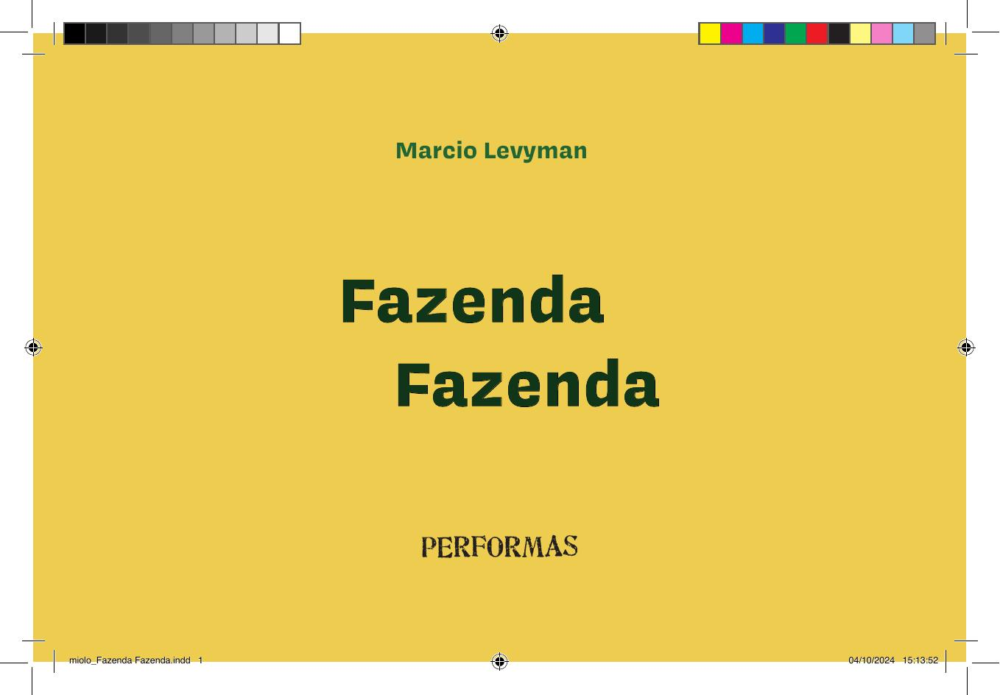

[Página 1]
Marcio Levyman

Fazenda
Fazenda

miolo_Fazenda Fazenda.indd 1

04/10/2024 15:13:52



---

[Página 2]
Copyright do texto e das ilustrações © 2024 Marcio Levyman
Direção e curadoria
Gestão editorial
Diagramação
Revisão

Todos os direitos reservados à Performas
Produções Artísticas e Socioculturais

Fábia Alvim
Felipe Augusto Neves Silva
Luisa Marcelino
Túlia Hortela

spcultura.prefeitura.sp.gov.br/espaco/5473/

Dados Internacionais de Catalogação na Publicação (CIP)
de acordo com ISBD
L668f

Rua Martinico Prado 90/104
01224-010 – São Paulo, SP

Levyman, Marcio

Fazenda fazenda / Marcio Levyman ; ilustrado por Marcio
Levyman. - São Paulo, SP : Performas, 2024.
24 p. : il. ; 20,5cm x 13,5cm.
ISBN: 978-65-98485-91-7 (livro impresso da criança)
978-65-98485-92-4 (livro digital da criança)
1. Literatura infantil. I. Título.

2022-3715

CDD 028.5
CDU 82-93

Elaborado por Vagner Rodolfo da Silva - CRB-8/9410
Índice para catálogo sistemático:
1. Literatura infantil 028.5
2. Literatura infantil 82-93

miolo_Fazenda Fazenda.indd 2

04/10/2024 15:13:52



---

[Página 3]
Para a inesquecível Fanny Abramovich, professora e parceira,
que leu, viu e insistiu para que essa Fazenda um dia virasse um livro.
Para a querida Cecilia Zioni, que ajudou a plantar
a primeira semente dessa Fazenda na Folhinha de S.Paulo.

miolo_Fazenda Fazenda.indd 3

04/10/2024 15:13:52



---

[Página 4]

miolo_Fazenda Fazenda.indd 4

04/10/2024 15:13:55



---

[Página 5]
Eram duas vezes
uma fazenda.

Fazenda onde tudo era duplo,
inclusive o nome.

miolo_Fazenda Fazenda.indd 5

04/10/2024 15:13:55



---

[Página 6]
Para se chegar até lá
era preciso andar duas vezes mais

miolo_Fazenda Fazenda.indd 6

04/10/2024 15:13:58



---

[Página 7]
porque a estrada de terra
dobrava em todas as curvas.

miolo_Fazenda Fazenda.indd 7

04/10/2024 15:13:58



---

[Página 8]
A casa tinha dois telhados,
duas entradas, duas saídas

miolo_Fazenda Fazenda.indd 8

04/10/2024 15:14:01



---

[Página 9]
e ainda por cima dois donos
que nela moravam duas vezes.

miolo_Fazenda Fazenda.indd 9

04/10/2024 15:14:02



---

[Página 10]
Na plantação nascia tudo em dobro. De cada semente, que era
dupla, nasciam sempre dois pés que cresciam duas vezes mais.

miolo_Fazenda Fazenda.indd 10

04/10/2024 15:14:05



---

[Página 11]
O espantalho espantava
duplamente.

miolo_Fazenda Fazenda.indd 11

04/10/2024 15:14:05



---

[Página 12]
Todas as árvores tinham dois troncos, duas copas
e faziam duas vezes mais sombra.

miolo_Fazenda Fazenda.indd 12

04/10/2024 15:14:08



---

[Página 13]
O rio eram dois.
Um que subia
e outro que descia.

miolo_Fazenda Fazenda.indd 13

04/10/2024 15:14:09



---

[Página 14]
As galinhas tinham dois bicos e quatro asas.
Botavam o dobro dos ovos,

miolo_Fazenda Fazenda.indd 14

04/10/2024 15:14:12



---

[Página 15]
de onde vinham sempre dois pintinhos.
Por sua vez, o galo acordava todo mundo duas vezes.

miolo_Fazenda Fazenda.indd 15

04/10/2024 15:14:12



---

[Página 16]
Nos porcos, com dois focinhos e dois rabos,
cada rabo era enrolado de um lado.

miolo_Fazenda Fazenda.indd 16

04/10/2024 15:14:15



---

[Página 17]
Tirar o leite da vaca era trabalho dobrado.
Cada litro, na verdade, eram dois.
miolo_Fazenda Fazenda.indd 17

04/10/2024 15:14:16



---

[Página 18]
Porque o sol era duplo, fazia duas vezes
mais calor durante o dia, que era duas
vezes mais longo.
E até as nuvens eram duplas. Quando chovia,
era chuva dobrada caindo duas vezes naquela
fazenda que era o dobro dela mesma.

miolo_Fazenda Fazenda.indd 18

04/10/2024 15:14:18



---

[Página 19]

miolo_Fazenda Fazenda.indd 19

04/10/2024 15:14:19



---

[Página 20]
Marcio Levyman nasceu em São Paulo. Tem formação em Arquitetura,
mas sempre atuou como artista gráfico e ilustrador. Participou de diversas
exposições individuais e coletivas. Transitou pela fotografia, pelo desenho
de humor, pela colagem e pela produção de materiais gráficos e objetos
inusitados. Utiliza técnicas como o desenho a nanquim, a colagem em papéis,
tecidos e texturas, os carimbos e as intervenções digitais. Colabora como
ilustrador em livros infantojuvenis, projetos didáticos, jornais e revistas.

miolo_Fazenda Fazenda.indd 20

04/10/2024 15:14:20



---

[Página 21]

miolo_Fazenda Fazenda.indd 21

04/10/2024 15:14:20



---

[Página 22]
O texto que compõe este livro foi publicado, originalmente, na Folha de
S.Paulo, na Folhinha, em novembro de 1984. Naquela época, Marcio Levyman
colaborava no jornal com cartuns e tiras para os pequenos leitores.

“Fui leitor da Folhinha quando criança e, muitos anos depois, este
foi o meu primeiro texto publicado. A ilustração que fiz para a
publicação tentava sintetizar tudo em uma só imagem.”
Marcio Levyman.

miolo_Fazenda Fazenda.indd 22

04/10/2024 15:14:20



---

[Página 23]

miolo_Fazenda Fazenda.indd 23

04/10/2024 15:14:21



---

[Página 24]
Esta obra foi composta em Presley Slab e Covik Sans
e impressa sobre papel cuchê fosco 115 g/m²
para a Performas em 2024.

miolo_Fazenda Fazenda.indd 24

04/10/2024 15:14:21



---

