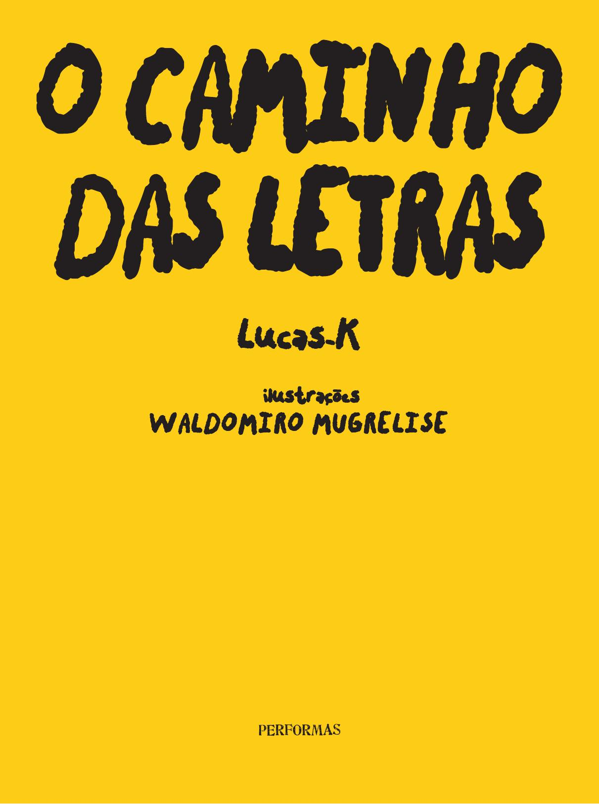

[Página 1]


---

[Página 2]


---

[Página 3]


---

[Página 4]


---

[Página 5]


---

[Página 6]


---

[Página 7]


---

[Página 8]


---

[Página 9]


---

[Página 10]


---

[Página 11]


---

[Página 12]


---

[Página 13]


---

[Página 14]


---

[Página 15]


---

[Página 16]


---

[Página 17]


---

[Página 18]


---

[Página 19]


---

[Página 20]


---

[Página 21]


---

[Página 22]


---

[Página 23]


---

[Página 24]
vamos passear
com a letra I pelas
montanhas?



---

[Página 25]


---

[Página 26]


---

[Página 27]


---

[Página 28]


---

[Página 29]


---

[Página 30]


---

[Página 31]


---

[Página 32]


---

[Página 33]


---

[Página 34]


---

[Página 35]


---

[Página 36]


---

[Página 37]


---

[Página 38]


---

[Página 39]


---

[Página 40]


---

[Página 41]


---

[Página 42]


---

[Página 43]


---

[Página 44]


---

[Página 45]


---

[Página 46]


---

[Página 47]


---

[Página 48]


---

[Página 49]


---

[Página 50]


---

[Página 51]


---

[Página 52]


---

[Página 53]


---

[Página 54]


---

[Página 55]


---

[Página 56]


---

[Página 57]


---

[Página 58]


---

[Página 59]


---

[Página 60]
LU CAS- K, NOM E A RTÍST I CO D E LU CAS D E
M ESQU I TA K RÖE F F, É U M A RT I STA V I SUA L
B R AS I LE I RO. É BAC HA R E L E M D ES I G N
P E LA U N I V E RS I DA D E F E D E R A L D E M I N AS
G E R A I S (U F M G) E E M A RT ES V I SUA I S P E LA
CA M B R I D G E S C H OOL OF A RTS ( RU S K I N
S C H OOL), N A I N G LAT E R R A . D ES E N VOLV E
T R A BA LH OS NU M A I NT E R FAC E LI V R E E NT R E
I N I C I AT I VAS I ND E P E ND E NT ES, I N ST I T U IÇÕES
D E A RT E E E D I TOR AS . P ROD UZ I N STA LAÇÕES,
LI V ROS, VÍD EOS E E X P E R IÊN C I AS COLET I VAS .



---

[Página 61]
LU CAS K RÖE F F É A RT I STA G RÁF I CO E
T R A BA LHA COM LI V ROS HÁ M A I S D E D E Z
A NOS . D ES E N VOLV E COLEÇÕES E D I TOR I A I S QU E
U S A M D O A LFA B ETO COM O F E R R A M E NTA .
JÁ T E V E T R A BA LH OS A P R ES E NTA D OS N A
11ª B I E N A L D E A RQU I T ET U R A D E SÃO PAU LO,
MU S EU D E T EC NOLO G I A D E CA M B R I D G E,
C I N E M AT ECA D E SÃO PAU LO, MU S EU D E M I N AS
E M ETA L, I I I X F EST I VA L I NT E R N AC I ON A L D E
V I D EOA RT E D E BA RC E LON A , A RCOM A D R I D,
E NT R E OU T ROS . E M 2015, R EC E B EU O
P RÊM I O D E A RT E DA SU ST E NTA B I LI DA D E
E M CA M B R I D G E . PA RT I C I POU D E COLET I VOS
D E A RT E COMO A AT P R ES S E M LOND R ES,
B E M COMO NOS G RU POS M A PA , BA N CA E
QUA D R A D O C I RCU LO NO B R AS I L .



---

[Página 62]


---

[Página 63]
C O P Y R I G H T DA E D I Ç Ã O ©

E D I T O R A H E D R A LT DA

				

D I R E I T O S C E D I D O S À P E R FO R M A S

I LU S T R A Ç Õ E S ©
ED IÇÃO

WA L D O M I R O M U G R E L I S E

J O R G E S A L LU M

COED IÇÃO

SUZA NA SA LA M A

R EV ISÃO

PAU LO H E N R I Q U E P O M P E R M A I E R

E R E N I E R S I LVA

DADOS INTERNACIONAIS DE CATALOGAÇÃO
NA PUBLICAÇÃO (CIP)
CÂMARA BRASILEIRA DO LIVRO, SP, BRASIL
W492C

K, LUCAS

O CAMINHO DAS LETRAS. LUCAS-K. ILUSTRAÇÕES
DE WALDOMIRO MUGRELISE. SÃO PAULO: EDITORA
HEDRA, 2021. 64 PÁGINAS, 27,5 X 20,5 CM.
1. LITERATURA INFANTIL. 2. BRINCADEIRAS.
ISBN: 978-65-89705-91-8
2021-3187			CDD 028.5
					CDU 82-93
ÍNDICE PARA CATÁLOGO SISTEMÁTICO
1. LITERATURA INFANTIL (028.5)
2. LITERATURA INFANTIL (82-93)
VAGNER RODOLFO DA SILVA, BIBLIOTECÁRIO
(CRB 8/9410)

EDITORA HEDRA LTDA
AV. SÃO LUÍS 187, PISO 3 LOJA 8
SÃO PAULO, SP, CEP 01046-912
TELEFONE 55 11 3097-8304
EDITORA@HEDRA.COM.BR



---

[Página 64]
ADV ERTE-SE AOS CU RIOSOS QUE SE
I M PRI M IU ESTA OBRA EM AG OSTO DE 2022,
COM POSTA NAS FONTES M ARKER FELT E
CHALKY CH ICKEN, EM PA PEL OFFSET 120



---

