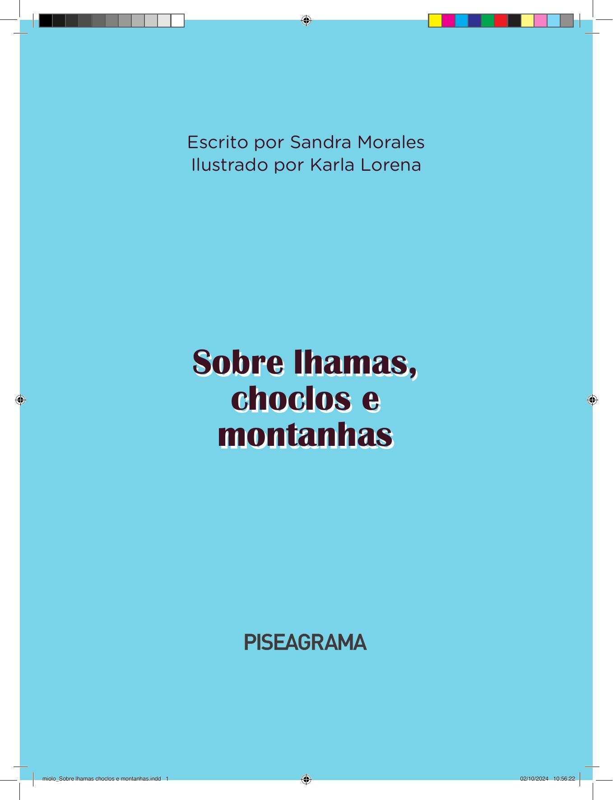

[Página 1]
Escrito por Sandra Morales
Ilustrado por Karla Lorena

Sobre lhamas,
choclos e
montanhas

miolo_Sobre lhamas choclos e montanhas.indd 1

02/10/2024 10:56:22



---

[Página 2]
Copyright do texto © 2024 Sandra Morales
Copyright das ilustrações © 2024 Karla Lorena
Direção e curadoria
Gestão editorial
Diagramação
Revisão

Fábia Alvim
Felipe Augusto Neves Silva
Luisa Marcelino
Márcia S. Zenit

Dados Internacionais de Catalogação na Publicação (CIP) de acordo
com ISBD
M828s Morales, Sandra
Sobre lhamas, choclos e montanhas / Sandra Morales ;
ilustrado por Karla Lorena. - São Paulo, SP :
Piseagrama, 2024.
16 p. : il. ; 20,5cm x 27,5cm.
ISBN: 978-65-89833-11-6 (livro impresso da criança)
978-65-89833-12-3 (livro digital da criança)
1. Literatura infantil. I. Lorena, Karla. II. Título.

2022-3616

CDD 028.5
CDU 82-93

Elaborado por Vagner Rodolfo da Silva - CRB-8/9410
Índice para catálogo sistemático:
1. Literatura infantil 028.5
2. Literatura infantil 82-93
Todos os direitos reservados à Piseagrama.
www.piseagrama.org
Avenida Afonso Pena, 941, Sala 701
30130-002 – Belo Horizonte, MG

miolo_Sobre lhamas choclos e montanhas.indd 2

02/10/2024 10:56:24



---

[Página 3]
A lhama é muito nobre e inteligente, pois é o único animal
de carga que não segue adiante quando é maltratado.

Ela só vai em frente e ajuda se falam com ela
e a tratam com carinho; senão, ela se deita no
chão em sinal de tristeza e não caminha mais.

miolo_Sobre lhamas choclos e montanhas.indd 3

02/10/2024 10:56:24



---

[Página 4]
Minha mãe me contou essa e outras histórias de
animais, como as de raposas, pumas, condores e
tantos outros que fazem parte das lendas andinas.

miolo_Sobre lhamas choclos e montanhas.indd 4

02/10/2024 10:56:28



---

[Página 5]

miolo_Sobre lhamas choclos e montanhas.indd 5

02/10/2024 10:56:29



---

[Página 6]

miolo_Sobre lhamas choclos e montanhas.indd 6

02/10/2024 10:56:31



---

[Página 7]
Mamãe sabe essas histórias porque ela nasceu
no Peru. Meu pai também nasceu lá. Eles
emigraram para o Brasil muitos anos atrás.

Já eu nasci no Brasil.

O Peru fica muito perto do Brasil, mas para
chegar lá é necessário pegar um avião.

miolo_Sobre lhamas choclos e montanhas.indd 7

02/10/2024 10:56:31



---

[Página 8]
Fui ao Peru pela primeira vez quando eu tinha três anos e
conheci muitos primos, primas, tios e tias. Eu me diverti um
montão, porque todos falavam em espanhol (e eu entendia
tudo) e sempre pediam que eu falasse em português para eles
aprenderem algumas palavras.
Já fui duas vezes ao Peru. Não sei bem como explicar, mas,
quando vou para lá, sinto saudades do Brasil. Se estou no
Brasil, sinto saudades do Peru.

miolo_Sobre lhamas choclos e montanhas.indd 8

02/10/2024 10:56:36



---

[Página 9]
Tenho muitos amigos e amigas aqui no Brasil,
amigos e amigas do meu bairro e da minha escola.
Eles e elas adoram ouvir as histórias que eu conto
sobre o Peru e acabam aprendendo várias palavras
em espanhol, porque eu misturo as duas línguas.

Meu pai sempre me diz que, se por acaso alguém não
conseguir me entender, posso procurar outras formas
para me expressar, tentando fazer que me entendam.

miolo_Sobre lhamas choclos e montanhas.indd 9

02/10/2024 10:56:38



---

[Página 10]
No dia em que ensinei a palavra choclo, meus amigos e
amigas riram muito, porque acharam engraçado, mas
ficaram impressionados quando eu contei que, no Peru, o
choclo tem muitas cores e tamanhos diferentes e que ele
é comido cozido ou frito e aparece em bolos ou sorvetes,
por exemplo.

miolo_Sobre lhamas choclos e montanhas.indd 10

02/10/2024 10:56:42



---

[Página 11]
Também gosto de contar para os meus amigos e as
minhas amigas sobre as grandes montanhas que formam
a cordilheira dos Andes, que parece pintada de branco,
porque muita neve se forma no topo. Minha mãe diz que
as montanhas sentem nossa presença e nos observam.
Decidimos que, quando tivermos idade apropriada,
iremos todos juntos para conhecê-las e escalá-las.

miolo_Sobre lhamas choclos e montanhas.indd 11

02/10/2024 10:56:43



---

[Página 12]
Também tenho muitos amigos e amigas
que não nasceram no Brasil ou que têm
pais vindos de outros países. Eu adoro isso,
porque sempre me ensinam brincadeiras,
palavras, costumes e comidas.

miolo_Sobre lhamas choclos e montanhas.indd 12

02/10/2024 10:56:44



---

[Página 13]
Para mim, é muito
divertido ter muitos
amigos e amigas
e aprender tantas
culturas e línguas
diferentes.

miolo_Sobre lhamas choclos e montanhas.indd 13

02/10/2024 10:56:45



---

[Página 14]
Sobre a autora
Sandra Morales nasceu no sul do Peru, na cidade de
Arequipa. Psicóloga de profissão, trabalhou por mais de dez
anos com crianças. Migrou para o Brasil em 2014, país onde
se especializou em psicologia junguiana, combinando seus
estudos com o interesse pela mitologia e pela cosmovisão
andina. Atualmente mora em São Paulo e trabalha como
psicoterapeuta e como professora. Ela é companheira do
Giancarlo e mãe da Bruna.

miolo_Sobre lhamas choclos e montanhas.indd 14

02/10/2024 10:56:48



---

[Página 15]
Sobre a ilustradora
Karla Lorena nasceu na Bolívia, na cidade de La Paz. Aos
onze anos mudou-se para o Brasil. Na escola sempre foi
elogiada por seus desenhos. Formada em Comunicação
Audiovisual, gosta de ouvir e transmitir histórias, seja com
a edição de vídeos, seja com a ilustração. Atualmente é
iniciante na arte digital, trabalha com edição de vídeos
e animação na Empresa Kaptiva, voltada para soluções
educacionais (EAD), contando histórias para facilitar o
ensino a distância.

miolo_Sobre lhamas choclos e montanhas.indd 15

02/10/2024 10:56:49



---

[Página 16]
Esta obra foi composta em Gotham Rounded e
impressa sobre papel cuchê fosco 115 g/m2 para
a Piseagrama em 2024.

miolo_Sobre lhamas choclos e montanhas.indd 16

02/10/2024 10:56:50



---

