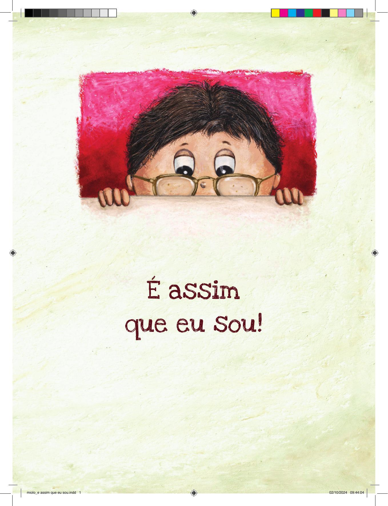

[Página 1]
É assim
que eu sou!

---

[Página 2]

---

[Página 3]
É assim
que eu sou!

TEXTO E ILUSTRAÇÕES:
NEWTON CESAR

---

[Página 4]
Umas
pernas são
tortinhas.

---

[Página 5]
Outras
são bem
compridinhas.

---

[Página 6]
Uns
têm perna
de pau.

---

[Página 7]
Outros,
de metal.

---

[Página 8]
Minha perna é redonda

---

[Página 9]
e com ela eu tiro onda.

---

[Página 10]

É assim que eu sou!

---

[Página 11]

---

[Página 12]

Uns dentes
são para a
frente.

---

[Página 13]
Outros,
presos por
corrente.

---

[Página 14]
Minha
boca é uma
janela.

---

[Página 15]
E o meu
apelido é
banguela.

---

[Página 16]

É assim que...

---

[Página 17]

eu sou!

---

[Página 18]
As mãos
têm o polegar.

---

[Página 19]
E também
o indicador.

---

[Página 20]
O médio,

o anular

eo
mindinho.

---

[Página 21]
Todos
ficam bem
juntinhos.

o.

---

[Página 22]
Contando-se todos,
são cinco.

---

[Página 23]
Mas cinco
não é
comigo.

---

[Página 24]
É assim que
eu s!

---

[Página 25]

---

[Página 26]
Existe cabelo que é gigante.

---

[Página 27]
E uns
só existem com
implante.

---

[Página 28]

Existem cabelos ondulados.

---

[Página 29]

E também os cacheados.

---

[Página 30]
Meu cabelo
não é nem
de um jeito
nem de outro.

---

[Página 31]

---

[Página 32]

É assim...

---

[Página 33]

que eu sou!

---

[Página 34]
Uns falam
bastante.

---

[Página 35]
Outros,
bem
pouquinho.

---

[Página 36]
Eu falo
com as mãos.
Nem por
isso sou
quietinho.

---

[Página 37]

---

[Página 38]

É ASSIM QUE EU SOU

---

[Página 39]
OI

---

[Página 40]
Um tem poder de
capa e espada.

---

[Página 41]
Outro, quando
desce da fachada.

---

[Página 42]
Meu poder está
bem na cara.

---

[Página 43]

---

[Página 44]
Uns acham
que sou
triste.

---

[Página 45]
Outros,
que sou
diferente.

---

[Página 46]

---

[Página 47]
Mas é só olhar
bem aqui no fundo
para ver que sou
igual a todo o
mundo.

---

[Página 48]
NEWTON CESAR
Autor e ilustrador

Formado em Marketing e pós-graduado em Marketing
Digital, Newton Cesar é escritor, publicitário, designer e
ilustrador.
Atuou em agências de propaganda, exercendo as funções
de direção de arte e criação. Também se especializou em
design editorial, desenvolvendo projetos gráficos e capas
de livros para editoras.
Como escritor, publicou livros de ficção e de negócios.
Entre eles:
• Um minuto
• Bendito maldito
• Eu, Beatriz e Ângela
• O mar e a escuridão
• A morte é de matar
• Direção de arte em propaganda
• Making of
• Vitamina fotográfica
• Os primeiros segredos da direção de arte
• Do livro ao livro: A arte de escrever e publicar ficção

Esta obra foi composta em Love Ya Like A Sister e em Minion Pro
e impressa sobre papel cuchê fosco 115 g/m²
para a Saíra Editorial em 2024.

---

