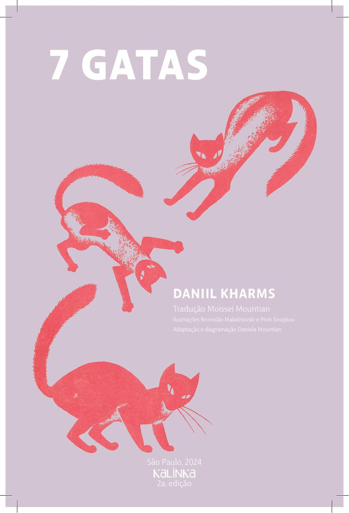

[Página 1]
7 GATAS

DANIIL KHARMS
Tradução Moissei Mountian

Ilustrações Bronisláv Malakhóvski e Piotr Snopkоv
Adaptação e diagramação Daniela Mountian

---

[Página 2]

---

[Página 3]

---

[Página 4]
VEJA SÓ QUE
HISTÓRIA!

---

[Página 5]
NÃO SEI O QUE FAZER.

ESTOU TODO CONFUSO

NÃO SEI MAIS DE NADA.

---

[Página 6]
ESCUTEM ESTA:

---

[Página 7]
EU ARRANJEI UM TRABALHO
DE VIGIA NUMA EXPOSIÇÃO DE
GATOS.

---

[Página 8]
ELES ME DERAM UMAS LUVAS
DE COURO PARA AS GATAS NÃO
ARRANHAREM MEUS DEDOS.

---

[Página 9]
DEPOIS ME MANDARAM PÔR AS
BICHANAS NUMAS CAIXINHAS E,
EM CADA CAIXINHA, ESCREVER
O NOME DA GATA.

---

[Página 10]
— TÁ BEM — DISSE EU —, MAS
COMO ELAS SE CHAMAM?

---

[Página 11]
— É ASSIM — DISSERAM —, A GATA DA
ESQUERDA SE CHAMA MARIOLINHA,
DO LADO DELA ESTÁ SENTADA A
PIRULITO, DEPOIS A SININHO, E ESSA
É A TOQUINHO, ESSA AQUI A JUJUBA, A
BUBA, E AQUELA ALI A PULA-PULA.

---

[Página 12]

MA... 

PI...

SI...

---

[Página 13]
TO

JU

BU

PU

---

[Página 14]
ENTÃO EU FICO SOZINHO COM
AS GATAS E PENSO:

---

[Página 15]
“PRIMEIRO VOU TOMAR UM
CHAZINHO, DEPOIS PONHO AS
GATAS NAS CAIXINHAS”.

---

[Página 16]

---

[Página 17]
AQUI ESTOU EU BEBENDO MEU
CHAZINHO E OLHANDO PARA
AS GATAS.

---

[Página 18]
UMA ESFREGA A PATA NO FOCINHO,
OUTRA OLHA PARA O TETO, A TERCEIRA
PASSEIA PELA SALA.

---

[Página 19]
EDONHA,
M
Z
O
V
RITA COM
G
A
T
R
A
U
A
AQ
RE SI, E UM
T
N
E
O
D
AM CHIAN
DUAS FIC
E ME DÁ
M
I
M
E
D
GA PERTO
E
H
C
A
D
N
AI
PERNA.
A
N
A
H
N
I
DID
UMA MOR

---

[Página 20]
EIXEI A
D
É
T
A
E
PULO
M
U
I
E
D
U
E
IR.
XÍCARA CA

---

[Página 21]
— CREDO! — GRITO EU. — NEM
PARECE UMA GATA. MAS VOCÊ É
A PIRULITO OU A TOQUINHO, OU
QUEM SABE A PULA-PULA?

---

[Página 22]
DE REPENTE EU ENTENDI QUE O
NOME DE TODAS CONFUNDI.

---

[Página 23]
NÃO TINHA A MENOR IDEIA DE
COMO CADA GATA SE CHAMAVA.

---

[Página 24]
— EI! — GRITO.— MARIOLINHA! PIRULITO!
SININHO! TOQUINHO! JUJUBA! BUBA!
PULA-PULA!
MAS AS GATAS NÃO DÃO A MÍNIMA.

---

[Página 25]
A ELAS:
R
A
P
I
E
T
I
EU GR

– KIS-KIS-KIS!

---

[Página 26]
E TODAS DE UMA VEZ SE
VOLTARAM PARA MIM.

---

[Página 27]
QUE FAZER?

---

[Página 28]

---

[Página 29]
ENTÃO AS GATAS SUBIRAM NO
PEITORIL DA JANELA, VIRARAM-SE E FICARAM OLHANDO PARA
FORA.

---

[Página 30]
TODAS ESTÃO SENTADAS, MAS QUAL É
A PULA-PULA E QUAL É A SININHO? NÃO
SEI MAIS DE NADA. ACHO QUE SÓ UMA
PESSOA MUITO SABIDA SERIA CAPAZ
DE ADIVINHAR O NOME DAS GATAS.

---

[Página 31]

---

[Página 32]

---

[Página 33]
PRESTE ATENÇÃO NESTA CENA
E DIGA QUAL É A MARIOLINHA,
QUAL É A PIRULITO, A SININHO,
A TOQUINHO, A JUJUBA, A BUBA
E A PULA-PULA.

---

[Página 34]
MARIOLINHA

---

[Página 35]
É A AMARELA

---

[Página 36]
PIRULITO

---

[Página 37]
É A AZUL

---

[Página 38]
SININHO

---

[Página 39]
É A VERMELHA

---

[Página 40]
TOQUINHO

---

[Página 41]
É A VERDE

---

[Página 42]
JUJUBA

---

[Página 43]
É A ROXA

---

[Página 44]
BUBA

---

[Página 45]
É A LARANJA

---

[Página 46]
PULA-PULA

---

[Página 47]
É A PRETA

---

[Página 48]
Editora Kalinka
www. kalinka.com.br

---

