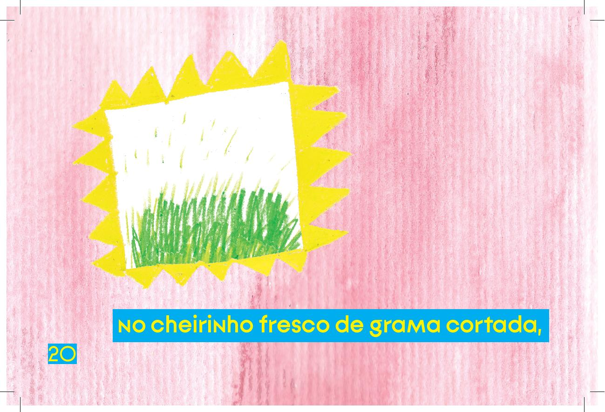
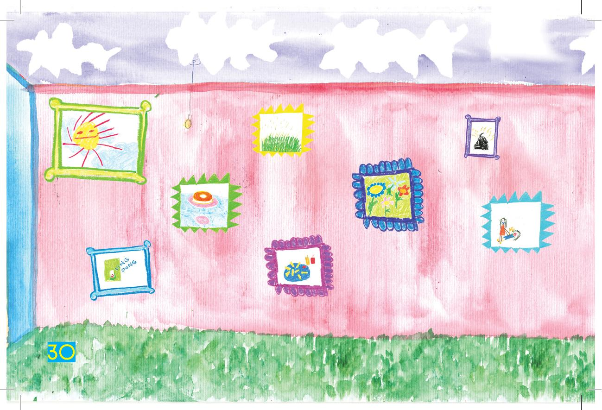

[Página 1]
TODOS OS NOSSOS SUPER PODERES
(também conhecidos como os cinco sentidos)

escrito por
Andressa Ce.

ilustrado por
Isabel Lee

---

[Página 2]

---

[Página 3]
TODOS OS NOSSOS SUPER PODERES
(também conhecidos como os cinco sentidos)

---

[Página 4]
EU E VOCÊ SOMOS SERES HUMANOS.

---

[Página 5]
Nós, seres humanos,
temos cinco
super poderes,

eles também são conhecidos
como cinco sentidos.

---

[Página 6]

TATO

---

[Página 7]
é como eu sinto o vento frio no rosto,

---

[Página 8]
é o toque fofinho do cobertor,

---

[Página 9]
são as cócegas divertidas
que mamãe me faz.

---

[Página 10]
Audição

---

[Página 11]
é como eu escuto o mágico
canto dos passarinhos,

---

[Página 12]

ou o agudo “ding-dong” da campainha

---

[Página 13]
e até o zumbido chato do mosquito!

---

[Página 14]
Visão

---

[Página 15]
me faz fechar os olhos quando olho
para o sol brilhante,

---

[Página 16]

me permite ver o colorido do arco-íris,

---

[Página 17]
me deixa ver uma foto e ter
uma lembrança querida.

---

[Página 18]
Olfato

---

[Página 19]
está no suave perfume das flores,

---

[Página 20]
no cheirinho fresco de grama cortada,

---

[Página 21]
mas também me faz perceber o lixo fedorento,

---

[Página 22]
Paladar

---

[Página 23]
está no gosto azedo do limão,

---

[Página 24]
no salgado da batata frita,

---

[Página 25]
e no doce do pudim da vovó.

---

[Página 26]
Os poderes variam de pessoa para pessoa.

---

[Página 27]
às vezes se não temos um,
o outro é ainda mais poderoso!

---

[Página 28]
Tornando cada ser humano único

---

[Página 29]
e especial.

---

[Página 30]

---

[Página 31]
FIM

---

[Página 32]
Andressa Ce. já quis ser mágica de circo, espiã secreta,
astronauta e veterinária de animais selvagens. Acabou sendo
fotógrafa e escritora, porque descobriu que o importante
mesmo era nunca abandonar sua imaginação.

Isabel Lee nasceu em Santos e estudou Artes Visuais,
já trabalhou com mosaico e design mas o que gosta
mesmo de fazer é inventar mundos e desenhar histórias.

---

