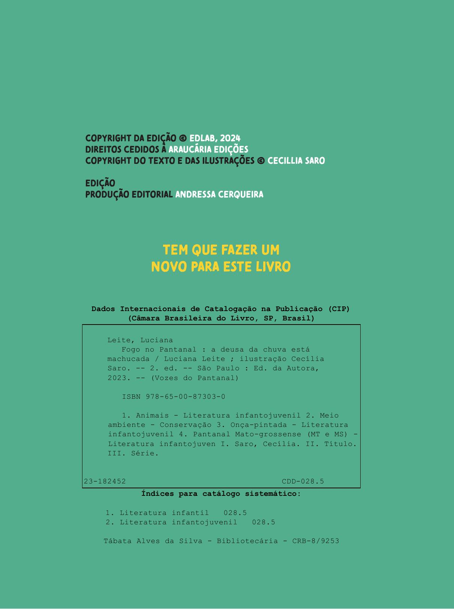
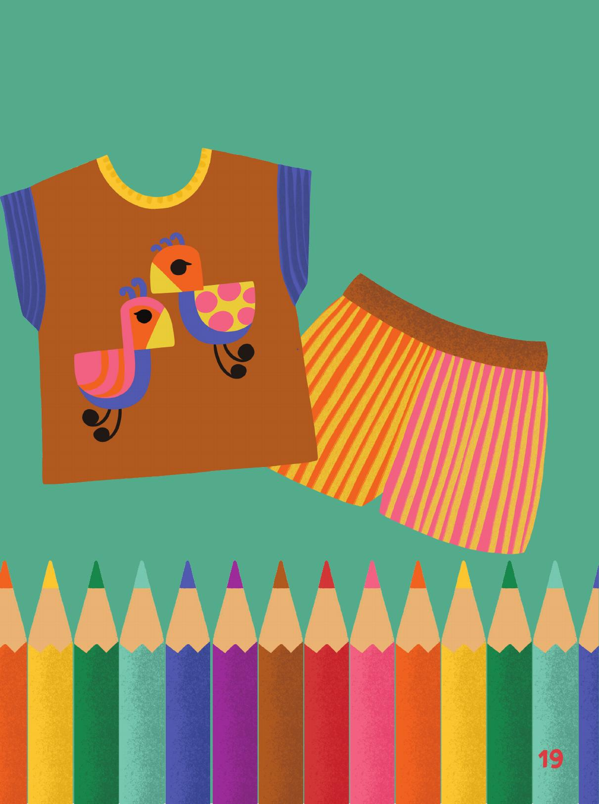

[Página 1]
Cadê as cores que estavam aqui?

Escrito & Ilustrado por
Cecilia Saro

---

[Página 2]

---

[Página 3]
A todos,
meu alerta e pedido para
conservarmos todas a cores
vivas ao nosso redor.

---

[Página 4]

TUDO TEM COR NA NATUREZA

---

[Página 5]

E AS CORES ESPANTAM NOSSA TRISTEZA.

---

[Página 6]
A planta, o sapo e o sapato.

---

[Página 7]

---

[Página 8]
O sol, a onça e a coroa.

---

[Página 9]

---

[Página 10]
O mar, a baleia e a chaleira.

---

[Página 11]

---

[Página 12]
A a terra, o tamanduá e o sofá.

---

[Página 13]

---

[Página 14]
O coração, a cobra e o balão.

---

[Página 15]

---

[Página 16]
Elas estão em tudo! Elas trazem
diversidade e inspiração

---

[Página 17]
para a nossa vida e a
nossa criaçÃo.

---

[Página 18]
Por causa delas, nossos lápis de
cor, nossos livros, nossas roupas
são coloridos.

---

[Página 19]
E assim, nossos dias ficam muito
mais divertidos!

---

[Página 20]
Além disso tudo, as cores fazem
bem aos nossos olhos,

---

[Página 21]
melhoram a nossa saúde
e conservam eternamente
nossa juventude.

---

[Página 22]
Mas o mundo está mudando
e as suas cores também.
A crise climática chegou,
e ela não POUPA ninguém!

---

[Página 23]

---

[Página 24]
Nós, humanos, temos mudado
a natureza ao nosso redor,

---

[Página 25]
Ela está cada vez mais triste,
cinza e só.

---

[Página 26]
Estamos derrubando a mata onde
moram nossos animais.

---

[Página 27]
Quando eles se vão, perdemos seu
canto, suas cores e a nossa paz.

---

[Página 28]
O fogo também tem mudado
nossa paisagem,

---

[Página 29]
Depois que ele passa o verde fica
cinza, deixando tudo sem vida.

---

[Página 30]
As borboletas também mudam,
assim como Pássaros e flores

---

[Página 31]
que ao perderem sua casa e sua vida,
acabam perdendo suas cores.

---

[Página 32]
NO fundo do mar também acontece
igual, a Pesca, a poluição e o calor

---

[Página 33]
têm mexido com a qualidade de
vida de cada alga e cada animal.

---

[Página 34]
Muitos animais já não vivem lá
e os corais seres tão importantes,

---

[Página 35]
também têm perdido suas cores num
movimento incessante.

---

[Página 36]

E A CADA DIA QUE PASSA, 

---

[Página 37]

NOSSOS DIAS TÊM PERDIDO AS CORES...

---

[Página 38]
Mas não é só a natureza que padece
com isso, ninguém consegue

---

[Página 39]
viver bem em um mundo sem cor e
sem vida, cada vez mais vazio.

---

[Página 40]
Precisamos lembrar que a natureza
é também o nosso lar.

---

[Página 41]

---

[Página 42]
as árvores são muito importantes,
cortá-las é um erro constante.

---

[Página 43]
Não vamos deixar a cor da
esperança desbotar!

---

[Página 44]
Vamos ensinar à todos que lugar do
lixo não é no mar,

---

[Página 45]
que é proibido caçar nossos animais
e colocar fogo em nossos pantanais

---

[Página 46]
cuidando da natureza estamos
garantindo um mundo de vida e
menos tristeza.

---

[Página 47]
e muito mais colorido,
com absoluta certeza!

---

[Página 48]
Autora & Ilustradora
Cecilia Saro é uma artista sutil que nos transporta para
perguntas mobilizadoras dos nossos dias de forma lúdica.
Como conhecer de verdade o mundo sem perder o
encantamento? Como encarar a perda das cores que nos
circundavam e ter vontade para repintá-las?
Cecilia é observadora do tempo e dos seus rastros em nossos
dias. Neste livro, o ecológico, a brincadeira, a beleza e a
proposta escondida do fazer junto aparecem como pano de
fundo, para questões que as crianças de hoje convivem desde
o seu nascimento. A autora, como quem convida o outro para
começar uma brincadeira, relembra-nos de como o mundo
era ontem, de como está hoje e como pode ser amanhã, e com
leveza e encantamento espera que aceitemos o seu convite
por Barbara Ganizev Jimenez.

---

