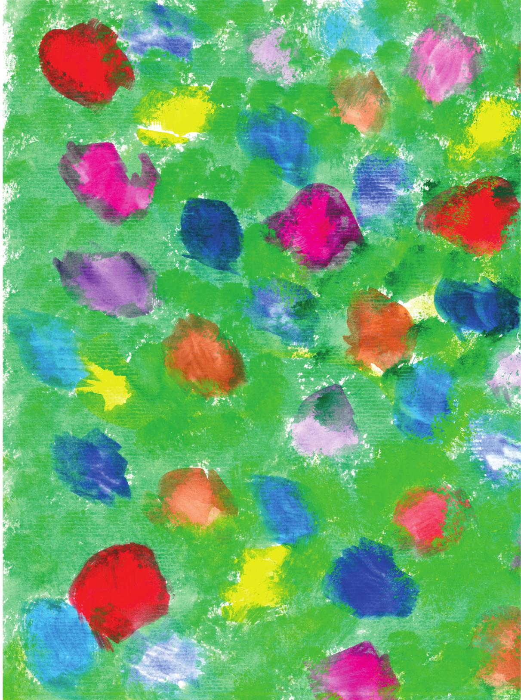

[Página 1]

---

[Página 2]

---

[Página 3]
PRAZER,
AMAZÔNIA

De MARINA HIROTA E CLAUDIA TIETSCHE

---

[Página 4]
PRAZER,

---

[Página 5]
MEU NOME É AMAZÔNIA!

---

[Página 6]
SOU UMA FLORESTA
BELA E DIVERSA:

---

[Página 7]
SÃO TANTAS
ÁRVORES, BICHOS

E FLORES…
SÃO TANTAS FORMAS, SONS E CORES!

---

[Página 8]
TUDO FUNCIONANDO EM CONJUNTO,

---

[Página 9]
NUM CICLO NATURAL QUE SEMPRE RECOMEÇA!

---

[Página 10]
A ÁGUA

EM ABUNDÂNCIA ME BANHA!

---

[Página 11]
TRILHÕES DE GOTINHAS DOS RIOS
E LAGOS, SOBEM AOS CÉUS COM
O CALOR DO SOL.

---

[Página 12]
JUNTAM-SE EM NUVENS,

---

[Página 13]
PARA LOGO DELAS PULAREM

---

[Página 14]
AO SOLO,
	ÀS PLANTAS,
		AOS ANIMAIS,

---

[Página 15]
ATÉ RETORNAREM AOS SAGRADOS RIOS!

---

[Página 16]
TANTAS GOTINHAS
DE ÁGUA SUBINDO
E DESCENDO,

---

[Página 17]
DOS RIOS E DO SUOR DAS FOLHAS
DE MINHAS ÁRVORES,

ME ENCHEM DE SUPERPODERES PARA
CUIDAR DO CLIMA!

---

[Página 18]
MESMO SENDO UMA FLORESTA GIGANTE,

---

[Página 19]
VOU PRECISAR DE TODA A AJUDA
POSSÍVEL, DE TODO O LUGAR
DO PLANETA.

---

[Página 20]
COMO CRIANÇAS, VOCÊS SABEM SER NATUREZA!

---

[Página 21]
SÃO CAPAZES DE SE PERDER
NO MOVIMENTO DAS ASAS DE UMA BORBOLETA

---

[Página 22]
DE SUBIR NO GALHO MAIS ALTO
DE UMA ÁRVORE,

---

[Página 23]
PARA COLHER SEU FRUTO
OU OLHAR MAIS DE PERTO
UM NINHO DE PASSARINHO...

---

[Página 24]
DE CONSIDERAR FLOR O AVESSO ROXO
DE UMA FOLHA VERDE,

---

[Página 25]
POIS NA PUREZA DO OLHAR
DE VOCÊS, CORES SÃO FLORES!

---

[Página 26]
MEU PEDIDO É QUE,
MESMO QUANDO FICAREM GRANDES,

---

[Página 27]
VOCÊS CONTINUEM SE SENTINDO
PARTE DA NATUREZA!

---

[Página 28]
ASSIM SERÃO CAPAZES
DE OBSERVAR, CUIDAR, VALORIZAR
E AMAR TODAS AS FLORESTAS,

---

[Página 29]
COMO PARTE
DE UMA GRANDE FAMÍLIA!

---

[Página 30]

---

[Página 31]
ABRAÇOS,

AMAZÔNIA.

---

[Página 32]
MARINA HIROTA
já foi bailarina e jogadora de
vôlei, mas porque gostava
muito de estudar e tinha o
desejo de conhecer o mundo
tornou-se cientista. Depois
de transitar por áreas como
matemática, ecologia e
antropologia, percebeu que
gosta mesmo é de olhar a Terra
e suas interações com um
olhar novo a cada momento
e colaborar com pessoas que
trabalham com diferentes
visões e perspectivas. Vem
trabalhando há vinte anos com
ecossistemas tropicais, como a
Amazônia e o Cerrado, e há sete
anos, iniciou sua caminhada
como a mãe do Kai, seu filho
que a inspira todos os dias com
sua curiosidade e vontade de
viver intensamente o presente.

CLAUDIA TIENTSCHE
É ESCRITORA E ILUSTRADORA
DE LIVROS INFANTOJUVENIS.
CLAUDIA É MÃE DA JOANA E
DA LAÍS.

---

