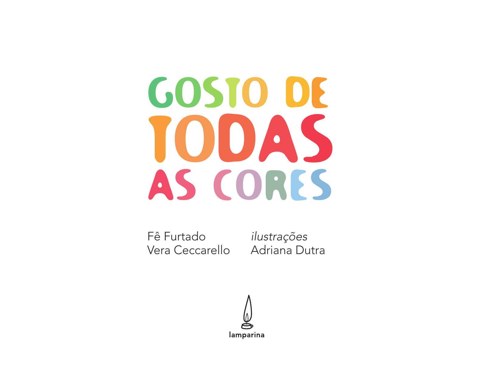

[Página 1]
GOSTO DE

TODAS
AS CORES

Fê Furtado
Vera Ceccarello

ilustrações
Adriana Dutra



---

[Página 2]
©2023 Fê Furtado, Vera Ceccarello
©2024 Produção Editorial Lamparina
Este livro segue as normas do Acordo Ortográfico da Língua
Portuguesa de 1990, em vigor no Brasil desde 2009.
Coordenação editorial

Patricia Capella
Tatiana Kely

Ilustrações e projeto gráfico

Adriana Dutra

Diagramação

Daniel Furtado

CIP-BRASIL. CATALOGAÇÃO NA PUBLICAÇÃO
SINDICATO NACIONAL DOS EDITORES DE LIVROS, RJ
F987g
2. ed.
Furtado, Fê
Gosto de todas as cores / Fê Furtado, Vera Ceccarello; ilustração Adriana Dutra.
- 2. ed. - Rio de Janeiro : Lamparina, 2024.
32 p. ; 28 cm.
ISBN 978-65-88791-31-8
1. Ficção. 2. Literatura infantojuvenil brasileira. I. Ceccarello,
Vera. II. Dutra, Adriana. III. Título.
24-94194			CDD: 808.899282
				CDU: 82-93(81)
Gabriela Faray Ferreira Lopes - Bibliotecária - CRB-7/6643



---

[Página 3]
PARA FRED, CAETANO, PEDRO, MIGUEL, JOÃO,
NICOLAS, LAURA, ÍSIS, EDOARDO E VALENTINA.
QUE DANI INSPIRE CRIANÇAS DE TODAS AS
IDADES A SENTIR O GOSTO DE SER QUEM SE
DESEJAR SER.



---

[Página 4]
MEU NOME É DANI.

SOU UMA CRIANÇA MUITO ESPERTA,
DEIXO A MENTE SEMPRE ABERTA.

AS BRINCADEIRAS SÃO
A MELHOR PARTE DO DIA.
COM ELAS, TRANSBORDO ALEGRIA.



---

[Página 5]


---

[Página 6]
MEU QUARTO, MEU MUNDO.
AQUI POSSO PINTAR
DA ESTRELA MAIS ALTA
AO AZUL MAIS PROFUNDO!



---

[Página 7]


---

[Página 8]


---

[Página 9]
GOSTO DE TODAS AS CORES,
MAS O FURTA-COR ME ENCHE DE AMORES:
PARECE UM CAMALEÃO
COM UM ARCO-ÍRIS NO CORAÇÃO.



---

[Página 10]
DO QUE MAIS GOSTO NO MUNDO?
BRINCAR! CASINHA, HERÓI, BOLA, BONECA, AVIÃO.
FANTASIAR NÃO É INCRÍVEL?
É QUE TODO FAZ DE CONTA CABE NA IMAGINAÇÃO.



---

[Página 11]
EU TENHO UM BAÚ DE MAGIA
CARREGADO DE SEGREDOS.
O QUE ME DÁ MAIS EUFORIA?

TRANSFORMAR TUDO EM BRINQUEDOS.



---

[Página 12]
QUANDO EU RODOPIO
COM MINHA CAPA ESPECIAL,
VIRO HÉLICE NUM GIRO
E ME SINTO SENSACIONAL!



---

[Página 13]


---

[Página 14]
ADORO SERVIR XÍCARAS DE CHÁ,
CONVIDO TODO MUNDO A SE DELICIAR.



---

[Página 15]
OS BICHOS DE PELÚCIA COMPARECEM
E, JUNTO COMIGO, SE DIVERTEM!



---

[Página 16]


---

[Página 17]
UMA BRINCADEIRA
DE QUE GOSTO BASTANTÃO
É CONSTRUIR COISAS
COM BLOCOS DE MONTAR.
MAS NÃO SOU MUITO
DE SEGUIR INSTRUÇÃO:
GOSTO MESMO
É DE INVENTAR.



---

[Página 18]


---

[Página 19]
ALGUMAS PESSOAS ME OLHAM ESQUISITO
E ISSO CHEGA A ME MAGOAR.
PAREÇO ATÉ UM ENIGMA DO EGITO.
NUNCA CONSIGO ME ENCAIXAR.



---

[Página 20]


---

[Página 21]
NÃO GOSTO DE QUEM ME REPRIME,
SÓ UM PENTEADO NÃO ME DEFINE.
NEM A ROUPA QUE VISTO,
QUE PODE SER AZUL, ROSA OU UM MISTO!

SHORT LISTRADO OU FLORIDO.
CABELO CURTO OU COMPRIDO.
ISSO OU AQUILO
NÃO É A ÚNICA VERDADE.
LEGAL MESMO É ESCOLHER COM LIBERDADE!



---

[Página 22]


---

[Página 23]
GOSTO DE SER COMO SOU,
ASSIM EU ME SINTO FELIZ:
SIGO FEITO UM SOL QUE RAIOU
E DANÇO COMO UM CHAFARIZ.



---

[Página 24]
NA RUA, PULANDO CARNAVAL,
SOU TUBARÃO
COM RABO DE SEREIA PRATA.



---

[Página 25]
OU,
PARA SER AINDA MAIS FENOMENAL:
VIRO UNICÓRNIO
COM CHAPÉU DE PIRATA.



---

[Página 26]
GOSTO QUANDO ME DEITO NO PARQUE.
PROCURO DESENHOS DE NUVEM, LÁ EM CIMA.
ENTÃO, UMA GRANDE EMOÇÃO ME INVADE.
JÁ VI ATÉ DINOSSAURO PINTANDO OBRA-PRIMA.



---

[Página 27]
DE DIA ENGULO O CÉU
E VIRO AZUL-CELESTE CELESTIAL.
DE NOITE, VEM O BREU,
FORMANDO UM PONTILHADO ESPACIAL.



---

[Página 28]
NA NATUREZA, ME SINTO EM PAZ.
NELA CABE TODO TIPO DE COR,
NINGUÉM FICA PARA TRÁS.
CADA UM TEM O SEU VALOR.

TENHO EM MIM TODAS AS CORES DO MUNDO.



---

[Página 29]


---

[Página 30]
Fê Furtado
Sou pedagoga e professora, com doutorado em psicologia. Ao
longo da minha vida profissional me emocionei, me revoltei e
me inspirei com diversas histórias relacionadas à educação das
infâncias.
Hoje, meu maior desafio é apresentar o mundo aos meus filhos de
forma que vejam com delicadeza e sem preconceitos as coisas lindas da vida e sintam-se
livres para ser quem quiserem. Inspirada por Fred e Caetano, meus filhos, e por minhas
alunas e alunos, apaixonada pela literatura infantil e por toda a sua potência, me aventuro
no universo dos livros infantis a partir de um outro lugar, dando vida às minhas inquietações
e elaborando possíveis caminhos a percorrer.

Vera Ceccarello
Sou socióloga, escritora e professora. Tenho mestrado e doutorado em
sociologia com ênfase em literatura e trabalho há mais de 15 anos com
educação popular, média e superior. Acredito na literatura e nas palavras
como instrumentos poderosos para ajudar a organizar pensamentos e
sentimentos.
Gosto de explorar a língua de acordo com o que se vê nas esquinas das sensações. Também
sou tia de quatro lindas crianças e gosto de brincar de inventar novos mundos antes de dormir.
Por meio da literatura me conecto com outras maneiras de ver as coisas e, brincando com as
palavras, posso criar novas formas de me entender e de entender o mundo.



---

[Página 31]
Adriana Dutra
Sou educadora musical e aquarelista. Formada em artes
plásticas e piano, paixão cultivada desde os 8 anos, tornei-me
professora em ambas as áreas. Sempre fui fascinada pelas
cores, formas e traços. A infância é meu território preferido, e
é nele que me sinto à vontade para dialogar usando diferentes
linguagens, sons, cores, movimentos, tudo numa mágica brincadeira. Sou também
tia – de Laura, Ísis, Edoardo e Valentina, pequenas crianças que me inspiram todo
dia. A aquarela é uma paixão que foi sendo desenvolvida com o tempo e ela reflete
toda a delicadeza dessa infância em mim. A relação da mistura da água com a cor
é fascinante; é como se dançassem sobre o papel, num ritmo e forma livres, assim
como deve ser a brincadeira: livre.



---

[Página 32]
Esta obra foi composta
em Pangolin em
setembro de 2024 para
a editora Lamparina.



---

